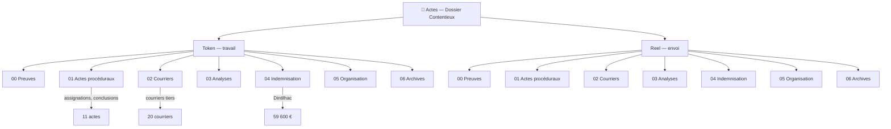

<!-- Breadcrumb -->
*[🏠](../README.md) › Actes*

<!-- /Breadcrumb -->

# 📁 Actes Dossier Contentieux

Bienvenue dans le dossier central du contentieux. Ce dossier repose sur une **double strate** : des versions anonymisées pour le travail courant, et des versions réelles pour l'impression et l'envoi.

---

## 🗺️ Cartographie interactive (Mermaid)

---

Pour comprendre l'enchaînement logique et l'ordre d'expédition de ces actes et courriers, veuillez consulter le [Graphe des Dépendances](../Memory/DEPENDANCES.md).

## 📋 Sous-dossiers Token/ (miroir identique dans Reel/)

- **[Preuves_officielles](Token/Preuves_officielles/README.md)**
Documents physiques, CR opératoire, PV police

- **[Actes procéduraux](Token/Actes_proceduraux/README.md)**
Assignations, conclusions, requêtes

- **[Courriers](Token/Courriers/README.md)**
Mises en demeure, signalements, relances

- **[Analyses_juridiques](Token/Analyses_juridiques/README.md)** — Plaidoiries, FAQ, mémorandums

- **[💰 Études d'indemnisation](Token/Etudes_indemnisation/README.md)** — Évaluation Dintilhac (59 600 €)

- **[Organisation](Token/Organisation/README.md)** — Index, plan d'action, calendrier

- **[Archives](Token/Archives/README.md)** — Anciens documents de travail, annexes

---

## 🔄 Workflow

1. On travaille exclusivement dans `Token/` (création, modification, révision)

2. On génère `Reel/` via `python3 app/generate_real_versions.py`

3. On imprime/envoie depuis `Reel/`