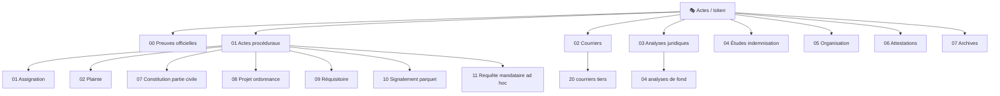

<!-- Breadcrumb -->
*[🏠](../../README.md) › [📁 Actes](../README.md) › 🎭 Token*

<!-- /Breadcrumb -->

# 🎭 Actes / token Version Anonymisée

**Ce dossier contient la version de travail de tous les actes.**  
Les identités réelles (noms, adresses, email, immatriculations) y sont remplacées par des tokens entre crochets et en **gras** : `[**[La Victime]**](../../Memory/Tokens/token-victime-nom-complet.md)`, `[**[L'Exploitant du Commerce (La SAS)]**](../../Memory/Tokens/token-exploitation-raison-sociale.md)`, etc.

## ✅ Règles

- **Toute modification se fait ici.** Ne jamais modifier les fichiers dans [`reel/`](../Reel/README.md).

- Un fichier créé ou modifié dans [`token/`](README.md) doit être propagé dans [`reel/`](../Reel/README.md) via le script.

- Les tokens sont définis dans [[Memory/TOKEN MAP.md](../../Memory/TOKEN MAP.md)](../../Memory/TOKEN%20MAP.md) et [Memory/STRICT VARIABLES.md](../../Memory/STRICT%20VARIABLES.md).

- L'ordre chronologique et logique d'envoi des documents est régi par les dépendances de pièces, voir le [Graphe des Dépendances](../../Memory/DEPENDANCES.md).

## 📂 Contenu

- **[00 — Preuves officielles](Preuves_officielles/README.md)** — 3 fichiers · Documents physiques et PV

- **[01 — Actes procéduraux](Actes_proceduraux/README.md)** — 16 fichiers · Pièces juridiques principales (assignations, conclusions)

- **[02 — Courriers](Courriers/README.md)** — 59 fichiers · Correspondance avec tiers (administrations, assurances)

- **[03 — Analyses juridiques](Analyses_juridiques/README.md)** — 20 fichiers · Plaidoiries, FAQ, analyses de fond

- **[04 — Études d'indemnisation](Etudes_indemnisation/README.md)** — 5 fichiers · Évaluation financière des préjudices

- **[05 — Organisation](Organisation/README.md)** — 14 fichiers · Index, plan d'action, calendrier

- **[06 — Attestations](Attestations/README.md)** — 3 fichiers · Témoignages (client, employé, témoin)

- **[07 — Archives](Archives/README.md)** — 11 fichiers · Anciennes versions, annexes, lexique

## 🗺️ Cartographie du dossier (interactif)

