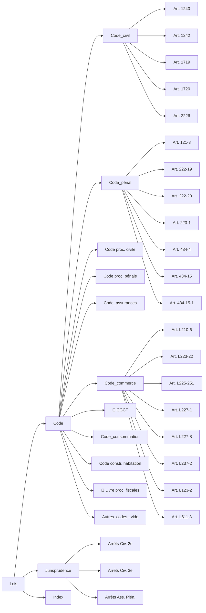

<!-- Breadcrumb -->
*[🏠](../README.md) › ⚖️ Lois*
<hr>
<!-- /Breadcrumb -->

# ⚖️ Bibliothèque Juridique

**Ce dossier contient les textes de loi et les arrêts de jurisprudence cités dans les actes du dossier.**
Chaque fichier est une fiche dédiée, conservant le texte intégral ou un extrait significatif de la source officielle.

## 🗺️ Cartographie des sources (interactif)



Le dossier a été réorganisé pour une meilleure navigation :

```
Lois/
├── Jurisprudence/README.md          # 37 arrêts Cass. + 7 décisions CA/TJ
│   ├── Responsabilité_du_fait_des_choses/     # 8 arrêts
│   ├── Transaction_sous_réserve_d'aggravation/ # 3 arrêts
│   ├── Réserve_d'aggravation/                  # 3 arrêts
│   ├── 🏛️ Préjudice corporel et incidence prof./   # 5 arrêts
│   ├── Responsabilité_des_dirigeants/          # 4 arrêts
│   ├── 🏛️ Action directe et assurance/            # 8 arrêts
│   ├── Jurisprudence_du_fond_(CA-TJ)/          # 7 décisions
│   ├── Responsabilité_du_commettant/           # 2 arrêts
│   └── Mise_en_danger_d'autrui/                # 1 arrêt
├── Code/                  # 12 sous-dossiers
│   ├── Code_civil/                            # 12 articles
│   ├── Code_pénal/                            # 9 articles
│   ├── Code_procédure_civile/                 # 7 articles
│   ├── Code_procédure_pénale/                 # 10 articles
│   ├── Code_assurances/                       # 5 articles
│   ├── Code_du_travail/                      # 7 articles
│   ├── Code_commerce/                         # 12 articles
│   ├── Code_général_des_collectivités_territoriales/ # 2 articles
│   ├── Code_consommation/                     # 1 article
│   ├── Code_construction_habitation/          # 1 article
│   ├── Code des relations avec le public/      # 1 article
│   ├── Livre_des_procédures_fiscales/         # 2 articles
│   └── Autres_codes/                           # vide (articles déplacés)
└── README.md                 # Ce fichier
```

## 📜 Codes et textes législatifs

### [Code_civil (12 articles)](../Actes/Token/README.md)


### [Code_pénal (9 articles)](../Actes/Token/README.md)


### [Code de procédure civile (7 articles)](../Actes/Token/README.md)


### [Code de procédure pénale (10 articles)](../Actes/Token/README.md)


### [Code des assurances (5 articles)](../Actes/Token/README.md)


### [Code de commerce (12 articles)](../Actes/Token/README.md)


### [Code_du_travail (7 articles)](../Actes/Token/README.md)


- [Art. R.4323-58](Code/Code_du_travail/Article_R4323-58_CodeTravail.md) — Travaux temporaires en hauteur

### [Code Général des Collectivités Territoriales (2 articles)](../Actes/Token/README.md)


### [Code de la consommation (1 article)](../Actes/Token/README.md)

### [Code de la construction et de l'habitation (1 article)](../Actes/Token/README.md)

### [Code_des_relations_entre_le_public_et_l'administration (1 article)](../Actes/Token/README.md)

### [Livre_des_procédures_fiscales (2 articles)](../Actes/Token/README.md)


### [Code de la sécurité sociale (1 fiche)](../Actes/Token/README.md)

### 📜 Règlements européens

## 🏛️ Jurisprudence — 37 arrêts Cass. + 7 décisions CA/TJ

Tous les arrêts sont disponibles dans le dossier [Jurisprudence/README.md](Jurisprudence/README.md)

### [Responsabilité_du_fait_des_choses (8 arrêts)](../Actes/Token/README.md)


### [Transaction_sous_réserve_d'aggravation (3 arrêts)](../Actes/Token/README.md)


### [Réserve_d'aggravation (3 arrêts)](../Actes/Token/README.md)


### [Préjudice_corporel_et_incidence_professionnelle (5 arrêts)](../Actes/Token/README.md)


### [Responsabilité_des_dirigeants (4 arrêts)](../Actes/Token/README.md)


### [Action_directe_et_obligation_d'assurance (8 arrêts)](../Actes/Token/README.md)


### [Responsabilité_du_commettant (2 arrêts)](../Actes/Token/README.md)


### [Mise_en_danger_d'autrui (1 arrêt)](../Actes/Token/README.md)

### [Jurisprudence_du_fond_(CA-TJ) — 7 décisions](Jurisprudence/Jurisprudence_du_fond_%28CA-TJ%29))/README.md)
Décisions de cours d'appel et tribunaux judiciaires sur les thèmes ERP, action directe, transaction et incidence professionnelle.

## 🔧 Documents techniques

- **[EXEMPLES_REQUETES_MCP](EXEMPLES_REQUETES_MCP.md)** — Exemples concrets de requêtes MCP Légifrance et Judilibre.

- **[RAPPORT_ORGANISATION_20260711](RAPPORT_ORGANISATION_20260711.md)** — Rapport d'organisation et d'audit (11 juillet 2026).

- **[Note - Changelog Juridique](../Actes/Reel/Analyses_juridiques/Note_Changelog_Juridique.md)** — Historique des modifications.

- **[CHANGELOG_JURIDIQUE](CHANGELOG_JURIDIQUE.md)**

- **[RGPD_Articles7_9_82](RGPD_Articles7_9_82.md)**