<!-- Breadcrumb -->
*[🏠](../README.md) › [🧠 Memory](./README.md)*

<!-- /Breadcrumb -->

# DEPENDANCES Graphe des dépendances logiques des Actes

Ce document répertorie et visualise l'ordre logique d'élaboration et d'expédition des différents actes et courriers du dossier. Certains courriers ou actes judiciaires ne peuvent être valablement rédigés ou envoyés sans disposer au préalable des pièces justificatives produites par d'autres démarches.

## 🗺️ Graphe Mermaid des Dépendances

```mermaid
graph TD
    %% Couleurs et styles
    classDef init fill:#f9f,stroke:#333,stroke-width:2px;
    classDef md fill:#bbf,stroke:#333,stroke-width:2px;
    classDef contentieux fill:#fbb,stroke:#333,stroke-width:2px;
    classDef signalement fill:#bfb,stroke:#333,stroke-width:2px;
    classDef relance fill:#ffb,stroke:#333,stroke-width:2px;

    %% Nœuds initiaux (Sources de preuves de base)
    P1["🚨 Plainte Initiale (J+4)<br>(Preuve de l'accident & faits)"]:::init
    CPAM["🏥 Dossier CPAM (J+5)<br>(Recours subrogatoire)"]:::init

    %% Phase J+31 (Mises en demeure pré-contentieuses)
    MD_SAS["📜 MD SAS (J+31)<br>(Lancement délai 8j)"]:::md
    MD_PRES["📜 MD Président (J+31)<br>(Responsabilité dirigeant)"]:::md
    MD_PROP["📜 MD Propriétaire (J+31)<br>(Responsabilité du bâtiment)"]:::md

    %% Phase J+32 (Contentieux et Plaintes RC)
    ASS_REF["⚖️ Assignation Référé (J+32)<br>(Demande de provision)"]:::contentieux
    PL_DEF["🚔 Plainte Défaut Assurance (J+32)<br>(Pression pénale)"]:::contentieux

    %% Phase J+37 / J+38 (Signalements & Recours)
    SIG_PREF["🚨 Signalement Préfecture (J+37)<br>(ERP non sécurisé)"]:::signalement
    SIG_CODAF["🚨 Signalement CODAF (J+37)<br>(Suspicion fraude)"]:::signalement
    SIG_URSSAF["🚨 Signalement URSSAF (J+37)<br>(Travail dissimulé)"]:::signalement
    SIG_SDIS["🚨 Signalement SDIS (J+37)<br>(Sécurité ERP)"]:::signalement
    SIG_IT["🚨 Signalement Inspection Travail (J+37)<br>(Sécurité salariés)"]:::signalement
    
    TR_CPAM["✉️ Transmission CPAM (J+38)<br>(Bordereau de pièces)"]:::contentieux
    CPC_PC["🛡️ Constitution PC (J+38)<br>(Tribunal Correctionnel)"]:::contentieux
    CONST_H["📸 Requête Constat Huissier (J+38)<br>(Mesures urgentes)"]:::contentieux

    %% Phase J+39 / J+40 (Conclusions et Relances)
    CONC_REF["🎯 Conclusions Référé (J+39)<br>(Réponse pièces adverses)"]:::contentieux
    REL_DIR["🔄 Relance Dirigeants (J+40)<br>(Délai MD SAS expiré)"]:::relance
    REL_CPAM["✉️ CPAM - Relance (J+37)<br>(Suivi ouverture dossier)"]:::relance

    %% ──────────────────────────────────────────────────────────
    %% Dépendances logiques (Liens)
    %% ──────────────────────────────────────────────────────────

    %% La plainte J+4 est nécessaire pour prouver les infractions de base
    P1 --> PL_DEF
    P1 --> CPC_PC
    P1 --> SIG_PREF
    P1 --> SIG_SDIS
    P1 --> SIG_URSSAF
    P1 --> SIG_IT

    %% Le dossier CPAM doit être ouvert pour y transmettre des pièces ou le relancer
    CPAM --> TR_CPAM
    CPAM --> REL_CPAM

    %% Les mises en demeure J+31 lancent le délai légal
    MD_SAS --> ASS_REF
    MD_SAS --> PL_DEF
    MD_SAS --> REL_DIR
    MD_PRES --> PL_DEF
    MD_PRES --> REL_DIR

    %% L'assignation en référé J+32 prouve l'existence du litige civil
    ASS_REF --> CONC_REF
    ASS_REF --> CPC_PC
    ASS_REF --> SIG_PREF
    ASS_REF --> SIG_CODAF
    ASS_REF --> CONST_H

    %% La transmission CPAM permet de consolider les demandes en référé
    TR_CPAM --> CONC_REF
```

## 📋 Détails des chaînes de dépendance

1. **La Chaîne Référé Civil** :

   - `MD SAS (J+31)` ➔ `Assignation Référé (J+32)` ➔ `Conclusions Référé (J+39)` (qui intègrent les pièces complémentaires de la CPAM).
   - *Règle* : On ne peut pas assigner sans avoir d'abord mis en demeure la SAS. On ne peut pas déposer des conclusions sans avoir initié l'assignation.

2. **La Chaîne Sécurité & Signalements ERP** :

   - `Plainte Initiale (J+4)` + `Assignation Référé (J+32)` ➔ `Signalement Préfecture (J+37)` / `Signalement SDIS (J+37)`.
   - *Règle* : Les signalements administratifs s'appuient sur le procès-verbal de police (dépôt de plainte) et sur l'assignation en justice pour prouver la matérialité de l'accident et des manquements de l'exploitant.

3. **La Chaîne Pénale & Fraudes** :

   - `Plainte Initiale (J+4)` ➔ `Plainte Défaut Assurance RC (J+32)` ➔ `Partie Civile - Constitution (J+38)`.
   - *Règle* : La constitution de partie civile devant le doyen des juges d'instruction ou le tribunal nécessite d'avoir préalablement déposé une plainte de base.