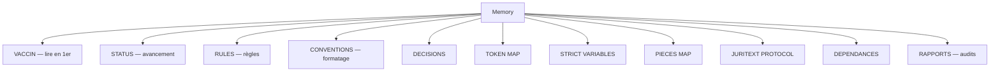

<!-- Breadcrumb -->
*[🏠](../README.md) › 🧠 Memory*

<!-- /Breadcrumb -->

# 🧠 Mémoire du Projet

Ce dossier contient les documents de référence, les variables strictes, et la mémoire institutionnelle du projet accident-main.

## 🗺️ Cartographie mémoire (interactif)

### Fichiers Principaux

- **[CONVENTIONS](CONVENTIONS.md)** - 🔴 Conventions de formatage unifiées

- **DECISIONS.md** - Décisions clés et choix architecturaux

- **DEPENDANCES.md** - Graphe des dépendances logiques des actes

- **STRICT VARIABLES.md** - Variables et constantes de référence

- **TODO.md** - Liste des tâches et roadmap

- **WORKFLOW.md** - Processus et workflows du projet

- **[GEMINI](GEMINI.md)**

- **[USER_DOC_SYNTHESE](USER_DOC_SYNTHESE.md)**

- **[CALENDAR_MAP](CALENDAR_MAP.md)**

- **[DEPENDENCIES](DEPENDENCIES.md)**

- **[RECOVERY_CHECKPOINT](RECOVERY_CHECKPOINT.md)** - Point de reprise après perte mémoire (18/07)

- **[Mémo Stratégie Bailleur HB BARBER](M%C3%A9mo%20Strat%C3%A9gie%20Bailleur%20HB%20BARBER.md)**

- **[CARNET_RDV_UTILISATEUR](CARNET_RDV_UTILISATEUR.md)**

- **[GESTIONNAIRE_DOC](GESTIONNAIRE_DOC.md)**

- **[📆 Mini Calendrier Procedure](Mini_Calendrier_Procedure.md)**

- **[📋 Fiche Suivi Démarches Administratives](Fiche_Suivi_Démarches_Administratives.md)**
### Documentation Technique

<!-- RAPPORT_JURISPRUDENCES supprimé — le dossier Archives n'existe plus dans Rapports, et ce rapport n'a pas été retrouvé. -->
- **[DESIGN](DESIGN.md)**

- **[EVIDENCE_MATRIX](EVIDENCE_MATRIX.md)**

- **[FINANCIAL_VARIABLES_DEPRECATED](FINANCIAL_VARIABLES_DEPRECATED.md)**

- **[JULES_MCP_GUIDELINES](JULES_MCP_GUIDELINES.md)**

- **[JURITEXT_PROTOCOL](JURITEXT_PROTOCOL.md)**

- **[JUSTIFICATION_PROVISION_15000](JUSTIFICATION_PROVISION_15000.md)**

- **[NOTE_SYNTHESE_AVOCAT](NOTE_SYNTHESE_AVOCAT.md)**

- **[PIECES MAP](PIECES%20MAP.md)**

- **[PLAN_ACTION_B](PLAN_ACTION_B.md)**

- **[RECADRAGE_NOMENCLATURE](RECADRAGE_NOMENCLATURE.md)**

- **[RULES](RULES.md)**

- **[STATS_DOSSIER](STATS_DOSSIER.md)**

- **[STATUS](STATUS.md)**

- **[TOKEN MAP](TOKEN%20MAP.md)**

- **[VACCIN](VACCIN.md)**

- **RAPPORT_AUDIT_*.md** - Rapports d'audit technique