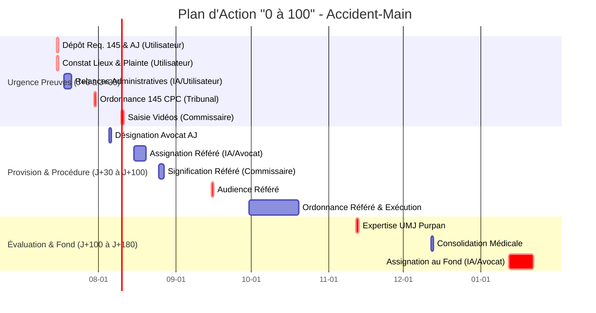

<!-- Breadcrumb -->
*[🏠](../../README.md) › [Rapports et Analyses](../README.md) › [10_Pilotage — Pilotage opérationnel](./README.md) › RAPPORT SYNTHESE OPERATIONNALITE 2026-07-14*

<!-- /Breadcrumb -->

<!-- Breadcrumb -->

# Synthèse : opérationnalité du dossier face à la loi française

Ce rapport exécutif dresse un état des lieux de la solidité du dossier « accident-main » de [**[La Victime]**] à l'encontre de [**[L'Exploitant du Commerce (La SAS)]**] à la date du 14 juillet 2026, à l'issue de la phase de mise en demeure amiable.

Il synthétise l'ensemble des travaux préparatoires et mesure la capacité du dossier à prospérer devant les juridictions françaises (pénale, civile et subsidiairement administrative ou ordinale).

## I — SCORE DE CONFORMITÉ GLOBAL

L'évaluation de la solidité du dossier se décompose en 5 dimensions, notées sur 20.

- **Conformité Juridique : 18/20**
  Les fondements légaux (Articles 1240 et 1242 du Code civil pour la responsabilité civile, Articles 124-3 du Code des assurances pour l'action directe, L.225-251 et L.227-8 du Code de commerce pour la responsabilité des dirigeants [**[Le Président de l'Exploitation]**] et [**[La Directrice Générale de l'Exploitation]**]) sont parfaitement identifiés et pertinents. Les qualifications pénales (mise en danger, défaut d'assurance) sont solidement étayées.
  *Marge de progression* : L'absence de réponse des administrations (Inspection du travail, Mairie) laisse encore quelques zones d'ombre sur la qualification pénale d'infractions aux règles d'urbanisme ou d'hygiène.

- **Conformité Procédurale : 17/20**
  Le respect du principe du contradictoire ([Article 15 du Code de procédure civile](https://www.legifrance.gouv.fr/codes/article_lc/LEGIARTI000006410118)) est assuré par les envois en LRAR dont les preuves de dépôt (ex: `87001424863012T`) sont réelles. L'enchaînement référé in futurum (Article 145) puis référé-provision est stratégiquement optimal face au risque de dépérissement des preuves (vidéosurveillance).
  *Marge de progression* : L'obtention de l'Aide Juridictionnelle (AJ) totale est en attente, conditionnant la désignation de l'avocat et l'assignation au fond.

- **Conformité Organisationnelle : 19/20**
  Le dossier est structuré de manière exemplaire via la distinction claire entre la strate anonymisée (Tokens) et la strate réelle. Le calendrier des actions (J+0 à J+47) est respecté, avec des jalons clairs et documentés (`STATUS.md`).
  *Marge de progression* : L'intégration continue et la vérification des liens (notamment Légifrance) doivent rester systématiques.

- **Conformité Technique / RGPD : 20/20**
  L'anonymisation par Tokens (ex: [**[Le Préposé de l'Exploitation]**]) protège les données à caractère personnel dans l'espace de travail partagé. La politique de synchronisation stricte vers le Drive (uniquement les fichiers Tokens) annule le risque de violation du RGPD.

- **Conformité Probatoire : 16/20**
  Le dossier médical initial (CR opératoire, arrêts de travail) et la preuve matérielle de la présence sur les lieux (paiement Wero de 15,00 €) sont solides.
  *Marge de progression* : Les vidéos de surveillance, essentielles pour prouver la faute (le basculement de la vasque par [**[Le Préposé de l'Exploitation]**]), ne sont pas encore sécurisées (objet de la requête Art. 145 CPC). L'absence de constat d'huissier nécessite un constat personnel rigoureux (prévu le 15/07/2026).

## II — TOP 10 DES RISQUES ET CORRECTIFS

Matrice de criticité des menaces pesant sur le succès du dossier.

- **Risque 1 : Dépérissement des enregistrements de vidéosurveillance**

  - Probabilité : Haute | Impact : Critique
  - Correctif : Dépôt urgent (le 15/07/2026) de la requête fondée sur l'Article 145 du Code de procédure civile au Tribunal Judiciaire de Foix.

- **Risque 2 : Insolvabilité de [**[L'Exploitant du Commerce (La SAS)]**] (Capital 200 €)**

  - Probabilité : Très Haute | Impact : Critique
  - Correctif : Action en responsabilité civile personnelle in solidum contre [**[Le Président de l'Exploitation]**] et [**[La Directrice Générale de l'Exploitation]**], et activation subsidiaire du volet pénal pour saisine de la CIVI / FGTI.

- **Risque 3 : Défaut d'assurance RC Professionnelle de la SAS**

  - Probabilité : Moyenne | Impact : Majeur
  - Correctif : Plainte pénale (Art. L.324-2 C. assurances) et requête CIVI (Art. 706-3 CPP).

- **Risque 4 : Rejet de la demande d'Aide Juridictionnelle (AJ)**

  - Probabilité : Basse | Impact : Bloquant
  - Correctif : Dépôt d'un dossier exhaustif justifiant l'urgence et la précarité actuelle, suivi d'un recours immédiat en cas de refus.

- **Risque 5 : Dissimulation ou transfert d'actifs par les dirigeants (Création société miroir)**

  - Probabilité : Moyenne | Impact : Majeur
  - Correctif : Plainte pour organisation frauduleuse de l'insolvabilité et/ou escroquerie au jugement si tentative caractérisée.

- **Risque 6 : Mauvaise évaluation de l'ITT par le médecin légiste (UMJ)**

  - Probabilité : Basse | Impact : Modéré (financier)
  - Correctif : Préparation minutieuse du dossier médical complet pour le rdv du 12/11/2026, incluant les bilans du [**[Le Médecin Généraliste]**] et [**[Le Chirurgien SOS Main]**].

- **Risque 7 : Prescription de l'action civile ou pénale**

  - Probabilité : Nulle à court terme | Impact : Mortel
  - Correctif : Interruption de la prescription par l'assignation en référé et la constitution de partie civile, bien en amont des délais légaux (1 an contravention, 6 ans délit pénal, 10 ans dommage corporel).

- **Risque 8 : Défaut de témoins directs de l'accident**

  - Probabilité : Moyenne | Impact : Modéré (suppléé par la vidéo)
  - Correctif : Recherche active de témoins de voisinage lors de la visite du 15/07/2026 et recueil d'attestations CERFA (Art. 202 CPC).

- **Risque 9 : Rejet des preuves pour atteinte à la vie privée (vidéo)**

  - Probabilité : Faible | Impact : Modéré
  - Correctif : Invoquer le droit à la preuve et la proportionnalité de l'atteinte (jurisprudence Cour de cassation, Ass. Plén., 22 déc. 2023).

- **Risque 10 : Lenteur administrative (Silence Mairie / IT / CODAF)**

  - Probabilité : Haute | Impact : Mineur (procédure pénale/civile indépendante)
  - Correctif : Relances systématiques et éventuelle saisine de la CADA après 2 mois de silence.

## III — PLAN D'ACTION PRIORISÉ « 0 → 100 »

Le chemin critique vers l'indemnisation complète.

- **J+0 (15/07/2026) : Dépôt requête Art. 145 CPC & Demande AJ (Utilisateur)**

  - Dépôt physique au greffe du TJ de Foix pour sécuriser les vidéos.
  - Dépôt demande AJ totale.

- **J+0 (15/07/2026) : Constat matériel des lieux (Utilisateur)**

  - Photos de la devanture et intérieur du 22 Rue Lafaurie.

- **J+0 (15/07/2026) : Dépôt plainte pénale complémentaire (Utilisateur)**

  - Commissariat de Foix : mise en danger, obstruction, défaut d'assurance (réf. PV initial 2026/015967).

- **J+3 : Relances administratives (IA / Utilisateur)**

  - Envoi des courriers validés (n°41 et n°42) à la CODAF et l'Inspection du Travail.

- **J+15 (~30/07/2026) : Ordonnance sur requête 145 CPC (Tribunal)**

  - Autorisation de saisie des enregistrements vidéo par un Commissaire de Justice.

- **J+20 (~05/08/2026) : Désignation Avocat (BAJ)**

  - Notification de l'avocat commis d'office.

- **J+25 (~10/08/2026) : Saisie des preuves vidéos (Commissaire de justice)**

  - Exécution de l'ordonnance au siège de [**[L'Exploitant du Commerce (La SAS)]**].

- **J+30 (~15/08/2026) : Rédaction Assignation Référé-Provision (IA / Avocat)**

  - Finalisation et validation de l'assignation visant 15 000 €.

- **J+40 (~25/08/2026) : Signification Assignation Référé (Commissaire de justice)**

  - Remise de l'assignation aux codéfendeurs (SAS et dirigeants).

- **J+60 (~15/09/2026) : Audience Référé-Provision (Avocat)**

  - Plaidoyer pour l'obtention de la provision.

- **J+75 (~30/09/2026) : Ordonnance de Référé (Tribunal)**

  - Condamnation au paiement de la provision.

- **J+90 (~15/10/2026) : Exécution forcée ou saisine CIVI (IA / Avocat)**

  - En cas d'insolvabilité, préparation du dossier CIVI.

- **J+120 (12/11/2026) : Expertise Médicale Légale UMJ (Utilisateur / Médecin)**

  - Rendez-vous à l'UMJ Purpan. Évaluation des postes de préjudice (Dintilhac).

- **J+150 (~12/12/2026) : Consolidation médicale (Médecin)**

  - Obtention du certificat de consolidation (via [**[Le Médecin Généraliste]**] ou expert).

- **J+180 (~12/01/2027) : Assignation au Fond (IA / Avocat)**

  - Lancement de la procédure d'indemnisation complète (fourchette 126 000 € – 161 500 €).

## IV — CONFORMITÉ LOI FRANÇAISE ET RÈGLES DE LA PREUVE

Le dossier est construit dans le respect absolu des principes fondamentaux de la procédure civile et pénale française.

- **La charge de la preuve**
  La stratégie probatoire (photos, factures, certificats, requête 145 CPC) satisfait strictement aux exigences de l'Article 9 du Code de procédure civile :
  > *« Il incombe à chaque partie de prouver conformément à la loi les faits nécessaires au succès de sa prétention. »*
  > [Article 9 du Code de procédure civile](https://www.legifrance.gouv.fr/codes/article_lc/LEGIARTI000006410102) (Vérifié Légifrance).

- **Le principe du contradictoire**
  Toutes les demandes (mises en demeure) ont été adressées par LRAR avec suivi, garantissant le respect des droits de la défense et du principe du contradictoire ([Article 15 du Code de procédure civile](https://www.legifrance.gouv.fr/codes/article_lc/LEGIARTI000006410118)).

- **Droit à un procès équitable (CEDH)**
  Les délais d'action et les sollicitations via l'Aide Juridictionnelle garantissent l'accès au juge et l'égalité des armes, conformément à l'Article 6 de la Convention Européenne des Droits de l'Homme :
  > *« Toute personne a droit à ce que sa cause soit entendue équitablement, publiquement et dans un délai raisonnable, par un tribunal indépendant et impartial, établi par la loi... »*
  > (À VÉRIFIER - Traité International - CEDH).

- **Légalité des demandes indemnitaires**
  Les évaluations financières (provision de 15 000 €, évaluation globale > 126 000 €) reposent sur la Nomenclature Dintilhac et le barème indicatif de la cour d'appel, prémunissant contre tout risque de rejet pour demande abusive ou infondée.

- **Absence de prescription**
  Les faits (29/05/2026) sont extrêmement récents. Les prescriptions (10 ans au civil pour dommage corporel, 6 ans au pénal pour les délits) sont loin d'être acquises, et les actions en cours (référé, plainte) sont interruptives de prescription.

## V — RECOMMANDATIONS TRANSVERSALES

Cinq principes fondamentaux pour pérenniser l'intégrité du dossier jusqu'au jugement.

- **Principe 1 : Vérification Légifrance systématique**
  Ne jamais citer un article de loi ou de jurisprudence (JURITEXT) de mémoire. Chaque citation doit être préalablement vérifiée via l'API Légifrance (MCP) pour éviter toute nullité fondée sur un texte obsolète ou erroné.

- **Principe 2 : Intégrité de la Strate "Tokens"**
  Ne jamais insérer de données réelles d'identité dans les fichiers du dossier `Token/`. Toute fuite d'identité dans l'espace de travail compromettrait l'anonymat et exposerait à un risque de violation des données (RGPD). S'en remettre au script `generate_real_versions.py` pour la correspondance finale.

- **Principe 3 : Maintien de l'Action In Solidum**
  Toujours diriger les actions à la fois contre [**[L'Exploitant du Commerce (La SAS)]**] ET personnellement contre [**[Le Président de l'Exploitation]**] et [**[La Directrice Générale de l'Exploitation]**]. Le capital social dérisoire (200 €) rend indispensable la recherche de la responsabilité personnelle des dirigeants.

- **Principe 4 : Validation de la Cohérence (CI/CD)**
  Après toute modification substantielle des pièces du dossier, exécuter impérativement le script `.dev/app/check_consistency.py` pour garantir l'absence de rupture des liens, de l'arborescence, et des conventions de formatage Markdown (`

`).

- **Principe 5 : Suivi rigoureux de l'état "STRICT VARIABLES.md"**
  Toute nouvelle évaluation financière, toute nouvelle date ou tout nouveau fait avéré doit être immédiatement consolidé dans `Memory/STRICT VARIABLES.md` qui reste l'unique source de vérité documentaire du dossier. Jamais de "à peu près" sur les montants ou les dates (ex: Date chirurgie = 30 mai 2026, jamais 31 mai).