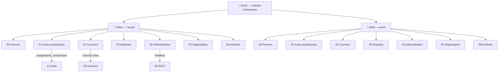

<!-- Breadcrumb -->
*[🏠](../README.md) › ⚖️ Actes*

<!-- /Breadcrumb -->

# 📁 Actes Dossier Contentieux

Bienvenue dans le dossier central du contentieux. Ce dossier repose sur une **double strate** : des versions anonymisées pour le travail courant, et des versions réelles pour l'impression et l'envoi.

---

## 🗺️ Cartographie interactive (Mermaid)

---

## 📋 Sous-dossiers 🔑 Token/ (miroir identique dans 👤 Reel/)

- **[📂 Preuves officielles](%F0%9F%94%91%20Token/%F0%9F%93%82%20Preuves%20officielles/README.md)** — Documents physiques, CR opératoire, PV police
- **[⚖️ Actes procéduraux](%F0%9F%94%91%20Token/%E2%9A%96%EF%B8%8F%20Actes%20proceduraux/README.md)** — Assignations, conclusions, requêtes
- **[✉️ Courriers](%F0%9F%94%91%20Token/%E2%9C%89%EF%B8%8F%20Courriers/README.md)** — Mises en demeure, signalements, relances
- **[📚 Analyses juridiques](%F0%9F%94%91%20Token/%F0%9F%93%9A%20Analyses%20juridiques/README.md)** — Plaidoiries, FAQ, mémorandums
- **[💰 Études d'indemnisation](%F0%9F%94%91%20Token/%F0%9F%92%B0%20Etudes%20indemnisation/README.md)** — Évaluation Dintilhac (59 600 €)
- **[🗂️ Organisation](%F0%9F%94%91%20Token/%F0%9F%97%82%EF%B8%8F%20Organisation/README.md)** — Index, plan d'action, calendrier
- **[🗄️ Archives](%F0%9F%94%91%20Token/%F0%9F%97%84%EF%B8%8F%20Archives/README.md)** — Anciens documents de travail, annexes

---

## 🔄 Workflow

1. On travaille exclusivement dans `🔑 Token/` (création, modification, révision)
2. On génère `👤 Reel/` via `python3 app/generate_real_versions.py`
3. On imprime/envoie depuis `👤 Reel/`