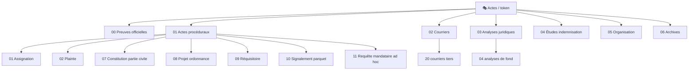

<!-- Breadcrumb -->
*[🏠](../../README.md) › [📁 Actes](../README.md) › 🔑 Token*

<!-- /Breadcrumb -->

# 🎭 Actes / token Version Anonymisée

---

**Ce dossier contient la version de travail de tous les actes.**  
Les identités réelles (noms, adresses, email, immatriculations) y sont remplacées par des tokens entre crochets et en **gras** : `**[La Victime]**`, `**[L'Exploitant du Commerce (La SAS)]**`, etc.

## ✅ Règles

- **Toute modification se fait ici.** Ne jamais modifier les fichiers dans `reel/`.
- Un fichier créé ou modifié dans `token/` doit être propagé dans `reel/` via le script.
- Les tokens sont définis dans [🧠 Memory/TOKEN MAP.md](../../%F0%9F%A7%A0%20Memory/TOKEN%20MAP.md) et [🧠 Memory/STRICT VARIABLES.md](../../%F0%9F%A7%A0%20Memory/STRICT%20VARIABLES.md).

## 📂 Contenu

- **[00 — Preuves officielles](%F0%9F%93%82%20Preuves%20officielles/README.md)** — 0 fichier · Documents physiques (en attente d'insertion)
- **[01 — Actes procéduraux](%E2%9A%96%EF%B8%8F%20Actes%20proceduraux/README.md)** — 6 fichiers · Pièces juridiques principales (assignations, conclusions)
- **[02 — Courriers](%E2%9C%89%EF%B8%8F%20Courriers/README.md)** — 20 fichiers · Correspondance avec tiers (administrations, assurances)
- **[03 — Analyses juridiques](%F0%9F%93%9A%20Analyses%20juridiques/README.md)** — 4 fichiers · Plaidoiries, FAQ, analyses de fond
- **[04 — Études d'indemnisation](%F0%9F%92%B0%20Etudes%20indemnisation/README.md)** — 1 fichier · Évaluation financière des préjudices
- **[05 — Organisation](%F0%9F%97%82%EF%B8%8F%20Organisation/README.md)** — 3 fichiers · Index, plan d'action, calendrier
- **[06 — Archives](%F0%9F%97%84%EF%B8%8F%20Archives/README.md)** — 7 fichiers · Anciennes versions, annexes, lexique

## 🗺️ Cartographie du dossier (interactif)

