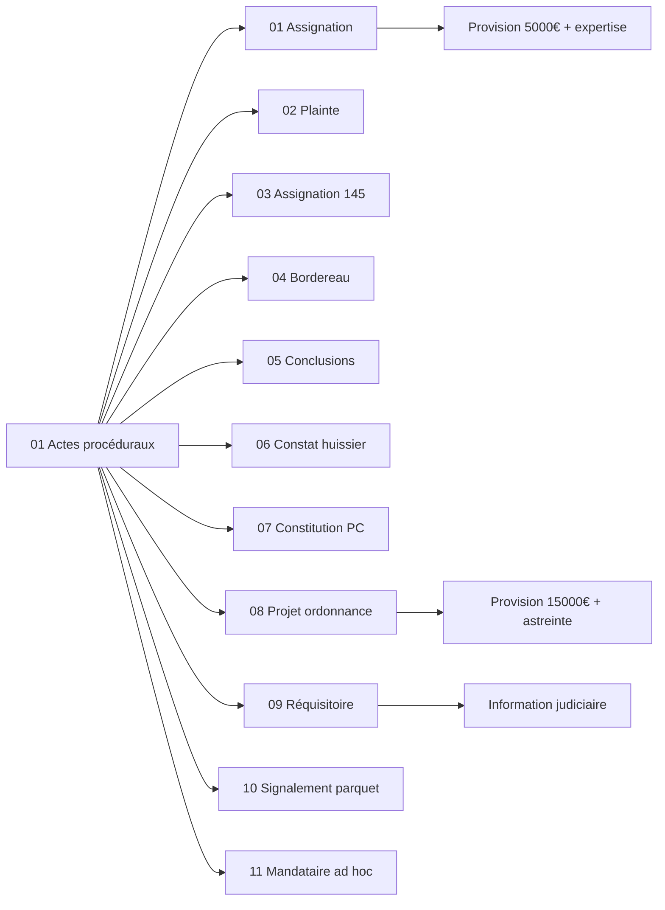

<!-- Breadcrumb -->
[🏠](../../../README.md) › [📁 Actes](../../README.md) › [🎭 Token](../README.md) › ⚖️ Actes proceduraux
<!-- /Breadcrumb -->

# ⚖️ Actes Procéduraux

**Ce dossier contient l'ensemble des actes juridiques destinés à être déposés au greffe du tribunal judiciaire.**  

Ces documents constituent le corps de la procédure en référé.

## 📋 Fichiers

- **[J+32 ⚖️ Assignation Refere Provision](J+32%20⚖️%20Assignation%20Refere%20Provision.md)**
- **[J+32 🚔 Plainte Defaut Assurance RC](J+32%20🚔%20Plainte%20Defaut%20Assurance%20RC.md)**
- **[J+38 📸 Requete Constat Huissier](J+38%20📸%20Requete%20Constat%20Huissier.md)**
- **[J+38 🛡️ Constitution Partie Civile](J+38%20🛡️%20Constitution%20Partie%20Civile.md)**
- **[J+39 🎯 Conclusions Refere Provision](J+39%20🎯%20Conclusions%20Refere%20Provision.md)**
- **[J+39 📑 Bordereau Unifie](J+39%20📑%20Bordereau%20Unifie.md)**
- **[J+47 ⚖️ Requisitoire introductif](J+47%20⚖️%20Requisitoire%20introductif.md)**
- **[J+47 🔍 Requete Article 145 CPC](J+47%20🔍%20Requete%20Article%20145%20CPC.md)**
- **[J+63 ⚖️ Projet Ordonnance Refere](J+63%20⚖️%20Projet%20Ordonnance%20Refere.md)**
- **[16 ⚠️ Signalement Parquet Fraud](16%20⚠️%20Signalement%20Parquet%20Fraud.md)**
- **[17 ⚖️ Requete Mandataire Ad Hoc](17%20⚖️%20Requete%20Mandataire%20Ad%20Hoc.md)**
## 🔗 Liens vers les versions réelles

> [⚖️ Actes/👤 Reel/⚖️ Actes proceduraux/README.md](..%2F..%2F👤%20Reel/%E2%9A%96%EF%B8%8F%20Actes%20proceduraux/README.md)

## 📅 Échéances

- **Fin phase amiable** : 14 juillet 2026
- **Audience de référé** : Date non fixée (à planifier)
- **Expertise médicale** : 12 novembre 2026

## 🗺️ Arbre des actes (interactif)

