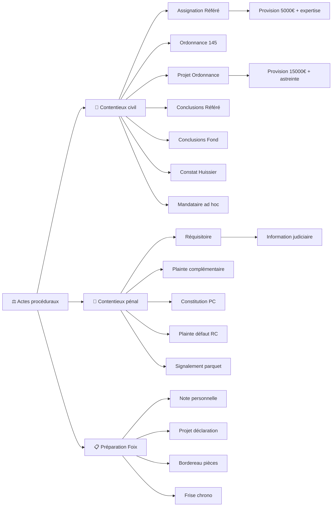

<!-- Breadcrumb -->
*[🏠](../../../README.md) › [📁 Actes — Dossier Contentieux](../../README.md) › [🎭 Actes / token — Version Anonymisée](../README.md) › ⚖️ Actes proceduraux*

<!-- /Breadcrumb -->

# ⚖️ Actes Procéduraux

**Ce dossier contient l'ensemble des actes juridiques destinés à être déposés au greffe du tribunal judiciaire.**

## 📂 Sous-dossiers

### [📜 Contentieux civil](%F0%9F%93%9C%20Contentieux%20civil/README.md)

- [Référé Provision - Assignation.md](%F0%9F%93%9C%20Contentieux%20civil/R%C3%A9f%C3%A9r%C3%A9%20Provision%20-%20Assignation.md)

- [CPC 145 - Ordonnance sur Requête.md](%F0%9F%93%9C%20Contentieux%20civil/CPC%20145%20-%20Ordonnance%20sur%20Requ%C3%AAte.md)

- [TJ Foix - Référé Provision - Ordonnance Projet.md](%F0%9F%93%9C%20Contentieux%20civil/TJ%20Foix%20-%20TJ%20Foix%20-%20R%C3%A9f%C3%A9r%C3%A9%20Provision%20-%20Ordonnance%20Projet.md)

- [Référé Provision - Conclusions.md](%F0%9F%93%9C%20Contentieux%20civil/R%C3%A9f%C3%A9r%C3%A9%20Provision%20-%20Conclusions.md)

- [TJ Foix - TJ Foix - Bordereau Unifié.md](%F0%9F%93%9C%20Contentieux%20civil/TJ%20Foix%20-%20TJ%20Foix%20-%20Bordereau%20Unifi%C3%A9.md)

- [TJ Foix - Conclusions au Fond.md](%F0%9F%93%9C%20Contentieux%20civil/TJ%20Foix%20-%20Conclusions%20au%20Fond.md)

- [Constat Huissier - Requête.md](%F0%9F%93%9C%20Contentieux%20civil/Constat%20Huissier%20-%20Requ%C3%AAte.md)

- [CPC 145 - Requête.md](%F0%9F%93%9C%20Contentieux%20civil/CPC%20145%20-%20Requ%C3%AAte.md)

- [Mandataire Ad Hoc - Requête.md](%F0%9F%93%9C%20Contentieux%20civil/Mandataire%20Ad%20Hoc%20-%20Requ%C3%AAte.md)

### [👮 Contentieux penal](%F0%9F%91%AE%20Contentieux%20penal/README.md)

- [Parquet - Réquisitoire Introductif.md](%F0%9F%91%AE%20Contentieux%20penal/Parquet%20-%20R%C3%A9quisitoire%20Introductif.md)

- [Plainte Complémentaire - Correction.md](%F0%9F%91%AE%20Contentieux%20penal/Plainte%20Compl%C3%A9mentaire%20-%20Correction.md)

- [Plainte Complémentaire - PV Audition.md](%F0%9F%91%AE%20Contentieux%20penal/Plainte%20Compl%C3%A9mentaire%20-%20PV%20Audition.md)

- [Assurance RC - Plainte Défaut.md](%F0%9F%91%AE%20Contentieux%20penal/Assurance%20RC%20-%20Plainte%20D%C3%A9faut.md)

- [Plainte Complémentaire - PV Audition Foix.md](%F0%9F%91%AE%20Contentieux%20penal/Plainte%20Compl%C3%A9mentaire%20-%20PV%20Audition%20Foix.md)

- [Partie Civile - Constitution.md](%F0%9F%91%AE%20Contentieux%20penal/Partie%20Civile%20-%20Constitution.md)

- [Parquet - Signalement Fraude.md](%F0%9F%91%AE%20Contentieux%20penal/Parquet%20-%20Signalement%20Fraude.md)

### [📋 Preparation Foix](../README.md)

- [📋 Police - Bordereau Pièces.md](../%E2%9C%89%EF%B8%8F%20Courriers/%F0%9F%91%AE%20Police/%F0%9F%93%8B%20Police%20-%20Bordereau%20Pi%C3%A8ces.md)

- [📋 Police - Note Frise Chronologique.md](../%E2%9C%89%EF%B8%8F%20Courriers/%F0%9F%91%AE%20Police/%F0%9F%93%8B%20Note%20-%20Note%20-%20Note%20-%20Police%20-%20Note%20Frise%20Chronologique.md)

- [📋 Police - Note Personnelle.md](../%E2%9C%89%EF%B8%8F%20Courriers/%F0%9F%91%AE%20Police/%F0%9F%93%8B%20Police%20-%20Note%20Personnelle.md)

- [📋 Police - Note Projet Déclaration.md](../%E2%9C%89%EF%B8%8F%20Courriers/%F0%9F%91%AE%20Police/%F0%9F%93%8B%20Police%20-%20Note%20Projet%20D%C3%A9claration.md)

- [TJ%20Foix%20-%20TJ%20Foix%20-%20M%C3%A9mo%20-%20Audience%2031-07-2026.md](../%E2%9C%89%EF%B8%8F%20Courriers/%F0%9F%8F%9B%EF%B8%8F%20Justice/TJ%20Foix%20-%20TJ%20Foix%20-%20M%C3%A9mo%20-%20Audience%2031-07-2026.md)

## 🔗 Liens vers les versions réelles

> [⚖️ Actes/👤 Reel/⚖️ Actes proceduraux/README.md](../../%F0%9F%91%A4%20Reel/%E2%9A%96%EF%B8%8F%20Actes%20proceduraux/README.md)

## 📅 Échéances

- **Fin phase amiable** : 14 juillet 2026

- **Audience de référé** : Date non fixée (à planifier)

- **Expertise médicale** : 12 novembre 2026

- **Dépendances des actes** : Voir le [Graphe des Dépendances](../../../%F0%9F%A7%A0%20Memory/DEPENDANCES.md) pour ordonner les procédures.

## 🗺️ Arbre des actes (interactif)

