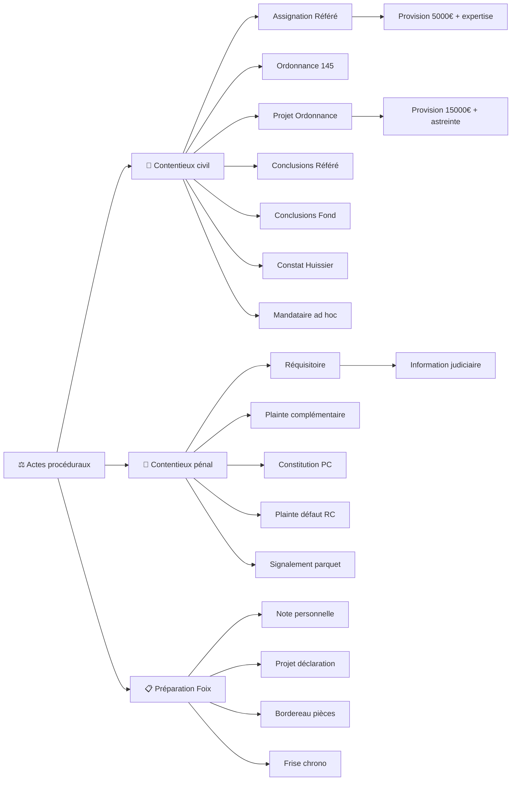

<!-- Breadcrumb -->
*[🏠](../../../README.md) › [📁 Actes — Dossier Contentieux](../../README.md) › [🎭 Actes / token — Version Anonymisée](../README.md) › ⚖️ Actes proceduraux*

<!-- /Breadcrumb -->

# ⚖️ Actes Procéduraux

**Ce dossier contient l'ensemble des actes juridiques destinés à être déposés au greffe du tribunal judiciaire.**

## 📂 Sous-dossiers

### [📜 Contentieux civil](%F0%9F%93%9C%20Contentieux%20civil/README.md)

- [⚖️ Assignation Refere Provision.md](%F0%9F%93%9C%20Contentieux%20civil/%E2%9A%96%EF%B8%8F%20Assignation%20Refere%20Provision.md)

- [⚖️ Ordonnance sur Requete Art. 145 CPC.md](%F0%9F%93%9C%20Contentieux%20civil/%E2%9A%96%EF%B8%8F%20Ordonnance%20sur%20Requete%20Art.%20145%20CPC.md)

- [⚖️ Projet Ordonnance Refere.md](%F0%9F%93%9C%20Contentieux%20civil/%E2%9A%96%EF%B8%8F%20Projet%20Ordonnance%20Refere.md)

- [🎯 Conclusions Refere Provision.md](%F0%9F%93%9C%20Contentieux%20civil/%F0%9F%8E%AF%20Conclusions%20Refere%20Provision.md)

- [📑 Bordereau Unifie.md](%F0%9F%93%9C%20Contentieux%20civil/%F0%9F%93%91%20Bordereau%20Unifie.md)

- [📜 Conclusions au Fond TJ Foix.md](%F0%9F%93%9C%20Contentieux%20civil/%F0%9F%93%9C%20Conclusions%20au%20Fond%20TJ%20Foix.md)

- [📸 Requete Constat Huissier.md](%F0%9F%93%9C%20Contentieux%20civil/%F0%9F%93%B8%20Requete%20Constat%20Huissier.md)

- [🔍 Requete Article 145 CPC.md](%F0%9F%93%9C%20Contentieux%20civil/%F0%9F%94%8D%20Requete%20Article%20145%20CPC.md)

- [17 ⚖️ Requete Mandataire Ad Hoc.md](%F0%9F%93%9C%20Contentieux%20civil/17%20%E2%9A%96%EF%B8%8F%20Requete%20Mandataire%20Ad%20Hoc.md)

### [👮 Contentieux penal](%F0%9F%91%AE%20Contentieux%20penal/README.md)

- [⚖️ Requisitoire introductif.md](%F0%9F%91%AE%20Contentieux%20penal/%E2%9A%96%EF%B8%8F%20Requisitoire%20introductif.md)

- [👮‍♂️ Plainte Complementaire Correction HB BARBER.md](%F0%9F%91%AE%20Contentieux%20penal/%F0%9F%91%AE%E2%80%8D%E2%99%82%EF%B8%8F%20Plainte%20Complementaire%20Correction%20HB%20BARBER.md)

- [👮‍♂️ PV Audition Plainte Complementaire.md](%F0%9F%91%AE%20Contentieux%20penal/%F0%9F%91%AE%E2%80%8D%E2%99%82%EF%B8%8F%20PV%20Audition%20Plainte%20Complementaire.md)

- [🚔 Plainte Defaut Assurance RC.md](%F0%9F%91%AE%20Contentieux%20penal/%F0%9F%9A%94%20Plainte%20Defaut%20Assurance%20RC.md)

- [🚔 PV Audition Plainte Complementaire Foix.md](%F0%9F%91%AE%20Contentieux%20penal/%F0%9F%9A%94%20PV%20Audition%20Plainte%20Complementaire%20Foix.md)

- [🛡️ Constitution Partie Civile.md](%F0%9F%91%AE%20Contentieux%20penal/%F0%9F%9B%A1%EF%B8%8F%20Constitution%20Partie%20Civile.md)

- [16 ⚠️ Signalement Parquet Fraud.md](%F0%9F%91%AE%20Contentieux%20penal/16%20%E2%9A%A0%EF%B8%8F%20Signalement%20Parquet%20Fraud.md)

### [📋 Preparation Foix](%F0%9F%93%8B%20Preparation%20Foix/README.md)

- [📋 Bordereau de Pieces Foix.md](%F0%9F%93%8B%20Preparation%20Foix/%F0%9F%93%8B%20Bordereau%20de%20Pieces%20Foix.md)

- [📋 Frise Chronologique Foix.md](%F0%9F%93%8B%20Preparation%20Foix/%F0%9F%93%8B%20Frise%20Chronologique%20Foix.md)

- [📋 Note Personnelle Commissariat Foix.md](%F0%9F%93%8B%20Preparation%20Foix/%F0%9F%93%8B%20Note%20Personnelle%20Commissariat%20Foix.md)

- [📋 Projet Declaration PV Foix.md](%F0%9F%93%8B%20Preparation%20Foix/%F0%9F%93%8B%20Projet%20Declaration%20PV%20Foix.md)

- [MEMO_AUDIENCE_31072026.md](%F0%9F%93%8B%20Preparation%20Foix/MEMO_AUDIENCE_31072026.md)

## 🔗 Liens vers les versions réelles

> [⚖️ Actes/👤 Reel/⚖️ Actes proceduraux/README.md](../../%F0%9F%91%A4%20Reel/%E2%9A%96%EF%B8%8F%20Actes%20proceduraux/README.md)

## 📅 Échéances

- **Fin phase amiable** : 14 juillet 2026

- **Audience de référé** : Date non fixée (à planifier)

- **Expertise médicale** : 12 novembre 2026

- **Dépendances des actes** : Voir le [Graphe des Dépendances](../../../%F0%9F%A7%A0%20Memory/DEPENDANCES.md) pour ordonner les procédures.

## 🗺️ Arbre des actes (interactif)

