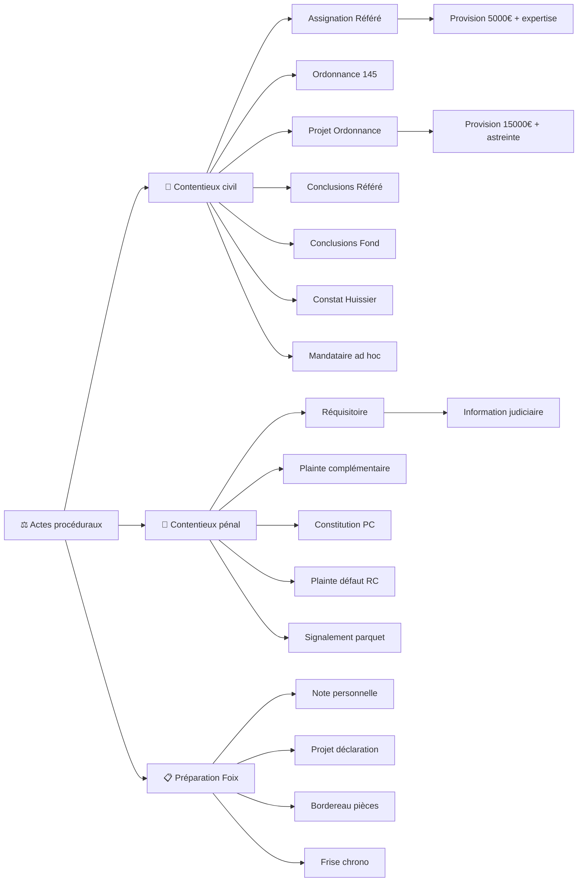

<!-- Breadcrumb -->
*[🏠](../../../README.md) › [📁 Actes — Dossier Contentieux](../../README.md) › [🎭 Actes / token — Version Anonymisée](../README.md) › ⚖️ Actes proceduraux*

<!-- /Breadcrumb -->

# ⚖️ Actes Procéduraux

**Ce dossier contient l'ensemble des actes juridiques destinés à être déposés au greffe du tribunal judiciaire.**

## 📂 Sous-dossiers

### [📜 Contentieux civil](%F0%9F%93%9C%20Contentieux%20civil/README.md)

- [Refere Provision Assignation.md](%F0%9F%93%9C%20Contentieux%20civil/Refere%20Provision%20Assignation.md)

- [Ordonnance sur Requete Art. 145 CPC.md](%F0%9F%93%9C%20Contentieux%20civil/Ordonnance%20sur%20Requete%20Art.%20145%20CPC.md)

- [Refere Ordonnance Projet.md](%F0%9F%93%9C%20Contentieux%20civil/Refere%20Ordonnance%20Projet.md)

- [Refere Provision Conclusion.md](%F0%9F%93%9C%20Contentieux%20civil/Refere%20Provision%20Conclusion.md)

- [Bordereau Unifie.md](%F0%9F%93%9C%20Contentieux%20civil/Bordereau%20Unifie.md)

- [Conclusions au Fond TJ Foix.md](%F0%9F%93%9C%20Contentieux%20civil/Conclusions%20au%20Fond%20TJ%20Foix.md)

- [Requete Constat Huissier.md](%F0%9F%93%9C%20Contentieux%20civil/Requete%20Constat%20Huissier.md)

- [Requete Article 145 CPC.md](%F0%9F%93%9C%20Contentieux%20civil/Requete%20Article%20145%20CPC.md)

- [Requete Mandataire Ad Hoc.md](%F0%9F%93%9C%20Contentieux%20civil/Requete%20Mandataire%20Ad%20Hoc.md)

### [👮 Contentieux penal](%F0%9F%91%AE%20Contentieux%20penal/README.md)

- [Requisitoire Introductif.md](%F0%9F%91%AE%20Contentieux%20penal/Requisitoire%20Introductif.md)

- [Plainte Complementaire Correction.md](%F0%9F%91%AE%20Contentieux%20penal/Plainte%20Complementaire%20Correction.md)

- [PV Audition Plainte Complementaire.md](%F0%9F%91%AE%20Contentieux%20penal/PV%20Audition%20Plainte%20Complementaire.md)

- [Plainte Defaut Assurance RC.md](%F0%9F%91%AE%20Contentieux%20penal/Plainte%20Defaut%20Assurance%20RC.md)

- [PV Audition Plainte Complementaire Foix.md](%F0%9F%91%AE%20Contentieux%20penal/PV%20Audition%20Plainte%20Complementaire%20Foix.md)

- [Constitution Partie Civile.md](%F0%9F%91%AE%20Contentieux%20penal/Constitution%20Partie%20Civile.md)

- [Signalement Parquet Fraud.md](%F0%9F%91%AE%20Contentieux%20penal/Signalement%20Parquet%20Fraud.md)

### [📋 Preparation Foix](../README.md)

- [📋 Bordereau de Pieces Foix.md](../%E2%9C%89%EF%B8%8F%20Courriers/%F0%9F%91%AE%20Police/%F0%9F%93%8B%20Bordereau%20de%20Pieces%20Foix.md)

- [📋 Frise Chronologique Foix.md](../%E2%9C%89%EF%B8%8F%20Courriers/%F0%9F%91%AE%20Police/%F0%9F%93%8B%20Frise%20Chronologique%20Foix.md)

- [📋 Note Personnelle Commissariat Foix.md](../%E2%9C%89%EF%B8%8F%20Courriers/%F0%9F%91%AE%20Police/%F0%9F%93%8B%20Note%20Personnelle%20Commissariat%20Foix.md)

- [📋 Projet Declaration PV Foix.md](../%E2%9C%89%EF%B8%8F%20Courriers/%F0%9F%91%AE%20Police/%F0%9F%93%8B%20Projet%20Declaration%20PV%20Foix.md)

- [MEMO_AUDIENCE_31072026.md](../%E2%9C%89%EF%B8%8F%20Courriers/%F0%9F%8F%9B%EF%B8%8F%20Justice/MEMO_AUDIENCE_31072026.md)

## 🔗 Liens vers les versions réelles

> [⚖️ Actes/👤 Reel/⚖️ Actes proceduraux/README.md](../../%F0%9F%91%A4%20Reel/%E2%9A%96%EF%B8%8F%20Actes%20proceduraux/README.md)

## 📅 Échéances

- **Fin phase amiable** : 14 juillet 2026

- **Audience de référé** : Date non fixée (à planifier)

- **Expertise médicale** : 12 novembre 2026

- **Dépendances des actes** : Voir le [Graphe des Dépendances](../../../%F0%9F%A7%A0%20Memory/DEPENDANCES.md) pour ordonner les procédures.

## 🗺️ Arbre des actes (interactif)

