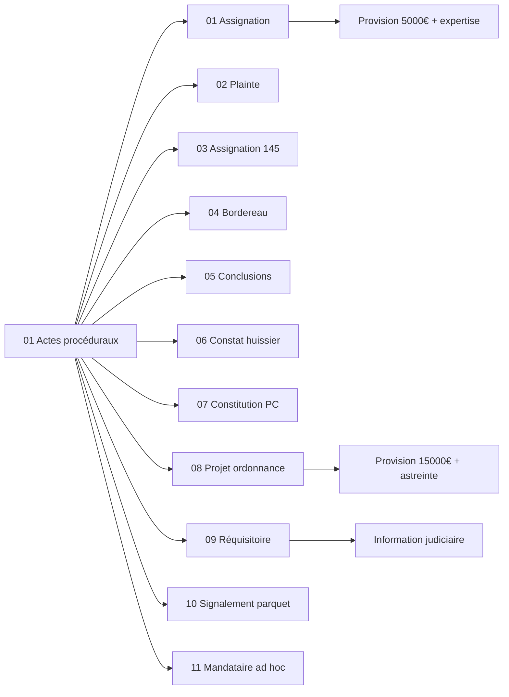

<!-- Breadcrumb -->
*[🏠](../../../README.md) › [📁 Actes](../../README.md) › [🎭 Token](../README.md) › ⚖️ Actes proceduraux*

<!-- /Breadcrumb -->

# ⚖️ Actes Procéduraux

**Ce dossier contient l'ensemble des actes juridiques destinés à être déposés au greffe du tribunal judiciaire.**  

Ces documents constituent le corps de la procédure en référé.

## 📋 Fichiers

- **[⚖️ Assignation Refere Provision](%E2%9A%96%EF%B8%8F%20Assignation%20Refere%20Provision.md)**
- **[🚔 Plainte Defaut Assurance RC](%F0%9F%9A%94%20Plainte%20Defaut%20Assurance%20RC.md)**
- **[📸 Requete Constat Huissier](%F0%9F%93%B8%20Requete%20Constat%20Huissier.md)**
- **[🛡️ Constitution Partie Civile](%F0%9F%9B%A1%EF%B8%8F%20Constitution%20Partie%20Civile.md)**
- **[🎯 Conclusions Refere Provision](%F0%9F%8E%AF%20Conclusions%20Refere%20Provision.md)**
- **[📑 Bordereau Unifie](%F0%9F%93%91%20Bordereau%20Unifie.md)**
- **[⚖️ Requisitoire introductif](%E2%9A%96%EF%B8%8F%20Requisitoire%20introductif.md)**
- **[🔍 Requete Article 145 CPC](%F0%9F%94%8D%20Requete%20Article%20145%20CPC.md)**
- **[⚖️ Projet Ordonnance Refere](%E2%9A%96%EF%B8%8F%20Projet%20Ordonnance%20Refere.md)**
- **[16 ⚠️ Signalement Parquet Fraud](16%20%E2%9A%A0%EF%B8%8F%20Signalement%20Parquet%20Fraud.md)**
- **[17 ⚖️ Requete Mandataire Ad Hoc](17%20%E2%9A%96%EF%B8%8F%20Requete%20Mandataire%20Ad%20Hoc.md)**
- **[MEMO_AUDIENCE_31072026](MEMO_AUDIENCE_31072026.md)**
## 🔗 Liens vers les versions réelles

> [⚖️ Actes/👤 Reel/⚖️ Actes proceduraux/README.md](../../%F0%9F%91%A4%20Reel/%E2%9A%96%EF%B8%8F%20Actes%20proceduraux/README.md)

## 📅 Échéances

- **Fin phase amiable** : 14 juillet 2026
- **Audience de référé** : Date non fixée (à planifier)
- **Expertise médicale** : 12 novembre 2026
- **Dépendances des actes** : Voir le [Graphe des Dépendances](../../../%F0%9F%A7%A0%20Memory/DEPENDANCES.md) pour ordonner les procédures.

## 🗺️ Arbre des actes (interactif)

