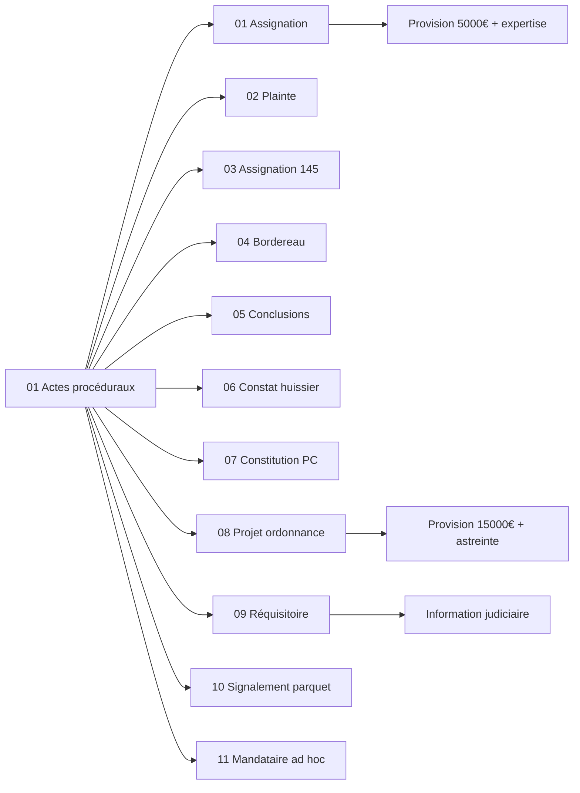

<!-- Breadcrumb -->
[🏠](../../../README.md) › [📁 Actes — Dossier Contentieux](../../README.md) › [🎭 Actes / token — Version Anonymisée](../README.md) › ⚖️ Actes proceduraux
<!-- /Breadcrumb -->

# ⚖️ Actes Procéduraux

**Ce dossier contient l'ensemble des actes juridiques destinés à être déposés au greffe du tribunal judiciaire.**  

Ces documents constituent le corps de la procédure en référé.

## 📋 Fichiers

- **[01 — Assignation - V1](01%20%E2%9A%96%EF%B8%8F%20Assignation.md)** — *Art. 835 CPC / Art. 1240 CC*   Assignation en référé-provision (5 000 €) + expertise médicale. Pièce maîtresse du dossier.

- **[02 — Plainte - V1](02%20%F0%9F%9A%94%20Plainte.md)** — *Art. L.113-2 C. assur.* — Plainte complémentaire pour défaut d'assurance RC. Victime agissant en qualité de client.

- **[03 — Assignation Art. 145 - V1](03%20%F0%9F%94%8D%20Assignation%20Article%20145.md)** — *Art. 145 CPC*   Référé pour communication forcée de la police d'assurance RC Pro, sous astreinte.

- **[04 — Bordereau de pièces unifié - V2](04%20%F0%9F%93%91%20Bordereau.md)** — *—* — Bordereau récapitulatif unifié (43 pièces, groupes A-G).

- **[05 — Conclusions Référé - V1](05%20%F0%9F%8E%AF%20Conclusions%20Refere.md)** — *Art. 835 CPC*   Conclusions détaillées pour l'audience du **Date non fixée (à planifier)**.

- **[06 — Requête Constat Huissier - V1](06%20%F0%9F%93%B8%20Requete%20Constat%20Huissier.md)** — *Art. 145 CPC* — Requête aux fins de constat d'huissier dans les locaux de l'exploitation.

- **[07 — Constitution Partie Civile - V1](02b%20%F0%9F%9B%A1%EF%B8%8F%20Constitution%20Partie%20Civile.md)** — *Art. 2 CPP / 222-19 CP* — Constitution de partie civile complémentaire : blessures involontaires + L.227-8/L.225-251 C.com. + condamnation in solidum SAS/Président/DG.

- **[08 — Projet Ordonnance Référé](07%20%E2%9A%96%EF%B8%8F%20Projet%20Ordonnance%20Refere.md)** — *Art. 835 al. 2 CPC / Art. 145 CPC*   Projet d'ordonnance de référé — provision 15 000 €, expertise médicale, communication assurance sous astreinte.

- **[09 — Réquisitoire introductif](15%20%E2%9A%96%EF%B8%8F%20R%C3%A9quisitoire%20introductif.md)** — *Art. 222-20 CP / Art. 223-1 CP / Art. 80 CPP*   Réquisitoire introductif — ouverture information judiciaire pour blessures involontaires et mise en danger.

- **[10 — Signalement Parquet Fraude](16%20%E2%9A%A0%EF%B8%8F%20Signalement%20Parquet%20Fraud.md)** — *Art. 40 CPP* — Signalement au Procureur de la République   fraude, dissimulation de preuves et obstruction à la justice.

- **[11 — Requête Mandataire Ad Hoc](17%20%E2%9A%96%EF%B8%8F%20Requete%20Mandataire%20Ad%20Hoc.md)** — *Art. L.611-3 C.com. / Art. L.227-8 C.com. / Art. 873 al. 2 CPC*   Requête désignation mandataire ad hoc + mesures conservatoires face à la disparition de la SAS.

## 🔗 Liens vers les versions réelles

> [⚖️ Actes/👤 Reel/⚖️ Actes proceduraux/README.md](..%2F..%2F👤%20Reel/%E2%9A%96%EF%B8%8F%20Actes%20proceduraux/README.md)

## 📅 Échéances

- **Fin phase amiable** : 14 juillet 2026
- **Audience de référé** : Date non fixée (à planifier)
- **Expertise médicale** : 12 novembre 2026

## 🗺️ Arbre des actes (interactif)

