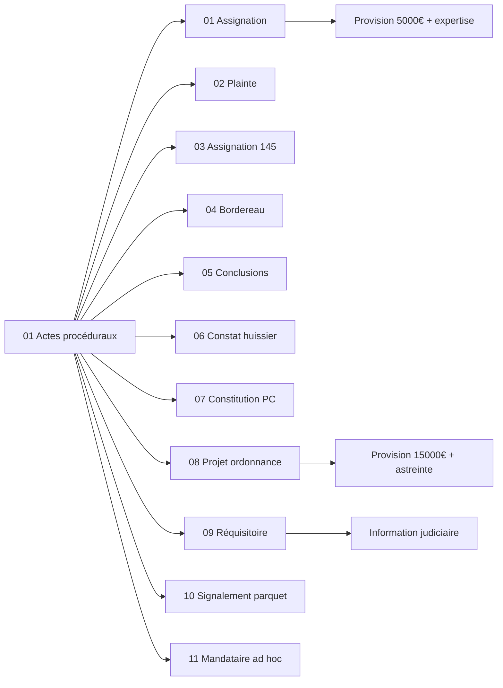

<!-- Breadcrumb -->
[🏠](../../../README.md) › [📁 Actes — Dossier Contentieux](../../README.md) › [🎭 Actes / token — Version Anonymisée](../README.md) › 01 ⚖️ Actes proceduraux
<!-- /Breadcrumb -->

# ⚖️ Actes Procéduraux

---

**Ce dossier contient l'ensemble des actes juridiques destinés à être déposés au greffe du tribunal judiciaire.**  
Ces documents constituent le corps de la procédure en référé.

## 📋 Fichiers

- **[01 — Assignation - V1](01 ⚖️ Assignation.md)** — *Art. 835 CPC / Art. 1240 CC* — Assignation en référé-provision (5 000 €) + expertise médicale. Pièce maîtresse du dossier.
- **[02 — Plainte - V1](02 🚔 Plainte.md)** — *Art. L.113-2 C. assur.* — Plainte complémentaire pour défaut d'assurance RC. Victime agissant en qualité de client.
- **[03 — Assignation Art. 145 - V1](03 🔍 Assignation Article 145.md)** — *Art. 145 CPC* — Référé pour communication forcée de la police d'assurance RC Pro, sous astreinte.
- **[04 — Bordereau de pièces unifié - V2](04 📑 Bordereau.md)** — *—* — Bordereau récapitulatif unifié (43 pièces, groupes A-G).
- **[05 — Conclusions Référé - V1](05 🎯 Conclusions Refere.md)** — *Art. 835 CPC* — Conclusions détaillées pour l'audience du **Date non fixée (à planifier)**.
- **[06 — Requête Constat Huissier - V1](06 📸 Requete Constat Huissier.md)** — *Art. 145 CPC* — Requête aux fins de constat d'huissier dans les locaux de l'exploitation.
- **[07 — Constitution Partie Civile - V1](02b 🛡️ Constitution Partie Civile.md)** — *Art. 2 CPP / 222-19 CP* — Constitution de partie civile complémentaire : blessures involontaires + L.227-8/L.225-251 C.com. + condamnation in solidum SAS/Président/DG.
- **[08 — Projet Ordonnance Référé](07 ⚖️ Projet Ordonnance Refere.md)** — *Art. 835 al. 2 CPC / Art. 145 CPC* — Projet d'ordonnance de référé — provision 15 000 €, expertise médicale, communication assurance sous astreinte.
- **[09 — Réquisitoire introductif](15 ⚖️ Réquisitoire introductif.md)** — *Art. 222-20 CP / Art. 223-1 CP / Art. 80 CPP* — Réquisitoire introductif — ouverture information judiciaire pour blessures involontaires et mise en danger.
- **[10 — Signalement Parquet Fraude](16 ⚠️ Signalement Parquet Fraud.md)** — *Art. 40 CPP* — Signalement au Procureur de la République — fraude, dissimulation de preuves et obstruction à la justice.
- **[11 — Requête Mandataire Ad Hoc](17 ⚖️ Requete Mandataire Ad Hoc.md)** — *Art. L.611-3 C.com. / Art. L.227-8 C.com. / Art. 873 al. 2 CPC* — Requête désignation mandataire ad hoc + mesures conservatoires face à la disparition de la SAS.

## 🔗 Liens vers les versions réelles

> [⚖️_Actes/👤_Reel/01_⚖️_Actes_proceduraux/README.md](⚖️_Actes/👤_Reel/01_⚖️_Actes_proceduraux/README.md)

## 📅 Échéances

- **Fin phase amiable** : 14 juillet 2026
- **Audience de référé** : Date non fixée (à planifier)
- **Expertise médicale** : 12 novembre 2026

## 🗺️ Arbre des actes (interactif)

