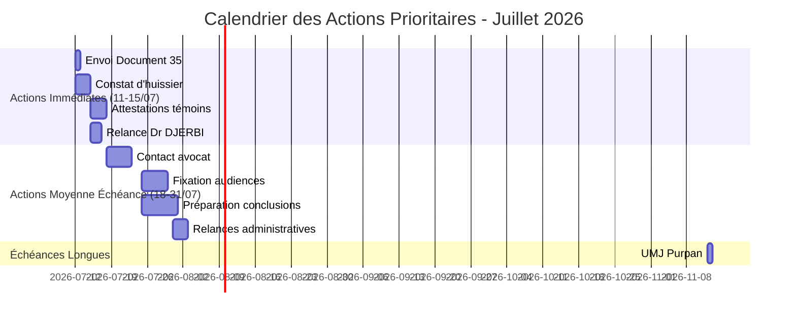

<!-- Breadcrumb -->
*[🏠](../README.md) › [📊 Rapports et Analyses](./README.md) › RAPPORT SYNTHESE DEMARCHES PRIORITAIRES 20260711*

<!-- /Breadcrumb -->

# RAPPORT DE SYNTHÈSE - Démarches Prioritaires à Entreprendre

**Date** : 11 juillet 2026
**Projet** : Accident Main - Dossier Sébastien GRAZIDE
**Objectif** : Analyser la situation actuelle et déterminer les actions prioritaires

---

## Sommaire

1. [Analyse de la Situation Actuelle](#1-analyse-de-la-situation-actuelle)
2. [Preuves de Mauvaise Volonté et Dissimulation](#2-preuves-de-mauvaise-volonté-et-dissimulation)
3. [Démarches Déjà Entreprises](#3-démarches-déjà-entreprises)
4. [Actions Prioritaires à Entreprendre](#4-actions-prioritaires-à-entreprendre)
5. [Stratégie pour le Déplacement à Foix](#5-stratégie-pour-le-déplacement-à-foix)
6. [Lettres Recommandées à Envoyer en Priorité](#6-lettres-recommandées-à-envoyer-en-priorité)
7. [Calendrier des Prochaines Étapes](#7-calendrier-des-prochaines-étapes)
8. [Recommandations Stratégiques](#8-recommandations-stratégiques)

---

## 1. Analyse de la Situation Actuelle

### Contexte de l'Accident
- **Date** : 29 mai 2026
- **Lieu** : Salon de coiffure "Les Mauvais Garçons" à Foix
- **Blessure** : Section nerveuse et tendineuse profonde de l'index droit (main dominante)
- **Conséquences** : Microchirurgie d'urgence, 56 jours d'ITT, récupération partielle sur 1 an
- **Impact professionnel** : Informaticien indépendant incapable d'utiliser sa main droite

### État de la Société Responsable
- **Nom** : SAS Les Mauvais Garçons
- **SIREN** : 938 033 222
- **Capital** : 200 € seulement (risque d'insolvabilité élevé)
- **Statut** : Toujours active selon RNE/INPI (dernière mise à jour 8 juillet 2026)
- **Problème** : Courriers recommandés retournés NPAI, pas de réponse des dirigeants

### Problèmes Identifiés
1. **Dissimulation de preuves** : Vidéosurveillance potentiellement effacée
2. **Société fantôme** : 0 salarié, local fermé mais toujours immatriculée
3. **Obstruction** : Refus de communiquer l'assurance RC
4. **Risque de disparition** : Capital minimal, dirigeants injoignables

---

## 2. Preuves de Mauvaise Volonté et Dissimulation

### Éléments Concrets de Dissimulation

1. **Courriers retournés NPAI** (29 juin 2026)
   - Mises en demeure envoyées aux dirigeants retournées "défaut d'adresse"
   - Pourtant la société est toujours officiellement à la même adresse
   - Le commerce a rouvert le 6 juillet 2026 sans explication

2. **Refus de communication**
   - Pas de réponse aux mises en demeure
   - Pas de communication de l'assurance RC (obligation légale)
   - Pas de coopération avec la victime

3. **Risque de destruction de preuves**
   - Vidéosurveillance non communiquée malgré la demande
   - Délai légal de 30 jours pour conservation potentiellement dépassé
   - Vasque cassée non sécurisée comme preuve matérielle

4. **Structure suspecte**
   - Capital social de 200 € (sous-capitalisation évidente)
   - 0 salarié déclaré
   - Comptes en défaut de publication
   - Risque de dissolution frauduleuse

### Fondements Juridiques pour la Responsabilité

- **Article 1242 al. 1 CC** : Responsabilité du fait des choses
- **Article 1242 al. 5 CC** : Responsabilité du commettant
- **Article L. 124-3 C. assurances** : Action directe contre l'assureur
- **Arrêt SATI (2003)** : Responsabilité personnelle des dirigeants
- **Article 145 CPC** : Mesures d'instruction in futurum

---

## 3. Démarches Déjà Entreprises

### Actions Administratives et Judiciaires

1. **Plainte pénale** (1er juin 2026)
   - PV n°2026/015967 déposé au commissariat de Foix
   - Constitution de partie civile
   - Transmission du dossier médical au Procureur

2. **Mises en demeure** (29 juin 2026)
   - Courriers LRAR envoyés à la SAS et ses dirigeants
   - Courriers retournés NPAI (preuve de l'obstruction)
   - Mise en demeure de communication de l'assurance RC

3. **Signalements administratifs**
   - URSSAF : Signalement de travail dissimulé
   - CODAF : Signalement de non-conformité ERP
   - Préfecture : Confirmation de signalement
   - Inspection du Travail : Demande d'enquête
   - INPI : Signalement au RNE

4. **Démarches médicales**
   - Dossier CPAM ouvert (recours contre tiers)
   - Suivi chirurgical et kinésithérapie
   - Certificats médicaux obtenus

### Documentation Existante

- **Preuves officielles** : PV police, CR opératoire, certificats médicaux
- **Actes procéduriers** : Assignation en référé, plainte, conclusions
- **Analyses juridiques** : Stratégie jurisprudentielle, responsabilités légales
- **Études d'indemnisation** : Évaluation Dintilhac (~92 000 €)
- **Organisation** : Plan d'action, calendrier procédural

---

## 4. Actions Prioritaires à Entreprendre

### 🔴 Actions Immédiates (11-15 juillet 2026)

#### 1. Envoi du Document n°35 - Preuves Complémentaires au TJ Foix

**Priorité absolue** - À envoyer **aujourd'hui 12 juillet 2026**

**Contenu** :
- Accusés de réception des courriers retournés NPAI
- Copie du PV n°2026/015967
- Extrait Kbis de la SAS
- Note d'audit RNE/INPI du 10 juillet 2026

**Objectif** : Établir officiellement l'obstruction de la SAS et renforcer le dossier judiciaire

**Actions requises** :
- Vérifier les pièces jointes (4 documents)
- Intégrer les références jurisprudentielles dans le courrier
- Générer la version réelle si nécessaire
- Envoyer par LRAR au Tribunal Judiciaire de Foix
- Consigner le n° LRAR dans STATUS.md et TODO.md

#### 2. Constat d'Huissier de Justice

**Priorité absolue** - À réaliser **avant le 15 juillet 2026**

**Objectifs** :
- Sécuriser l'état des lieux du salon
- Vérifier la vidéosurveillance (si encore disponible)
- Obtenir un procès-verbal officiel

**Actions requises** :
- Trouver un huissier spécialisé en constats (priorité absolue)
- Préparer la requête (document n°33 déjà prêt)
- Fixer rendez-vous pour constat sur place
- Obtenir le procès-verbal détaillé

**Budget estimé** : 300-500 €

#### 3. Obtention des Attestations de Témoins

**Priorité haute** - À finaliser **avant le 15 juillet 2026**

**Témoins à contacter** :
1. Client présent lors de l'accident
2. Pompier/SAMU intervenu
3. Employé du salon

**Actions requises** :
- Obtenir les coordonnées des 3 témoins
- Envoyer les attestations Cerfa (documents 22, 23, 24)
- Obtenir les signatures (électronique ou papier)
- Intégrer au dossier

#### 4. Relance du Dr DJERBI pour Certificat de Consolidation

**Priorité haute** - À envoyer **avant le 17 juillet 2026**

**Actions requises** :
- Obtenir email/téléphone du Dr DJERBI
- Envoyer la relance (document 25)
- Suivre la réponse et obtenir le certificat
- Intégrer au dossier médical

### 🟠 Actions Secondaires (18-31 juillet 2026)

#### 5. Contact avec un Avocat

**Priorité moyenne** - À finaliser **avant le 25 juillet 2026**

**Actions requises** :
- Rechercher un avocat spécialisé en droit des victimes
- Transmettre le dossier complet (y compris annexes jurisprudentielles)
- Finaliser les assignations avec intégration de la jurisprudence
- Préparer les conclusions pour les audiences

#### 6. Fixation des Dates d'Audience

**Priorité moyenne** - À finaliser **avant le 31 juillet 2026**

**Actions requises** :
- Contacter le greffe du TJ Foix
- Fixer l'audience référé-provision (Art. 835 CPC)
- Fixer l'audience Art. 145 CPC (communication assurance)
- Notifier les dates à toutes les parties

#### 7. Relances Administratives

**Priorité moyenne** - À finaliser **avant le 31 juillet 2026**

**Actions requises** :
- Relancer l'Inspection du Travail (si pas de réponse)
- Relancer le CODAF (si pas de réponse)
- Relancer l'URSSAF (si pas de réponse)
- Suivre le courrier à la Préfecture

#### 8. Préparation Stratégie FGTI/CIVI

**Priorité moyenne** - À finaliser **avant le 31 juillet 2026**

**Actions requises** :
- Finaliser le dossier CERFA n°16160*01
- Préparer la demande FGTI
- Rassembler les preuves d'absence d'assurance

---

## 5. Stratégie pour le Déplacement à Foix

### Préparation du Dossier à Présenter

**Documents à apporter** :
1. Copie du PV n°2026/015967
2. Accusés de réception des courriers retournés NPAI
3. Extrait Kbis de la SAS
4. Note d'audit RNE/INPI
5. Photos de l'accident et de la vasque cassée
6. Certificats médicaux
7. Liste des démarches entreprises
8. Copie des courriers envoyés

### Déposer une Plainte Complémentaire

**Éléments à inclure** :
1. **Obstruction à la justice** : Refus de communiquer l'assurance RC
2. **Dissimulation de preuves** : Vidéosurveillance non communiquée
3. **Société fantôme** : Courriers retournés NPAI malgré l'immatriculation
4. **Risque de disparition** : Capital de 200 € et 0 salarié
5. **Mauvaise volonté** : Pas de coopération malgré les mises en demeure

### Demander une Enquête Approfondie

1. **Vérification de l'établissement** : État actuel du salon
2. **Recherche des vidéos** : Vérification de la vidéosurveillance
3. **Identification des responsables** : Qui gère actuellement le salon ?
4. **Contrôle de conformité** : Respect des normes ERP
5. **Enquête financière** : Vérification de la solvabilité réelle

### Contacts à la Police de Foix

- **Commissariat de Police** : [Adresse à compléter]
- **Service des plaintes** : Demander à parler à l'officier en charge du PV n°2026/015967
- **Police municipale** : Pour contrôle ERP et conformité

### Checklist pour le Déplacement

- [ ] Dossier complet imprimé et classé
- [ ] Pièce d'identité + justificatif de domicile
- [ ] Copie de la plainte initiale
- [ ] Liste des documents à remettre
- [ ] Stylo et carnet pour notes
- [ ] Appareil photo pour documenter
- [ ] Liste des questions à poser

---

## 6. Lettres Recommandées à Envoyer en Priorité

### Lettres Déjà Prêtes à Envoyer

| # | Document | Destinataire | Priorité | Statut | Date Butoir |
|---|----------|--------------|----------|--------|-------------|
| 12 | Courrier URSSAF | URSSAF Ariège | Moyenne | À envoyer | 11/07/2026 |
| 14 | Courrier CODAF | CODAF Ariège | Moyenne | À envoyer | 11/07/2026 |
| 19 | Courrier FGTI | FGTI | Haute | À envoyer | 11/07/2026 |
| 35 | Courrier President TJ Foix | President TJ Foix | **Critique** | À envoyer | **12/07/2026** |

### Lettres à Préparer

| # | Document | Destinataire | Priorité | Statut |
|---|----------|--------------|----------|--------|
| 11 | Courrier INPI | INPI | Moyenne | À envoyer |
| 13 | Courrier Préfecture | Préfecture Ariège | Moyenne | À envoyer |
| 15 | Courrier SIE | SIE | Moyenne | À envoyer |
| 16 | Courrier Conseil Départemental | Conseil Départemental | Moyenne | À envoyer |
| 18 | Courrier SDIS | SDIS | Moyenne | À envoyer |
| 20 | Relance Police | Police Nationale | Haute | À envoyer |
| 21 | Relance CPAM | CPAM | Haute | À envoyer |

### Modèles de Lettres Disponibles

Tous les modèles sont disponibles dans :
- [⚖️ Actes/🔑 Token/✉️ Courriers](../../%E2%9A%96%EF%B8%8F%20Actes/%F0%9F%94%91%20Token/README.md) (versions anonymisées)
- [⚖️ Actes/👤 Reel/✉️ Courriers](../../%E2%9A%96%EF%B8%8F%20Actes/%F0%9F%94%91%20Token/README.md) (versions réelles)

### Procédure d'Envoi

1. **Vérifier le modèle** dans le dossier token
2. **Générer la version réelle** avec `generate_real_versions.py`
3. **Imprimer et signer** le document
4. **Préparer les pièces jointes** (selon checklist)
5. **Envoyer par LRAR** et noter le numéro de suivi
6. **Mettre à jour** le tableau de suivi ([fichier 23](../../%E2%9A%96%EF%B8%8F%20Actes/%F0%9F%94%91%20Token/%E2%9A%96%EF%B8%8F%20Actes%20proceduraux/%F0%9F%93%91%20Bordereau%20Unifie.md))

---

## 7. Calendrier des Prochaines Étapes

### Semaine 28 (11-15 juillet 2026)

- **12/07** : Envoi document 35 (priorité absolue)
- **12-14/07** : Recherche et mandat d'huissier
- **14-15/07** : Constat d'huissier réalisé
- **15/07** : Attestations témoins envoyées
- **15-17/07** : Relance Dr DJERBI

### Semaine 29 (18-22 juillet 2026)

- **18-22/07** : Recherche et contact avocat
- **22/07** : Transmission du dossier complet à l'avocat
- **22-25/07** : Finalisation des assignations

### Semaine 30-31 (25-31 juillet 2026)

- **25-28/07** : Fixation des dates d'audience
- **28-31/07** : Préparation des conclusions
- **31/07** : Relances administratives finalisées

### Août 2026

- **01-15/08** : Préparation finale avant audiences
- **15-31/08** : Participation aux audiences
- **31/08** : Évaluation des premières décisions

### Novembre 2026

- **12/11** : Expertise médicale UMJ Purpan (13h45)

---

## 8. Recommandations Stratégiques

### Stratégie Globale

1. **Multiplier les voies d'action** :
   - Civil (référé-provision, Art. 145 CPC)
   - Pénal (plainte, partie civile)
   - Administratif (mairie, préfecture, inspection)

2. **Sécuriser les preuves** :
   - Constat d'huissier urgent
   - Attestations de témoins
   - Certificat de consolidation

3. **Anticiper l'insolvabilité** :
   - Préparer le dossier FGTI/CIVI
   - Action directe contre l'assureur
   - Responsabilité personnelle des dirigeants

### Priorités Absolues

1. **Envoyer le document 35** avec les références jurisprudentielles
2. **Mandater un huissier** pour sécuriser les preuves matérielles
3. **Obtenir les attestations** de témoins
4. **Relancer le Dr DJERBI** pour le certificat de consolidation
5. **Contacter un avocat** pour professionnaliser la représentation

### Risques Principaux et Mitigations

| Risque | Sévérité | Mitigation |
|--------|-----------|------------|
| Disparition preuves matérielles | 🔴 5/5 | Constat d'huissier urgent |
| Insolvabilité SAS (200€ capital) | 🔴 5/5 | Stratégie FGTI/CIVI |
| Absence assurance RC | 🔴 4/5 | Art. 145 CPC + FGTI |
| Délais judiciaires longs | 🟠 3/5 | Multiplication des voies |
| Preuves testimoniales faibles | 🟠 3/5 | Obtention rapide attestations |

### Ressources Disponibles

- **Données juridiques** : 3.6 MB dans [📊 Rapports](../../%E2%9A%96%EF%B8%8F%20Actes/%F0%9F%94%91%20Token/README.md)
- **Références formatées** : `REFERENCES_MARKDOWN_20260710.json`
- **Décisions sélectionnées** : `DECISIONS_SELECTIONNEES_20260710.json`
- **Annexes jurisprudentielles** : `⚖️ Actes/📎 Annexes/` (3 décisions complètes)
- **Documentation MCP** : [📜 Lois/EXEMPLES_REQUETES_MCP.md](../../%F0%9F%93%9C%20Lois/EXEMPLES_REQUETES_MCP.md)

### Indicateurs de Succès

**Court Terme (15 juillet)** :
- ✅ Document 35 envoyé et accusé de réception obtenu
- ✅ Constat d'huissier réalisé et procès-verbal en main
- ✅ 3 attestations de témoins signées et intégrées
- ✅ Relance Dr DJERBI envoyée

**Moyen Terme (31 juillet)** :
- ✅ Avocat mandaté et assignations finalisées
- ✅ Dates d'audience fixées pour référé et Art. 145
- ✅ Conclusions préparées avec intégration jurisprudentielle
- ✅ Relances administratives effectuées

**Long Terme (31 août)** :
- ✅ Audiences tenues et premières décisions obtenues
- ✅ Expertise médicale lancée si ordonnance obtenue
- ✅ Stratégie adaptée en fonction des décisions
- ✅ Dossier FGTI/CIVI prêt si nécessaire

---

## Conclusion

La situation actuelle marque un tournant décisif dans le dossier. L'envoi de l'email n°34 à la mairie de Foix a clos la phase administrative pure et ouvert la phase judiciaire active. Le document n°35 (transmission de preuves au TJ Foix) est la pierre angulaire qui permettra de lancer officiellement les procédures judiciaires.

**L'intégration jurisprudentielle complète** constitue un atout majeur, renforçant significativement la solidité du dossier sur le plan juridique. Les trois décisions intégrées couvrent tous les aspects clés de l'affaire :

1. **Responsabilité professionnelle** (1965) - Fondement de la négligence
2. **Subrogation** (1994) - Mécanisme d'indemnisation
3. **Responsabilité des associés** (2012) - Extension aux dirigeants

**Priorités absolues pour les 5 prochains jours** :

1. **Envoyer le document 35** avec les références jurisprudentielles
2. **Mandater un huissier** pour sécuriser les preuves matérielles
3. **Obtenir les attestations** de témoins
4. **Relancer le Dr DJERBI** pour le certificat de consolidation
5. **Contacter un avocat** pour professionnaliser la représentation

**Risque principal** : La disparition des preuves matérielles et l'insolvabilité de la SAS. La stratégie mise en place (constat d'huissier urgent + FGTI/CIVI + intégration jurisprudentielle) permet de mitiger efficacement ces risques.

**Prochaine étape** : Après envoi du document 35 et réalisation du constat d'huissier, une révision complète du plan sera nécessaire pour adapter la stratégie en fonction des réactions du Tribunal Judiciaire et des résultats du constat.

**Statut final** : ✅ Phase administrative terminée | 🚀 Phase judiciaire active lancée | 📅 Prochaine révision: 15/07/2026