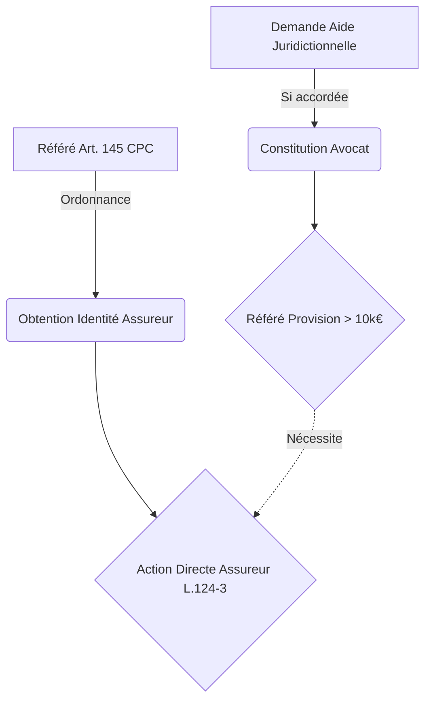

<!-- Breadcrumb -->
[🏠](../README.md)

<!-- /Breadcrumb -->

# Plan de continuité et gestion des dépendances procédurales

## I — INTRODUCTION

Le présent rapport a pour objet d'évaluer la résilience du dossier contentieux relatif à l'accident corporel survenu le 29 mai 2026 au sein des locaux de la société **[L'Exploitant du Commerce (La SAS)]**.

L'objectif est d'identifier de manière proactive les dépendances procédurales critiques, les points de défaillance unique (Single Points of Failure), et de structurer un plan de secours pour chaque scénario défavorable, tout en rappelant les délais légaux impératifs et les actions ne pouvant être déléguées par **[La Victime]**.

## II — CARTOGRAPHIE DES DÉPENDANCES CRITIQUES

La stratégie procédurale actuelle repose sur une imbrication d'actions juridiques. Il convient de clarifier la nature de ces dépendances.

### II.1 — L'Article 145 du CPC conditionne-t-il l'action directe ?

L'obtention de la police d'assurance responsabilité civile professionnelle via le référé probatoire de l'article 145 n'est **pas une condition légale** à l'exercice de l'action directe.

En effet, le droit d'action directe de la victime contre l'assureur du responsable est un droit propre, fondé sur l'article L. 124-3 du Code des assurances.

> « Le tiers lésé dispose d'un droit d'action directe à l'encontre de l'assureur garantissant la responsabilité civile de la personne responsable. »  
> **[Code des assurances > Article L124-3]**  
> [Article L124-3](https://www.legifrance.gouv.fr/codes/article_lc/LEGIARTI000017735449)

Cependant, en pratique, cette dépendance est **factuelle et opérationnelle**. Sans connaître l'identité de l'assureur ni les termes du contrat (plafonds, franchises, exclusions), l'action directe ne peut être matériellement dirigée. L'article 145 CPC (révélation forcée sous astreinte) est donc un prérequis tactique indispensable.

### II.2 — L'Aide Juridictionnelle (AJ) conditionne-t-elle le référé-provision ?

L'action en référé-provision devant le Tribunal Judiciaire, visant à obtenir une indemnité (évaluée à 15 000 € dans le dossier), est conditionnée par l'obligation de constituer avocat.

Les dispositions du Code de procédure civile imposent la représentation par avocat devant le tribunal judiciaire, sauf exception. Or, la demande dépassant 10 000 €, la constitution d'avocat est obligatoire.

> « Les parties sont, sauf disposition contraire, tenues de constituer avocat devant le tribunal judiciaire. »  
> **[Code de procédure civile > Article 760]**  
> [Article 760](https://www.legifrance.gouv.fr/codes/article_lc/LEGIARTI000039623478)

> « Les parties sont dispensées de constituer avocat dans les cas prévus par la loi ou le règlement et dans les cas suivants : [...] 3° A l'exclusion des matières relevant de la compétence exclusive du tribunal judiciaire, lorsque la demande porte sur un montant inférieur ou égal à 10 000 euros »  
> **[Code de procédure civile > Article 761]**  
> [Article 761](https://www.legifrance.gouv.fr/codes/article_lc/LEGIARTI000051869371)

En l'absence de ressources financières suffisantes de la part de **[La Victime]**, l'octroi de l'Aide Juridictionnelle (totale ou partielle) est donc une dépendance critique absolue pour pouvoir engager l'action en référé-provision.

### II.3 — Diagramme des dépendances

## III — POINTS DE DÉFAILLANCE UNIQUE ET SCÉNARIOS DE SECOURS

Le dossier s'expose à plusieurs points de défaillance unique. Pour chacun, un plan B doit être formellement prévu.

### III.1 — L'assureur reste introuvable ou inexistant

**Défaillance :** La SAS refuse de communiquer son assurance, même sous astreinte, ou bien il s'avère qu'elle n'était pas assurée.

**Plan de secours :**
1. Maintien de l'action directe contre **[L'Exploitant du Commerce (La SAS)]** sur ses fonds propres.
2. Si la SAS est insolvable (dépôt de bilan), saisine de la CIVI (Commission d'Indemnisation des Victimes d'Infractions) ou du SARVI, avec prise en charge par le FGTI, car les faits (blessures involontaires par manquement délibéré) constituent une infraction pénale réparable sous les conditions de l'article 706-3 du Code de procédure pénale.

> « Toute personne [...] ayant subi un préjudice résultant de faits volontaires ou non qui présentent le caractère matériel d'une infraction peut obtenir la réparation intégrale des dommages qui résultent des atteintes à la personne [...] »  
> **[Code de procédure pénale > Article 706-3]**  
> [Article 706-3](https://www.legifrance.gouv.fr/codes/article_lc/LEGIARTI000038312693)

### III.2 — L'Aide Juridictionnelle est refusée

**Défaillance :** Les revenus de **[La Victime]** dépassent les plafonds, rendant la prise en charge des frais d'avocat impossible pour agir au civil.

**Plan de secours :**
Privilégier exclusivement la **voie pénale** en se constituant partie civile. La constitution de partie civile devant la juridiction répressive permet de demander des dommages-intérêts (action civile greffée sur l'action publique) sans que l'assistance d'un avocat ne soit strictement obligatoire sous peine d'irrecevabilité, bien qu'elle reste vivement recommandée.

### III.3 — La SAS est dissoute ou liquidée

**Défaillance :** Les dirigeants de **[L'Exploitant du Commerce (La SAS)]** procèdent à une dissolution anticipée pour organiser leur insolvabilité.

**Plan de secours :**
La dissolution d'une société ne fait pas disparaître le droit d'action directe contre son assureur pour un sinistre survenu *pendant* la période de validité du contrat. L'action directe (L. 124-3 C. assur.) sera engagée directement contre la compagnie d'assurance de l'ex-SAS. À défaut d'assurance, recours au FGTI.

### III.4 — Les preuves vidéos sont détruites

**Défaillance :** Les vidéos de surveillance, sollicitées in extremis, ont été écrasées par le système.

**Plan de secours :**
Le fondement du droit commun de la responsabilité du fait des choses pallié à l'absence d'images. Le bac à shampoing (chose instrument du dommage) était sous la garde de l'employeur. Il suffira de produire le PV de police initial, les certificats médicaux initiaux et d'éventuelles attestations de témoins confirmant la chute dans l'établissement.

> « On est responsable non seulement du dommage que l'on cause par son propre fait, mais encore de celui qui est causé [...] par les choses que l'on a sous sa garde. »  
> **[Code civil > Article 1242]**  
> [Article 1242](https://www.legifrance.gouv.fr/codes/article_lc/LEGIARTI000032041559)

### III.5 — E. L'expertise UMJ est repoussée ou annulée

**Défaillance :** Le rendez-vous fixé au 12 novembre 2026 à Purpan n'a pas lieu.

**Plan de secours :**
- À titre conservatoire : solliciter un médecin-conseil de victimes indépendant pour établir une évaluation provisoire de DFP.
- Sur le plan procédural : intégrer la demande de désignation d'un expert judiciaire médical au sein de l'assignation en référé-provision, rendant l'expertise UMJ moins cruciale pour l'évaluation civile définitive.

## IV — DÉLAIS LÉGAUX IMPÉRATIFS (PRESCRIPTION)

Afin d'éviter la forclusion et la perte des droits d'action, les délais de prescription suivants sont opposables :

### IV.1 — Au civil : 10 ans

L'action en responsabilité pour dommage corporel se prescrit par dix ans à compter de la consolidation.

> « L'action en responsabilité née à raison d'un événement ayant entraîné un dommage corporel, engagée par la victime directe ou indirecte des préjudices qui en résultent, se prescrit par dix ans à compter de la date de la consolidation du dommage initial ou aggravé. »  
> **[Code civil > Article 2226]**  
> [Article 2226](https://www.legifrance.gouv.fr/codes/article_lc/LEGIARTI000019017259)

### IV.2 — Au pénal : 6 ans

L'infraction pénale pertinente en l'espèce est le délit de blessures involontaires. Le délai de prescription de l'action publique pour un délit est de six ans à compter du jour où l'infraction a été commise.

> « L'action publique des délits se prescrit par six années révolues à compter du jour où l'infraction a été commise. »  
> **[Code de procédure pénale > Article 8]**  
> [Article 8](https://www.legifrance.gouv.fr/codes/article_lc/LEGIARTI000049531911)

*(Note technique : bien que l'article 222-25 du Code pénal soit parfois cité à tort dans certaines documentations génériques relatives aux délais trentenaires, il concerne expressément le viol ayant entraîné la mort. Ce fondement est donc totalement inapplicable et écarté pour le présent dossier d'accident.)*

## V — GOULOTS D'ÉTRANGLEMENT HUMAINS (À NE JAMAIS OUBLIER)

Les actions suivantes reposent **exclusivement** sur des démarches que **[La Victime]** doit accomplir personnellement. Aucune automatisation ne peut s'y substituer.

- **Rendez-vous UMJ :** Se présenter impérativement au CHU Purpan (Toulouse) le **12 novembre 2026 à 13h45** muni du dossier médical complet.
- **Suivi de la demande d'Aide Juridictionnelle :** Compléter et adresser le dossier (CERFA n° 16146*03) au Bureau d'Aide Juridictionnelle (BAJ) du tribunal et répondre à leurs éventuelles demandes de pièces complémentaires.
- **Dépôt des plaintes/requêtes :** Tout dépôt de plainte complémentaire ou remise physique d'un document au greffe du Tribunal Judiciaire de Foix (comme prévu le 15 juillet 2026).
- **Relances médicales :** Obtenir le certificat de consolidation final auprès du chirurgien (Dr DJERBI) une fois l'état médical stabilisé.
- **Attestations de témoins :** Obtenir les signatures physiques (et copie des cartes d'identité) sur les formulaires CERFA des témoins (pompier, employé, etc.).
