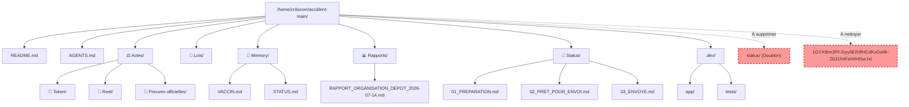

<!-- Breadcrumb -->
*[🏠](../README.md) › [📊 Rapports](./README.md) › RAPPORT_ORGANISATION_DEPOT_2026-07-14*

<!-- /Breadcrumb -->

# Audit de l'organisation et de la navigabilité du dépôt

Ce rapport présente l'audit de l'organisation, de la navigabilité et de la maintenabilité du dépôt `accident-main`, réalisé le 14 juillet 2026. L'objectif est d'identifier les écarts organisationnels par rapport aux règles du projet (notamment les conventions) et de proposer un plan d'action de remédiation.

## I — Arborescence et Propreté

L'analyse de l'arborescence à la racine et dans les sous-dossiers révèle plusieurs anomalies et écarts de propreté :

- **Fichiers orphelins à la racine** :
  - Le fichier `1GVXtbm3PFJcyybER9fHCdKxGa9k-Zb31fxtFshHHI5w.txt` est présent à la racine. Conformément à la Règle #13 de DECISIONS, la racine doit être propre et ne contenir que les fichiers essentiels (comme `README.md` et `AGENTS.md`).
- **Doublons structurels** :
  - Il existe deux dossiers concurrents pour le suivi des statuts : `status/` et `🚦 Status/`. Cette duplication engendre de la confusion. Le dossier canonique selon `README.md` est `🚦 Status/`.
- **Scripts et développement** :
  - L'organisation du dossier `.dev/` est globalement respectée (les scripts Python se trouvent dans `.dev/app/` et les tests dans `.dev/tests/`). L'outil `check_consistency.py` est bien placé et fonctionnel.

## II — Liens Internes et Navigabilité

La vérification de l'intégrité des liens relatifs a été effectuée à l'aide du script dédié :

- L'exécution de `python3 .dev/app/check_consistency.py` a retourné le résultat suivant :
  `=== VÉRIFICATION CROSS-DOCUMENT ===`
  `Rien à signaler — tout est cohérent.`
- **Conclusion** : La navigabilité inter-documents (Règle AGENTS #15/#17) est excellente. Tous les liens internes pointent correctement vers des cibles existantes.

## III — Conventions de Formatage

L'audit des conventions de formatage (règles strictes de `CONVENTIONS.md`) a mis en évidence plusieurs non-conformités :

- **Fils d'Ariane (Breadcrumbs) manquants** :
  - Plusieurs fichiers dans les répertoires `status/` et `📊 Rapports/` sont dépourvus du commentaire HTML `<!-- Breadcrumb -->`.
  - Exemples : `status/envoye.md`, `status/brouillon.md`, `status/final.md`, `status/preparation.md`, `status/projet.md`, `status/archive.md`.
  - Dans les rapports : `📊 Rapports/AUDIT_YAML_HEADERS.md`, `📊 Rapports/audit/20260713_audit_faits_canoniques.md`, `📊 Rapports/audit/20260713_RAPPORT_VERITE_LRAR.md`.
- **Absence des séparateurs de sections `

`** :
  - La convention exige un double séparateur `

` avant chaque section de premier niveau (H2).
  - Des manquements ont été détectés dans les fichiers suivants (versions Token et Reel) :
    - `⚖️ Actes/.../📚 Analyses juridiques/J+39 📜 Strategie Jurisprudentielle.md`
    - `⚖️ Actes/.../🗂️ Organisation/06 📋 Synthese des Actions et Audits.md`
    - `⚖️ Actes/.../🗂️ Organisation/J+38 📦 Bon Envoi Physique.md`
    - `⚖️ Actes/.../🗂️ Organisation/J+43 📊 Suivi Envois LRAR.md`
    - `⚖️ Actes/.../🗂️ Organisation/J+32 📅 Calendrier Procedure.md`
    - `⚖️ Actes/.../🗂️ Organisation/J+43 ✅ Checklist Envoi 11-07.md`
    - `⚖️ Actes/.../🗂️ Organisation/22 📋 Modif Email Maire Foix.md`

## IV — Index et Statuts

L'analyse de l'indexation et du suivi de statut met en évidence une incohérence majeure :

- **Conflit `status/` vs `🚦 Status/`** :
  - Le dépôt contient à la fois `status/` (avec des fichiers comme `brouillon.md`, `final.md`, `archive.md`) et `🚦 Status/` (avec `01_PREPARATION.md`, `02_PRET_POUR_ENVOI.md`, `03_ENVOYE.md`).
  - Le `README.md` à la racine référence explicitement `🚦 Status/`.
  - Le dossier `status/` n'est pas documenté officiellement et semble être un vestige ou un doublon.

## V — Plan d'action et Arborescence cible

Afin de restaurer la conformité stricte avec les règles du projet et d'améliorer la maintenabilité, voici les recommandations prioritaires :

### Liste priorisée des corrections

1. **Suppression ou Archivage du doublon `status/`** (Impact fort / Maintenance) :
   - Migrer toute information pertinente de `status/` vers `🚦 Status/`.
   - Supprimer le dossier `status/`.
2. **Nettoyage de la racine** (Impact moyen / Propreté) :
   - Déplacer ou supprimer le fichier `1GVXtbm3PFJcyybER9fHCdKxGa9k-Zb31fxtFshHHI5w.txt`.
3. **Mise en conformité du formatage - Breadcrumbs** (Impact moyen / Navigabilité) :
   - Ajouter les blocs de breadcrumb manquants dans les fichiers du dossier `📊 Rapports/audit/` et dans `📊 Rapports/AUDIT_YAML_HEADERS.md`.
4. **Mise en conformité du formatage - Séparateurs** (Impact faible / Conventions) :
   - Insérer les `

` manquants avant les balises `##` dans les fichiers listés en section III (notamment dans `⚖️ Actes/.../🗂️ Organisation/`).

### Arborescence cible recommandée

