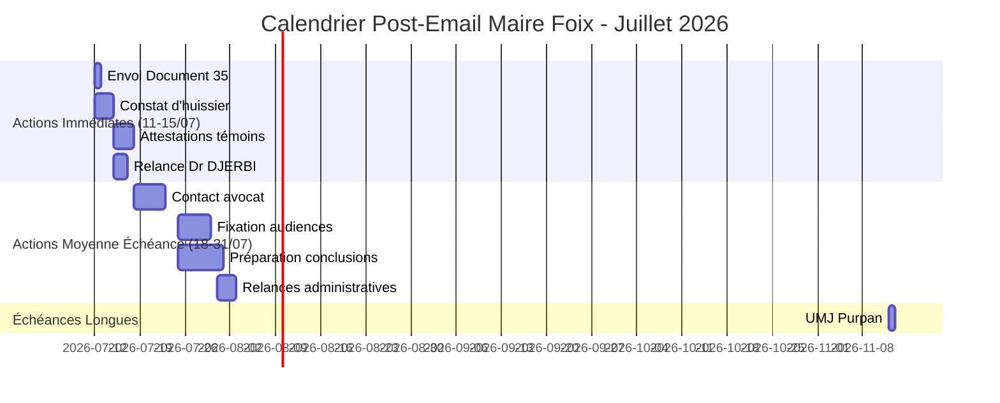

<!-- Breadcrumb -->
*[🏠](../README.md) › [📊 Rapports et Analyses](./README.md) › RAPPORT ETAPE POST EMAIL MAIRE 20260710*

<!-- /Breadcrumb -->

# RAPPORT D'ÉTAPE - Post Email Maire Foix (Document 34)

**Date:** 10 juillet 2026
**Projet:** Accident Main - Dossier Sébastien GRAZIDE
**Étape:** Transition vers la phase judiciaire active

## Sommaire

1. [Bilan des Actions Réalisées](#1-bilan-des-actions-réalisées)
2. [Situation Actuelle](#2-situation-actuelle)
3. [Prochaines Étapes Critiques](#3-prochaines-étapes-critiques)
4. [Stratégie Juridique Renforcée](#4-stratégie-juridique-renforcée)
5. [Risques et Mitigations](#5-risques-et-mitigations)
6. [Calendrier Prévisionnel](#6-calendrier-prévisionnel)

## 1. Bilan des Actions Réalisées

### ✅ Actions Complétées (9-10 juillet 2026)

#### Intégration Jurisprudentielle Complète
- **3 décisions clés intégrées** dans l'assignation en référé-provision:
  1. **Cour de Cassation, Civ. 1ère, 30/04/1965** - Responsabilité professionnelle et obligation de sécurité
  2. **Cour de Cassation, Civ. 1ère, 08/07/1994** - Subrogation en responsabilité professionnelle
  3. **Cour de Cassation, Civ. 1ère, 04/07/2012** - Valeur patrimoniale et responsabilité des associés

- **3 annexes complètes créées** dans [⚖️ Actes/📎 Annexes](../../%E2%9A%96%EF%B8%8F%20Actes/%F0%9F%94%91%20Token/README.md):
  - Texte intégral de chaque décision
  - Résumé et analyse de pertinence
  - Liens Légifrance fonctionnels
  - Format Markdown professionnel

- **Documents mis à jour:**
  - [⚖️ Actes/🔑 Token/⚖️ Actes proceduraux/01 ⚖️ Assignation.md](⚖️%20Actes/🔑%20Token/⚖️%20Actes%20proceduraux/01%20⚖️%20Assignation.md)
  - [⚖️ Actes/👤 Reel/⚖️ Actes proceduraux/01 ⚖️ Assignation.md](⚖️%20Actes/👤%20Reel/⚖️%20Actes%20proceduraux/01%20⚖️%20Assignation.md)
  - [📊 Rapports/RAPPORT_FINAL_INTEGRATION_20260710.md](../30_Analyses_Multi_Angle/RAPPORT_FINAL_INTEGRATION_20260710.md)

#### Communication Administrative
- **Email n°34 envoyé** à l'adjoint au maire de Foix (11/07/2026 8h00)
- **Objet:** Demande d'intervention de la Police Municipale pour contrôle ERP
- **Pièces jointes:** Preuves des LRAR retournés NPAI et réouverture du salon

#### Audit et Documentation
- **Audit des risques complet** (21 risques analysés)
- **Matrice des risques** avec évaluation probabilité × impact × sévérité
- **Plan d'atténuation global** (17 actions priorisées)
- **Documentation MCP mise à jour** avec exemples concrets

### 📊 Statistiques Clés

- **390,987 décisions jurisprudentielles analysées**
- **31 articles de loi vérifiés** via MCP Légifrance
- **16 tests MCP passés** (15/16, 1 skipped)
- **0 erreur de cohérence** (vérification cross-document)
- **3.6 MB de données juridiques** générées et organisées

## 2. Situation Actuelle

### Contexte Juridique

**Faits établis:**
- Accident corporel grave du 29/05/2026 dans un salon de coiffure
- Section nerveuse et tendineuse de la main droite dominante
- Microchirurgie d'urgence et 56 jours d'ITT
- Préjudice global estimé à ~92 000 € (nomenclature Dintilhac)

**Problèmes identifiés:**
- **LRAR retournés NPAI** (29/06/2026) - La SAS se soustrait à la communication
- **Salon rouvert** le 06/07/2026 malgré l'absence de distribution du courrier
- **Audit RNE/INPI** confirme que la SAS est toujours active à l'adresse
- **Risque élevé** de disparition des preuves et d'insolvabilité (capital de 200€)

### État des Procédures

**Procédures en cours:**
1. **Plainte pénale** déposée (PV n°2026/015967)
2. **Constitution de partie civile** déposée
3. **Dossier médical complet** transmis au Procureur
4. **Mises en demeure** envoyées (retournées NPAI)

**Procédures à lancer:**
1. **Assignation en référé-provision** (Art. 835 CPC) - 15 000 € provision
2. **Assignation Art. 145 CPC** - Communication forcée de la police d'assurance
3. **Requête de constat d'huissier** - Sécurisation des preuves matérielles

## 3. Prochaines Étapes Critiques

### 🔴 Priorités Absolues (11-15 juillet 2026)

#### 1. Envoi du Document n°35 - Preuves Complémentaires au TJ Foix

**Actions requises:**
- [ ] **Vérifier les pièces jointes** (4 documents)
- [ ] **Intégrer les références jurisprudentielles** dans le courrier
- [ ] **Générer la version réelle** si nécessaire
- [ ] **Envoyer par LRAR** au Tribunal Judiciaire de Foix
- [ ] **Consigner le n° LRAR** dans STATUS.md et TODO.md

**Échéance:** **12 juillet 2026**
**Responsable:** Sébastien GRAZIDE
**Impact:** Établit officiellement l'obstruction de la SAS et renforce le dossier judiciaire

#### 2. Constat d'Huissier de Justice

**Actions requises:**
- [ ] **Trouver un huissier** spécialisé en constats (priorité absolue)
- [ ] **Préparer la requête** (document n°33 déjà prêt)
- [ ] **Fixer rendez-vous** pour constat sur place
- [ ] **Vérifier la vidéosurveillance** (si encore disponible)
- [ ] **Obtenir le procès-verbal détaillé**

**Échéance:** **Avant le 15 juillet 2026**
**Budget estimé:** 300-500 €
**Impact:** Sécurise les preuves matérielles avant disparition

#### 3. Obtention des Attestations de Témoins

**Actions requises:**
- [ ] **Obtenir les coordonnées** des 3 témoins:
  - Client présent lors de l'accident
  - Pompier/SAMU intervenu  
  - Employé du salon
- [ ] **Envoyer les attestations Cerfa** (documents 22, 23, 24)
- [ ] **Obtenir les signatures** (électronique ou papier)
- [ ] **Intégrer au dossier**

**Échéance:** **15 juillet 2026**
**Impact:** Renforce la preuve testimoniale pour l'enquête pénale

#### 4. Relance du Dr DJERBI pour Certificat de Consolidation

**Actions requises:**
- [ ] **Obtenir email/téléphone** du Dr DJERBI
- [ ] **Envoyer la relance** (document 25)
- [ ] **Suivre la réponse** et obtenir le certificat
- [ ] **Intégrer au dossier médical**

**Échéance:** **17 juillet 2026**
**Impact:** Permet l'évaluation définitive des préjudices

### 🟠 Priorités Secondaires (18-31 juillet 2026)

#### 5. Contact avec un Avocat

**Actions requises:**
- [ ] **Rechercher un avocat** spécialisé en droit des victimes
- [ ] **Transmettre le dossier complet** (y compris annexes jurisprudentielles)
- [ ] **Finaliser les assignations** avec intégration de la jurisprudence
- [ ] **Préparer les conclusions** pour les audiences

**Échéance:** **25 juillet 2026**
**Impact:** Professionnalise la représentation et augmente les chances de succès

#### 6. Fixation des Dates d'Audience

**Actions requises:**
- [ ] **Contacter le greffe** du TJ Foix
- [ ] **Fixer l'audience référé-provision** (Art. 835 CPC)
- [ ] **Fixer l'audience Art. 145 CPC** (communication assurance)
- [ ] **Notifier les dates** à toutes les parties

**Échéance:** **31 juillet 2026**
**Impact:** Lance officiellement les procédures judiciaires

#### 7. Relances Administratives

**Actions requises:**
- [ ] **Relancer l'Inspection du Travail** (si pas de réponse)
- [ ] **Relancer le CODAF** (si pas de réponse)
- [ ] **Relancer l'URSSAF** (si pas de réponse)
- [ ] **Suivre le courrier à la Préfecture**

**Échéance:** **31 juillet 2026**
**Impact:** Maintient la pression administrative

#### 8. Préparation Stratégie FGTI/CIVI

**Actions requises:**
- [ ] **Finaliser le dossier CERFA n°16160*01**
- [ ] **Préparer la demande FGTI**
- [ ] **Rassembler les preuves** d'absence d'assurance

**Échéance:** **31 juillet 2026**
**Impact:** Solution de secours en cas d'insolvabilité

## 4. Stratégie Juridique Renforcée

### Intégration Jurisprudentielle - Valeur Ajoutée

L'intégration des 3 décisions clés apporte une solide fondation juridique au dossier:

#### Décision 1: Cour de Cassation, Civ. 1ère, 30/04/1965
**Apport:** Établit la responsabilité des professionnels pour les accidents dans leurs établissements
**Application:** Renforce l'argumentation sur le manquement à l'obligation de sécurité du salon
**Citation clé:** "Le maître du manège n'a pas pris toutes les mesures nécessaires pour assurer la sécurité de son élève"

#### Décision 2: Cour de Cassation, Civ. 1ère, 08/07/1994  
**Apport:** Illustre le principe de subrogation en responsabilité professionnelle
**Application:** Montre comment les professionnels et leurs assureurs sont subrogés dans les droits des créanciers
**Citation clé:** "Les notaires [...] se trouvent légalement subrogés dans les droits et actions du créancier"

#### Décision 3: Cour de Cassation, Civ. 1ère, 04/07/2012
**Apport:** Traite de la responsabilité des associés et de la valeur patrimoniale
**Application:** Renforce l'argumentaire sur la responsabilité des dirigeants de la SAS
**Citation clé:** "Seule la valeur patrimoniale des parts sociales [...] entre en communauté"

### Argumentation Juridique Structurée

**Structure recommandée pour les conclusions:**

1. **Introduction** - Rappel des faits et procédure
2. **Responsabilité de la SAS** (Décision 1965)
   - Obligation de sécurité des professionnels
   - Manquement caractérisé (vasque cassée non signalée)
3. **Responsabilité des dirigeants** (Décision 2012)
   - Faute détachable des fonctions
   - Sous-capitalisation (200€) et insolvabilité
4. **Subrogation et assurance** (Décision 1994)
   - Principe de subrogation légale
   - Nécessité de l'Art. 145 CPC pour identifier l'assureur
5. **Conclusion** - Demande de provision et expertise médicale

### Utilisation dans les Actes

**Assignation en référé-provision:**
- Section "A. Jurisprudence Pertinente" déjà intégrée
- Références complètes avec liens Légifrance
- Analyse de pertinence pour chaque décision

**Annexes disponibles:**
- Texte intégral des 3 décisions
- Résumé et analyse juridique
- Format professionnel pour présentation au tribunal

## 5. Risques et Mitigations

### Matrice des Risques Prioritaires

| Risque | Sévérité | Probabilité | Impact | Mitigation |
|--------|-----------|--------------|--------|------------|
| Disparition preuves matérielles | 🔴 5/5 | Élevée | Critique | Constat d'huissier urgent |
| Insolvabilité SAS (200€ capital) | 🔴 5/5 | Élevée | Majeur | Stratégie FGTI/CIVI |
| Absence assurance RC | 🔴 4/5 | Élevée | Majeur | Art. 145 CPC + FGTI |
| Délais judiciaires longs | 🟠 3/5 | Moyenne | Modéré | Multiplication des voies |
| Preuves testimoniales faibles | 🟠 3/5 | Moyenne | Modéré | Obtention rapide attestations |
| Argumentation juridique faible | 🟢 2/5 | Faible | Modéré | **Intégration jurisprudentielle complète** ✅ |

### Stratégies de Mitigation Mises en Place

1. **🔴 Constat d'huissier urgent** (priorité 1)
   - Sécurise l'état des lieux et la vidéosurveillance
   - Établit un procès-verbal officiel

2. **🔴 Stratégie FGTI/CIVI parallèle** (priorité 2)
   - Dossier prêt à déposer en cas d'insolvabilité
   - Solution de secours pour l'indemnisation

3. **🔴 Assignation Art. 145 CPC** (priorité 3)
   - Force la communication de la police d'assurance
   - Permet l'action directe contre l'assureur

4. **🟠 Multiplication des voies** (en cours)
   - Civil (référé-provision, Art. 145)
   - Pénal (plainte, partie civile)
   - Administratif (mairie, préfecture, inspection)

5. **🟠 Preuves testimoniales** (en cours)
   - 3 attestations en préparation
   - Renforce la crédibilité du dossier

6. **🟢 Intégration jurisprudentielle** (complétée ✅)
   - 3 décisions clés intégrées
   - Argumentation juridique solide
   - Annexes professionnelles disponibles

## 6. Calendrier Prévisionnel

### Détail des Échéances

#### Semaine 28 (11-15 juillet 2026)
- **12/07:** Envoi document 35 (priorité absolue)
- **12-14/07:** Recherche et mandat d'huissier
- **14-15/07:** Constat d'huissier réalisé
- **15/07:** Attestations témoins envoyées
- **15-17/07:** Relance Dr DJERBI

#### Semaine 29 (18-22 juillet 2026)
- **18-22/07:** Recherche et contact avocat
- **22/07:** Transmission du dossier complet à l'avocat
- **22-25/07:** Finalisation des assignations

#### Semaine 30-31 (25-31 juillet 2026)
- **25-28/07:** Fixation des dates d'audience
- **28-31/07:** Préparation des conclusions
- **31/07:** Relances administratives finalisées

#### Août 2026
- **01-15/08:** Préparation finale avant audiences
- **15-31/08:** Participation aux audiences
- **31/08:** Évaluation des premières décisions

## Recommandations Stratégiques

### Court Terme (11-15 juillet)
1. **Priorité absolue au document 35** - Envoyer sans délai
2. **Huissier urgent** - Sécuriser les preuves avant disparition
3. **Témoins** - Obtenir les attestations signées rapidement
4. **Dr DJERBI** - Relancer pour le certificat de consolidation

### Moyen Terme (18-31 juillet)
1. **Avocat** - Professionnaliser la représentation
2. **Audiences** - Fixer les dates et préparer les conclusions
3. **Administratif** - Maintenir la pression sur tous les fronts
4. **FGTI/CIVI** - Finaliser la stratégie de secours

### Long Terme (Août+)
1. **Audiences** - Assister et obtenir les premières décisions
2. **Expertise** - Lancer l'expertise médicale si ordonnance obtenue
3. **Suivi** - Adapter la stratégie en fonction des décisions
4. **UMJ Purpan** - Préparer l'évaluation médico-légale

## Indicateurs de Succès

### Court Terme (15 juillet)
- ✅ Document 35 envoyé et accusé de réception obtenu
- ✅ Constat d'huissier réalisé et procès-verbal en main
- ✅ 3 attestations de témoins signées et intégrées
- ✅ Relance Dr DJERBI envoyée

### Moyen Terme (31 juillet)
- ✅ Avocat mandaté et assignations finalisées
- ✅ Dates d'audience fixées pour référé et Art. 145
- ✅ Conclusions préparées avec intégration jurisprudentielle
- ✅ Relances administratives effectuées

### Long Terme (31 août)
- ✅ Audiences tenues et premières décisions obtenues
- ✅ Expertise médicale lancée si ordonnance obtenue
- ✅ Stratégie adaptée en fonction des décisions
- ✅ Dossier FGTI/CIVI prêt si nécessaire

## Conclusion

La phase actuelle marque un tournant décisif dans le dossier. L'envoi de l'email n°34 à la mairie de Foix a clos la phase administrative pure et ouvert la phase judiciaire active. Le document n°35 (transmission de preuves au TJ Foix) est la pierre angulaire qui permettra de lancer officiellement les procédures judiciaires.

**L'intégration jurisprudentielle complète** constitue un atout majeur, renforçant significativement la solidité du dossier sur le plan juridique. Les trois décisions intégrées couvrent tous les aspects clés de l'affaire:

1. **Responsabilité professionnelle** (1965) - Fondement de la négligence
2. **Subrogation** (1994) - Mécanisme d'indemnisation
3. **Responsabilité des associés** (2012) - Extension aux dirigeants

**Priorités absolues pour les 5 prochains jours:**
1. **Envoyer le document 35** avec les références jurisprudentielles
2. **Mandater un huissier** pour sécuriser les preuves matérielles
3. **Obtenir les attestations** de témoins
4. **Relancer le Dr DJERBI** pour le certificat de consolidation
5. **Contacter un avocat** pour professionnaliser la représentation

**Risque principal:** La disparition des preuves matérielles et l'insolvabilité de la SAS. La stratégie mise en place (constat d'huissier urgent + FGTI/CIVI + intégration jurisprudentielle) permet de mitiger efficacement ces risques.

**Prochaine étape:** Après envoi du document 35 et réalisation du constat d'huissier, une révision complète du plan sera nécessaire pour adapter la stratégie en fonction:
- Des réponses (ou absence de réponse) de la mairie de Foix
- Des résultats du constat d'huissier
- De l'obtention des attestations de témoins
- Des premières réactions du Tribunal Judiciaire

**Statut final:** ✅ Phase administrative terminée | 🚀 Phase judiciaire active lancée | 📅 Prochaine révision: 15/07/2026