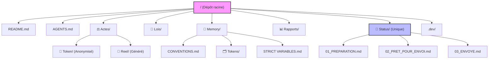

<!-- Breadcrumb -->
*[🏠](../README.md) › [📊 Rapports](README.md) › Audit Organisation Dépôt*

<!-- /Breadcrumb -->

# Audit de l'organisation et de la navigabilité du dépôt

## 1. Arborescence et Propreté

**Diagnostic de la racine et des dossiers de premier niveau :**
- L'arborescence globale reflète bien la séparation entre les actes (`⚖️ Actes/`), la mémoire institutionnelle (`🧠 Memory/`), les textes de loi (`📜 Lois/`), et le suivi (`🚦 Status/`, `📊 Rapports/`).
- Cependant, une redondance problématique a été détectée avec la présence d'un dossier `status/` en minuscule (contenant `envoye.md`, `brouillon.md`, etc.) coexistant avec le dossier officiel `🚦 Status/` (contenant `01_PREPARATION.md`, `02_PRET_POUR_ENVOI.md`, etc.). Le dossier `status/` en minuscule semble être un résidu orphelin non documenté.

**Fichiers à la racine :**
- Outre les fichiers attendus (`README.md`, `AGENTS.md`, `setup.sh`), on note la présence d'un fichier indésirable : `1GVXtbm3PFJcyybER9fHCdKxGa9k-Zb31fxtFshHHI5w.txt`. Ce type de fichier (possiblement une validation Google Search Console ou un résidu de test) encombre la racine.

**Scripts et artefacts :**
- Le répertoire de cache Python `./.dev/app/__pycache__` est présent. Bien qu'il soit ignoré par git (selon `.gitignore`), son existence souligne la nécessité de nettoyer les artefacts résiduels si non souhaités. Aucun script orphelin en dehors de `.dev` n'a été constaté (les scripts de test créés pour cet audit sont exclus).

## 2. Navigabilité et Liens Internes

**Vérification de cohérence (Script `check_consistency.py`) :**
- Le passage du script officiel `.dev/app/check_consistency.py` retourne `0 erreur` ("Rien à signaler — tout est cohérent.").
- Les liens relatifs au sein de la documentation principale (fichiers `README.md`, index et actes pointés) sont tous fonctionnels, assurant une navigabilité optimale sans lien mort (Conformité Règle AGENTS #15/#17).

## 3. Conformité des Breadcrumbs et Front Matter YAML

L'audit révèle des défaillances systématiques sur l'application des règles YAML et des breadcrumbs HTML (Règle #14, `CONVENTIONS.md`), en particulier dans l'arborescence des sous-répertoires `README.md` générés.

- **Absence de Front Matter YAML (`---`)** sur 22 fichiers (principalement les `README.md` de sous-dossiers dans `⚖️ Actes/👤 Reel/` et le dossier orphelin `status/`).
- **Absence de Breadcrumb HTML** sur 26 fichiers, rompant le fil d'Ariane pour l'utilisateur.

*Exemples de répertoires impactés :*
- `⚖️ Actes/👤 Reel/✉️ Courriers/📋 Attestations/README.md`
- `⚖️ Actes/👤 Reel/🗄️ Archives/README.md`
- `status/envoye.md`

## 4. Index, Statuts et doubles strates

- **Dossiers de Statuts** : Comme mentionné, l'existence conjointe de `🚦 Status/` et de `status/` génère de la confusion. Le `🧠 Memory/STATUS.md` et `TODO.md` pointent vers `🚦 Status/`, rendant `status/` obsolète.
- **Double strate (Token / Reel)** : L'arborescence dans `⚖️ Actes/🔑 Token/` et `⚖️ Actes/👤 Reel/` est symétrique. Toutefois, les index (`README.md`) de la partie `Reel` accusent un retard dans le respect des conventions (YAML et Breadcrumb manquants).

## 5. Séparateurs et Conventions de Formatage

- L'audit met en lumière que de très nombreux fichiers (322 fichiers) ne possèdent pas la balise `

` avant les sections de premier niveau, contrairement aux exigences stipulées dans `CONVENTIONS.md`.
- Cette anomalie inclut une grande majorité des actes et des fiches de la bibliothèque `📜 Lois/`.

## 6. Liste Priorisée des Corrections et Recommandations

Voici les recommandations d'amélioration, classées par ordre de priorité :

1. **Suppression du dossier orphelin `status/`**
   - *Impact* : Élimine la duplication avec `🚦 Status/` et clarifie le statut des documents.
2. **Nettoyage de la racine**
   - *Impact* : Supprimer le fichier `1GVXtbm3PFJcyybER9fHCdKxGa9k-Zb31fxtFshHHI5w.txt` pour garder une racine propre.
3. **Mise à jour des fichiers README.md (`👤 Reel` et sous-dossiers)**
   - *Impact* : Restaure la navigabilité. Ajouter le front matter YAML et le breadcrumb HTML manquants sur la vingtaine de fichiers identifiés.
4. **Application globale de la convention `

`**
   - *Impact* : Homogénéisation du formatage (relancer le script `.dev/app/normalize_sections.py` s'il existe et vérifier sa couverture, ou adapter les scripts d'hygiène).

## 7. Diagramme Mermaid de l'Arborescence Cible

Voici la proposition d'arborescence nettoyée et optimale :

