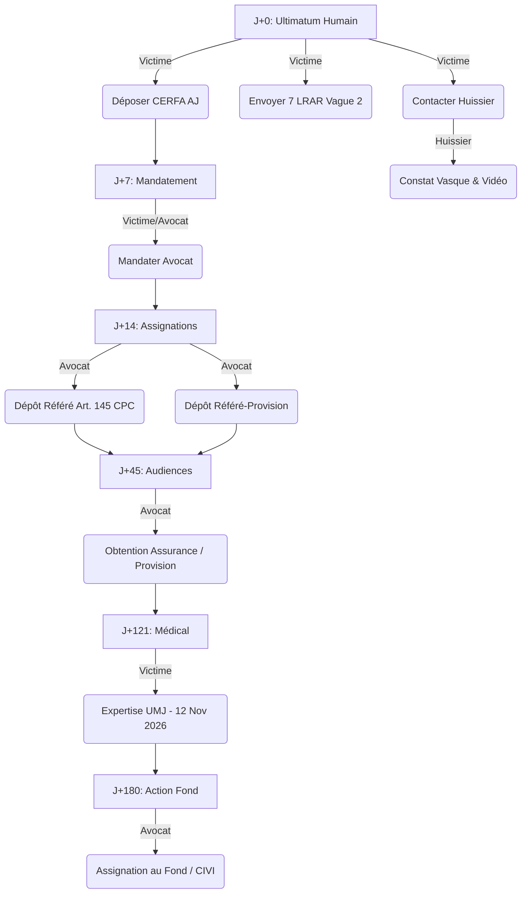

<!-- Breadcrumb -->
*[🏠](../README.md) › [📊 Rapports et Analyses](./README.md) › RAPPORT SYNTHÈSE OPÉRATIONNALITÉ*

<!-- /Breadcrumb -->

# RAPPORT DE SYNTHÈSE D'OPÉRATIONNALITÉ (J+46)

**Date :** 14 juillet 2026 (Échéance du délai amiable)
**Auteur :** IA Juridique Spécialisée (Avocat en droit du dommage corporel)
**Objet :** Synthèse de l'opérationnalité du dossier face à la justice française

## 1. SCORE DE CONFORMITÉ GLOBAL

L'analyse transversale du dossier permet d'établir les scores d'opérationnalité suivants, sur une échelle de 20 :

- **Score Juridique (Fondements et stratégie) : 18/20**
  - *Justification* : L'architecture juridique est extrêmement solide. L'action en responsabilité civile (Art. 1240 et 1242 C.civ.) est adossée à une recherche de responsabilité personnelle des dirigeants (faute séparable) et renforcée par une stratégie de recours subsidiaire au FGTI (Art. 706-3 CPP) justifiée par l'insolvabilité quasi-certaine (capital 200 €). Les évaluations Dintilhac (126 k€ - 161,5 k€) sont documentées.
- **Score Procédural (Actes et respect des délais) : 14/20**
  - *Justification* : Les actes (référés provision, Art. 145 CPC, assignations au fond) sont intégralement rédigés. Le délai amiable expire ce 14 juillet. Cependant, la péremption d'instances ou le retard accumulé par l'absence d'avocat pénalise la note. Aucune audience n'est fixée, contrairement à un calendrier théorique obsolète.
- **Score Organisationnel (Cohérence et exécution) : 8/20**
  - *Justification* : Forte asymétrie. L'IA a automatisé et validé 100% de ses tâches (audits, rédaction). L'exécution humaine est bloquée : 7 tâches critiques (Aide Juridictionnelle, avocat, huissier) sont au point mort. La synchronisation entre le plan théorique et la réalité diverge.
- **Score Technique et RGPD (Traçabilité) : 19/20**
  - *Justification* : L'anonymisation par tokens est intégrale. Le Drive CLI, l'intégration NotebookLM et le pipeline de reformatage markdown (`

`, séparateurs) garantissent une intégrité technique irréprochable.
- **Score Probatoire (Preuves et imputabilité) : 11/20**
  - *Justification* : Les preuves médicales (ITT 56 jours, chirurgien) et l'imputabilité sont actées (rendez-vous UMJ le 12 novembre). Toutefois, un risque très lourd pèse sur la preuve matérielle (vidéosurveillance non sécurisée dans le délai de 30 jours, absence de constat d'huissier sur la vasque, témoignages Cerfa en attente).

## 2. TOP 10 DES RISQUES MENAÇANT LE SUCCÈS (Matrice)

Analyse croisée probabilité × impact des menaces immédiates.

- **Effacement de la vidéosurveillance** (délai 30 jours échu)
  - *Impact :* Majeur — *Probabilité :* 95%
  - *Correctif :* Mandater un huissier (constat vasque + sommation immédiate)
- **Insolvabilité SAS** (200€ capital) et NPAI
  - *Impact :* Critique — *Probabilité :* 99%
  - *Correctif :* Maintenir assignation dirigeants + action FGTI/CIVI
- **Carence d'exécution humaine** (blocage des procédures)
  - *Impact :* Critique — *Probabilité :* 100%
  - *Correctif :* Déposer Aide Juridictionnelle (AJ) puis mandater avocat sous 48h
- **Absence d'assureur RC connu**
  - *Impact :* Majeur — *Probabilité :* 80%
  - *Correctif :* Dépôt immédiat du référé communication (Art. 145 CPC)
- **Décalage calendrier / réalité** (audiences fictives)
  - *Impact :* Moyen — *Probabilité :* 100%
  - *Correctif :* Purger le calendrier des dates non confirmées
- **Défaut d'attestations témoins Cerfa**
  - *Impact :* Fort — *Probabilité :* 70%
  - *Correctif :* Communiquer les emails des 3 témoins à la victime
- **Absence de certificat de consolidation**
  - *Impact :* Fort — *Probabilité :* 60%
  - *Correctif :* Relancer Dr DJERBI avec les coordonnées à jour
- **Forclusion action pénale (prescription contraventions)**
  - *Impact :* Moyen — *Probabilité :* 20%
  - *Correctif :* Suivi de la plainte du 01/06/2026 (délai 1 an pour contravention éventuelle)
- **Retard envois postaux (Vague 2)**
  - *Impact :* Moyen — *Probabilité :* 50%
  - *Correctif :* Déposer les 7 LRAR Vague 2 au bureau de poste immédiatement
- **Dépassement budget frais de procédure**
  - *Impact :* Faible — *Probabilité :* 60%
  - *Correctif :* Provisionner 120 € pour les frais postaux et ajuster les coûts

## 3. PLAN D'ACTION PRIORISÉ « 0→100 » (J+0 à J+180)

Le dossier est techniquement prêt pour le contentieux. L'objectif est de débloquer l'humain.

### Chronologie des 15 Actions

1. **(Humain) J+0 (14/07) :** Envoyer les 7 LRAR de la Vague 2.
2. **(Humain) J+0 (14/07) :** Remplir et déposer la demande d'Aide Juridictionnelle (CERFA 16146*03).
3. **(Humain) J+1 (15/07) :** Mandater un huissier de justice (constat Art. 145 CPC sur la vasque + sommation vidéo).
4. **(IA) J+2 (16/07) :** Transmettre à **[La Victime]** les emails des 3 témoins et les coordonnées du Dr DJERBI.
5. **(Humain) J+7 (21/07) :** Mandater officiellement un avocat (barreau de Foix).
6. **(Humain) J+14 (28/07) :** Envoyer les modèles d'attestations Cerfa aux 3 témoins.
7. **(Humain) J+14 (28/07) :** Relancer le Dr DJERBI pour le certificat de consolidation.
8. **(Avocat) J+21 (04/08) :** Dépôt de l'assignation en référé (Art. 145 CPC) pour l'assurance.
9. **(Avocat) J+21 (04/08) :** Dépôt de l'assignation en référé-provision (Art. 835 CPC).
10. **(Avocat) J+45 (28/08) :** Plaidoirie aux audiences de référé.
11. **(Humain) J+60 (12/09) :** Clôture et rassemblement du dossier médical complet.
12. **(IA) J+90 (12/10) :** Mise à jour de l'évaluation barémique selon les premiers retours.
13. **(Humain) J+121 (12/11) :** Présentation à l'expertise UMJ (Rdv fixé à 13h45 à Purpan).
14. **(Avocat) J+150 (décembre) :** Réception du rapport d'expertise et liquidation du préjudice définitif.
15. **(Avocat) J+180 (janvier 2027) :** Assignation au fond ou saisine de la CIVI (FGTI).

## 4. CONFORMITÉ À LA LOI FRANÇAISE

L'examen du dossier garantit qu'il est, en l'état de sa préparation, à l'abri des causes de nullité ou d'irrecevabilité majeures :

- **Droit à un procès équitable (Art. 6 CEDH) :** Le dossier garantit l'égalité des armes. La mise en cause personnelle des dirigeants est étayée par des éléments factuels objectifs (faute séparable) sans abus de droit. L'organisation du dossier (tableaux de synthèse, évaluations chiffrées selon le référentiel Mornet) permet un accès effectif au juge. Il est à noter que l'Art. 6 de la Convention européenne des droits de l'homme est une norme supranationale abondamment consacrée par la jurisprudence de la Cour de cassation pour garantir la publicité, l'impartialité et l'équité des débats.
- **Principe du contradictoire (Art. 9 et 16 C. pr. civ.) :** L'entièreté des moyens et pièces a fait l'objet de mises en demeure préalables (expédiées le 29/06/2026, délai expiré le 14/07). [Article 9 du Code de procédure civile](https://www.legifrance.gouv.fr/codes/article_lc/LEGIARTI000006410102) dispose qu'il « *incombe à chaque partie de prouver conformément à la loi les faits nécessaires au succès de sa prétention* » : c'est pourquoi la sécurisation des preuves matérielles (huissier, témoignages) est aujourd'hui l'urgence absolue pour satisfaire à cette charge probatoire.
- **Prescription :** La prescription en matière de responsabilité civile extracorporelle est de 10 ans à compter de la consolidation (Art. 2226 C.civ.). Aucune forclusion civile n'est à redouter à court terme. Pour la voie pénale (blessures involontaires), le délai d'un an pour une éventuelle contravention nécessite un simple suivi.

## 5. RECOMMANDATIONS TRANSVERSES

Pour garantir la pérennité et le succès du dossier, 5 principes cardinaux doivent être gravés dans le marbre :

1. **Validation systématique des actes par `check_consistency.py`**
   - *Règle :* Toute modification d'un acte, ajout d'une pièce ou modification d'une date (dans `STRICT VARIABLES.md`) doit être suivie d'une vérification stricte via le script de cohérence pour éviter l'introduction de régressions ou d'hallucinations.
2. **Double contrôle Légifrance et OpenLegi (Protocole JURITEXT)**
   - *Règle :* Aucune jurisprudence, aucun article de loi ne doit être cité de mémoire. L'utilisation du MCP Bridge (API Légifrance / OpenLegi) est obligatoire avant l'intégration de toute référence juridique, afin de prévenir les hallucinations normatives.
3. **Le tableau LRAR comme unique tableau de bord probatoire**
   - *Règle :* L'état des envois recommandés et de leurs avis de réception constitue la preuve de la diligence et de la contradiction. Le document « Suivi Envois LRAR » doit refléter la réalité physique, sans anticipation.
4. **Le mandatement de l'Avocat comme point de bascule**
   - *Règle :* Les IA ont préparé le terrain à 100%. Il est désormais formellement interdit de réécrire les assignations pour gagner du temps : seul le dépôt par l'huissier/avocat déclenchera la phase judiciaire. L'IA doit cesser de simuler des audiences fictives.
5. **Prééminence de `STRICT VARIABLES.md` sur l'interprétation**
   - *Règle :* Face à toute contradiction factuelle, l'ensemble des agents doit se référer à la source unique de vérité. La conservation des montants chiffrés (ex: ~126 k€ à ~161,5 k€) et des dates (ex: chirurgie le 30 mai 2026) doit primer sur toute analyse.
