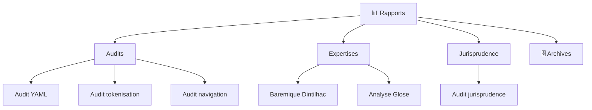

<!-- Breadcrumb -->
[🏠](../README.md) › 📊 Rapports
<!-- /Breadcrumb -->

# 📊 Rapports et Analyses

Ce dossier contient tous les rapports générés, analyses et documents de suivi du projet.

## 🗺️ Cartographie rapports (interactif)

### 🗄️ Archives/
- Rapports historiques et versions précédentes
- Organisés par date et type

### audit/
- Rapports d'audit technique
- Vérifications de conformité

### jules/
- Rapports générés par l'agent Jules
- Recommandations et analyses automatisées

## 📋 Types de Rapports

- **RAPPORT_AUDIT_*.md** - Audits techniques complets
- **RAPPORT_ORGANISATION_*.md** - Organisation et structure
- **RAPPORT_JURIDIQUE_*.md** - Analyses juridiques

- **[20260708_Rapport_Baremique_Dintilhac](20260708_Rapport_Baremique_Dintilhac.md)**
- **[PLAN_CORRECTION_HERMES_20260711](PLAN_CORRECTION_HERMES_20260711.md)**
- **[RAPPORT_AUDIT_CALENDRIER](RAPPORT_AUDIT_CALENDRIER.md)**
- **[RAPPORT_AUDIT_CHECKLIST](RAPPORT_AUDIT_CHECKLIST.md)**
- **[RAPPORT_AUDIT_COMPLETUDE_LOIS_20260711](RAPPORT_AUDIT_COMPLETUDE_LOIS_20260711.md)**
- **[RAPPORT_AUDIT_COMPLET_20260711](RAPPORT_AUDIT_COMPLET_20260711.md)**
- **[RAPPORT_AUDIT_COURRIERS](RAPPORT_AUDIT_COURRIERS.md)**
- **[RAPPORT_AUDIT_FGTI_DINTILHAC](RAPPORT_AUDIT_FGTI_DINTILHAC.md)**
- **[RAPPORT_AUDIT_GITHUB](RAPPORT_AUDIT_GITHUB.md)**
- **[RAPPORT_AUDIT_HERMES_20260711](RAPPORT_AUDIT_HERMES_20260711.md)**
- **[RAPPORT_AUDIT_JURIDIQUE](RAPPORT_AUDIT_JURIDIQUE.md)**
- **[RAPPORT_AUDIT_PJ](RAPPORT_AUDIT_PJ.md)**
- **[RAPPORT_AUDIT_PLAN_ACTION](RAPPORT_AUDIT_PLAN_ACTION.md)**
- **[RAPPORT_AUDIT_PRIORITES](RAPPORT_AUDIT_PRIORITES.md)**
- **[RAPPORT_AUDIT_REDACTION](RAPPORT_AUDIT_REDACTION.md)**
- **[RAPPORT_AUDIT_REORGANISATION_PREUVES_20260711](RAPPORT_AUDIT_REORGANISATION_PREUVES_20260711.md)**
- **[RAPPORT_AUDIT_RISQUES](RAPPORT_AUDIT_RISQUES.md)**
- **[RAPPORT_AUDIT_STRATEGIQUE](RAPPORT_AUDIT_STRATEGIQUE.md)**
- **[RAPPORT_AUDIT_STRUCTURE](RAPPORT_AUDIT_STRUCTURE.md)**
- **[RAPPORT_AUDIT_TOKENISATION](RAPPORT_AUDIT_TOKENISATION.md)**
- **[RAPPORT_CORRECTIONS_20260711](RAPPORT_CORRECTIONS_20260711.md)**
- **[RAPPORT_CORRECTION_BREADCRUMBS_20260711](RAPPORT_CORRECTION_BREADCRUMBS_20260711.md)**
- **[RAPPORT_CORRECTION_STRUCTURE_LOIS_20260711](RAPPORT_CORRECTION_STRUCTURE_LOIS_20260711.md)**
- **[RAPPORT_DOCUMENTATION_NOUVEAU_DOSSIER_20260711](RAPPORT_DOCUMENTATION_NOUVEAU_DOSSIER_20260711.md)**
- **[RAPPORT_ETAPE_POST_EMAIL_MAIRE_20260710](RAPPORT_ETAPE_POST_EMAIL_MAIRE_20260710.md)**
- **[RAPPORT_FINAL_INTEGRATION_20260710](RAPPORT_FINAL_INTEGRATION_20260710.md)**
- **[RAPPORT_MEI_README_20260710](RAPPORT_MEI_README_20260710.md)**
- **[RAPPORT_NAVIGATION_INTERACTIVE_20260711](RAPPORT_NAVIGATION_INTERACTIVE_20260711.md)**
- **[RAPPORT_PREPARATION_PLAINTE_COMPLEMENTAIRE_20260711](RAPPORT_PREPARATION_PLAINTE_COMPLEMENTAIRE_20260711.md)**
- **[RAPPORT_STABILISATION_GIT_20260711](RAPPORT_STABILISATION_GIT_20260711.md)**
- **[RAPPORT_SYNTHESE_DEMARCHES_PRIORITAIRES_20260711](RAPPORT_SYNTHESE_DEMARCHES_PRIORITAIRES_20260711.md)**
- **[RAPPORT_SYNTHESE_GLOBALE](RAPPORT_SYNTHESE_GLOBALE.md)**
- **[RAPPORT_SYNTHESE_RECHERCHES_20260710](RAPPORT_SYNTHESE_RECHERCHES_20260710.md)**
- **[RAPPORT_VALIDATION_URLS_20260711](RAPPORT_VALIDATION_URLS_20260711.md)**
- **[note_frais_estimative](note_frais_estimative.md)**
- **[pv_constat_virtuel](pv_constat_virtuel.md)**
- **[recommandations_urgentes](recommandations_urgentes.md)**
- **[PROMPT_COMPLETION_FICHES_LOIS_20260711](PROMPT_COMPLETION_FICHES_LOIS_20260711.md)**
- **[RAPPORT_NAVIGATION_CITATIONS_20260711](RAPPORT_NAVIGATION_CITATIONS_20260711.md)**