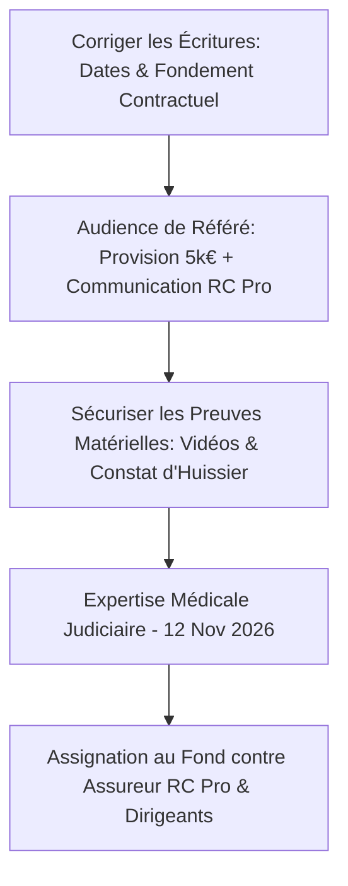

<!-- Breadcrumb -->
[🏠](../../../README.md) › [📊 Rapports et Analyses](../../README.md) › [📁 🗄️ Archives](../README.md) › [📁 audit](./README.md) › AGENT-05 mission
<!-- /Breadcrumb -->

# Rapport d'Audit Juridique et Stratégique — Avocat de la Victime

**Dossier :** Sébastien GRAZIDE c/ SAS LES MAUVAIS GARÇONS et consorts  
**Date du rapport :** 6 juillet 2026  
**Rédacteur :** AGENT 4 — Avocat de la Victime (AVOCAT_VICTIME)  
**Objectif :** Audit critique de la stratégie de défense des intérêts de la victime, cohérence des écritures, analyse des fondements juridiques et des montants réclamés.

---

## 1. Analyse des Fondements Juridiques et Risques de Qualification

### A. Le piège du fondement délictuel (Art. 1240 et 1242 C. civ.) vs contractuel (Art. 1231-1 C. civ.)
L'assignation en référé actuelle invoque la responsabilité civile délictuelle (Articles 1240 et 1242 al. 5 du Code civil) au motif que le préposé a commis une faute et que l'exploitant est gardien de la chose.
*   **Risque majeur :** La victime, Sébastien GRAZIDE, était un client du salon de coiffure au moment des faits (paiement Wero de 15,00 € pour prestations capillaires, Pièce n°1).
*   **Règle du non-cumul :** En droit français, la responsabilité délictuelle ne peut être invoquée entre cocontractants si le dommage résulte de l'exécution ou de l'inexécution d'une obligation contractuelle. L'obligation de sécurité de l'exploitant d'un salon de coiffure vis-à-vis de ses clients est de nature contractuelle (obligation de sécurité de moyens renforcée ou de résultat selon la dynamique).
*   **Recommandation :** Modifier le fondement principal de la responsabilité de la SAS LES MAUVAIS GARÇONS dans les conclusions au fond pour viser l'**article 1231-1 du Code civil** (responsabilité contractuelle pour manquement à l'obligation de sécurité) tout en maintenant à titre subsidiaire le fondement délictuel si la qualité de client était contestée. Pour le référé-provision, l'existence de l'obligation reste non sérieusement contestable (Art. 835 al. 2 CPC) quel que soit le fondement, mais il convient de sécuriser l'écriture.

### B. La faute détachable des dirigeants (Jurisprudence SATI - Cass. Com., 20 mai 2003)
Pour contourner l'insolvabilité probable de la SAS LES MAUVAIS GARÇONS (capital social de 200 €), l'action vise personnellement le Président (Sabir MOUNTASSER) et la Directrice Générale (Catherine ANDISSAC).
*   **Condition de la faute détachable :** Il faut caractériser une faute intentionnelle d'une particulière gravité incompatible avec l'exercice normal des fonctions sociales.
*   **Arguments à valoriser :**
    1.  *L'inaction délibérée* face à un danger connu : tolérer l'utilisation d'une vasque présentant une cassure majeure préexistante non signalée.
    2.  *Le manquement aux obligations de sécurité* les plus élémentaires (absence d'escabeau pour le personnel, forçant le coiffeur à monter sur la céramique de la vasque).
*   **Solidité :** Cet axe stratégique est essentiel pour appréhender le patrimoine personnel des dirigeants en l'absence d'assurance ou en cas de liquidation de la SAS.

### C. L'action directe contre l'assureur RC Pro (Art. L. 124-3 C. assur.)
La recherche de l'assureur RC Pro via le référé-communication (Article 145 CPC) est la priorité absolue. L'action directe est autonome et insensible à la liquidation ou à la mauvaise foi de l'assuré (Cass. Civ. 2e, 4 avril 2024).

---

## 2. Évaluation des Préjudices Financiers (Nomenclature Dintilhac)

Une incohérence de chiffrage et de qualification existe entre les différents documents (Assignation, Étude d'indemnisation, Note de synthèse).

### A. Tableau Comparatif des Postes de Préjudice

| Poste de Préjudice | Version Assignation Référé | Version Étude Indemnisation / Réelle | Analyse et Recommandations |
| :--- | :---: | :---: | :--- |
| **PGPA** (Pertes de Gains Professionnels Actuels) | 7 500 € *(Forfaitaire)* | 1 400 € *(Prorata réel)* | **Alerte :** Le calcul réel basé sur le CA URSSAF (750 €/mois pour 56 jours d'ITT) donne 1 400 €. L'assignation réclame 7 500 € de manière forfaitaire. Au fond, il faudra justifier la perte réelle ou prouver une perte de chance de contrats spécifiques pour soutenir un montant plus élevé. |
| **DFP** (Déficit Fonctionnel Permanent) | 25 200 € | 25 200 € | Basé sur une estimation de 12% d'AIPP à 44 ans. Cohérent avec les barèmes, mais reste soumis à l'expertise médicale du 12 novembre 2026. |
| **SE** (Souffrances Endurées) | 12 000 € | 12 000 € | Évalué à 4/7 (moyen). Justifié par la microchirurgie d'urgence (suture 6 brins) et la rééducation. |
| **IP / Incidence Professionnelle** | 15 000 € *(Aménagements)* | 15 000 € *(Aménagements)* | **Attention aux termes :** L'assignation qualifie ce poste d'« Incidence Professionnelle (IP) » pour des aménagements ergonomiques de poste informatique. Or, dans la note de synthèse, ce poste est confondu avec l'« Invalidité Permanente (IP) ». Il convient de bien distinguer le DFP (physiologique) de l'Incidence Professionnelle (économique, dévalorisation sur le marché du travail pour un informaticien dont la main dominante est lésée). |
| **Préjudice d'Agrément** | *Non mentionné* | 3 000 € | À réintégrer impérativement dans les conclusions au fond (perte de la capacité de pratiquer des loisirs/sports nécessitant l'usage de la main droite). |
| **Article 700 CPC** | 3 000 € | 3 000 € | Frais de procédure. |
| **TOTAL** | **59 700 €** | **59 600 €** | L'écart de 100 € provient d'une erreur d'addition/arrondi dans les écritures de l'assignation. |

### B. Justification de la Provision de 5 000 €
La demande de provision de 5 000 € en référé (10% du préjudice estimé) est parfaitement calibrée :
*   Elle n'est pas sérieusement contestable en son principe.
*   Elle couvre les besoins urgents de la victime (provision *ad litem* pour honoraires d'avocat et frais de médecin-conseil pour préparer l'expertise judiciaire).

---

## 3. Cohérence des Écritures et Anomalies Chronologiques

L'analyse transversale révèle plusieurs erreurs matérielles répétées qui nuisent à la crédibilité du dossier et doivent être corrigées dans tous les actes :

1.  **Date de l'accident :** Mentionnée par erreur comme le **29 juin 2026** dans l'assignation Art. 145 et la plainte pénale. La date réelle est le **29 mai 2026**. (Le 29 juin correspond à l'envoi des mises en demeure).
2.  **Heure de l'accident :** Indiquée à **15h20** dans les courriers et analyses, alors que la vérité factuelle (Master) fixe l'accident à **15h00**.
3.  **Date de la chirurgie :** Indiquée parfois au **31 mai 2026** (date de rédaction du compte-rendu opératoire de sortie). L'intervention a eu lieu le **30 mai 2026** (le samedi).
4.  **Description du mécanisme :** Éviter les termes affirmant que la vasque s'est "brisée" ou "effondrée" le jour de l'accident. Le mécanisme exact est le **basculement** de la vasque sous le poids du coiffeur, la main de la victime ayant heurté une **cassure majeure préexistante**.
5.  **Services d'urgence :** Réintroduire la mention du **SMUR 09** (Centre Ariégeois de Soins Immédiats) conformément aux pièces médicales initiales.

---

## 4. Plan d'Action et Recommandations Stratégiques

### Recommandations Immédiates :
1.  **Rectification des actes réels :** Mettre à jour l'assignation en référé et la plainte pour rétablir les dates exactes (accident le 29/05/2026, chirurgie le 30/05/2026).
2.  **Changement de fondement juridique :** Rédiger les futures conclusions au fond sur le fondement de la responsabilité contractuelle (obligation de sécurité de l'exploitant).
3.  **Sommation de communiquer :** Utiliser l'ordonnance de référé pour contraindre la SAS et les dirigeants à communiquer les coordonnées et la police d'assurance de leur assureur RC Pro sous astreinte de 150 €/jour.
4.  **Préparation de l'expertise (12/11/2026) :** Assister la victime d'un médecin-conseil indépendant pour évaluer précisément le DFP et l'incidence professionnelle réelle sur son activité d'informaticien indépendant.