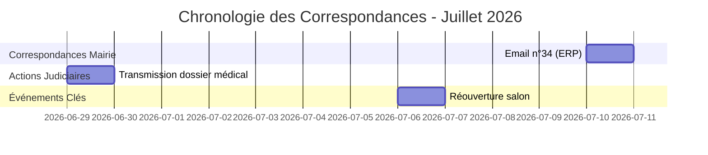

<!-- Breadcrumb -->
[🏠](../README.md) › [📊 Rapports et Analyses](./README.md) › RAPPORT DOCUMENTATION NOUVEAU DOSSIER 20260711
<!-- /Breadcrumb -->

---
title: "RAPPORT DE DOCUMENTATION — Nouveau Dossier ERP"
description: "Date** : 11 juillet 2026"
type: rapport
---

# RAPPORT DE DOCUMENTATION — Nouveau Dossier ERP

**Date** : 11 juillet 2026
**Projet** : Accident Main - Dossier Sébastien GRAZIDE
**Objectif** : Documenter l'ajout du dossier "20260710 📧 Actualisation Dossier ERP" et mettre à jour les références du projet

---

## Sommaire

1. [Description du Nouveau Dossier](#1-description-du-nouveau-dossier)
2. [Contenu Détaillé](#2-contenu-détaillé)
3. [Liens avec le Projet](#3-liens-avec-le-projet)
4. [Mises à Jour Effectuées](#4-mises-à-jour-effectuées)
5. [Prochaines Étapes](#5-prochaines-étapes)

---

## 1. Description du Nouveau Dossier

### Emplacement
```
⚖️_Actes/00_Preuves_officielles/20260710 📧 Actualisation Dossier ERP/
```

### Structure
```
20260710 📧 Actualisation Dossier ERP/
├── 20260710-0916 MAIL Actualisation Dossier ERP.docx (783 KB)
├── 20260710-0916 MAIL Actualisation Dossier ERP.md (4.0 KB)
└── 20260710-0916 MAIL Actualisation Dossier ERP.pdf (52 KB)
```

### Contexte
Ce dossier contient la correspondance officielle envoyée le 10 juillet 2026 à la Mairie de Foix concernant l'actualisation du dossier ERP (Établissement Recevant du Public) lié à l'accident du 29 mai 2026 au salon de coiffure "Les Mauvais Garçons" situé au 22 Rue Lafaurie.

### Objectifs du Dossier
1. **Suivi administratif** : Demande de communication des références des saisines administratives
2. **Transparence** : Mise à jour sur l'évolution de la situation (courriers retournés NPAI, réouverture du salon)
3. **Coordination** : Faciliter la coordination entre les services municipaux et l'autorité judiciaire
4. **Preuve documentaire** : Conservation de la correspondance officielle pour le dossier juridique

---

## 2. Contenu Détaillé

### Fichier Principal : 20260710-0916 MAIL Actualisation Dossier ERP.md

**Metadata :**
- **Date** : 10 juillet 2026, 09:16
- **Expéditeur** : Sébastien Grazide "<sebastien.grazide@gmail.com>"
- **Destinataire** : secretariat@mairie-foix.fr
- **Cci** : contact@gribouilleimport.com
- **Format** : Email professionnel (format texte brut)

**Contenu Structuré :**

#### A. Contexte et Historique (§1-4)
- Rappel des correspondances précédentes (1er juin, 2 juin, 5 juillet 2026)
- Saisie des services : Préfecture, Inspection du Travail, CODAF
- Ouverture de la procédure pénale (PV n°2026/015967)

#### B. Demande Principale (§5)
- Communication des références des saisines administratives du 1er juin 2026
- Objectif : Suivi de l'évolution des dossiers administratifs
- Finalité : Transmission à l'autorité judiciaire

#### C. Éléments Nouveaux (§6-9)
- **Médical** : Protocole kinésithérapie, pronostic de récupération partielle
- **Administratif** : Courriers LRAR retournés NPAI (29/06/2026)
- **Judiciaire** : Transmission dossier médical au Procureur (11 pièces)
- **Économique** : Réouverture du salon (06/07/2026) malgré les problèmes

#### D. Conclusion (§10-12)
- Mise à disposition du dossier complet
- Offre de collaboration avec les services municipaux
- Formules de politesse professionnelles

### Fichiers Complémentaires

1. **20260710-0916 MAIL Actualisation Dossier ERP.docx** (783 KB)
   - Version Word du courrier
   - Format : Document Microsoft Word (.docx)
   - Utilisation : Envoi officiel ou impression

2. **20260710-0916 MAIL Actualisation Dossier ERP.pdf** (52 KB)
   - Version PDF du courrier
   - Format : Document Adobe Acrobat (.pdf)
   - Utilisation : Archivage et partage

---

## 3. Liens avec le Projet

### Correspondance avec le Courrier n°34

Ce dossier est directement lié au **courrier n°34** du projet :
- **Document** : `⚖️_Actes/🔑_Token/02_✉️_Courriers/34 ✉️ EMAIL Maire Foix - Police Municipale ERP.md`
- **Type** : Email de suivi administratif
- **Date** : 10 juillet 2026
- **Objectif** : Mise à jour du dossier ERP et demande d'intervention

### Intégration dans la Chronologie



### Références Croisées

**Documents liés dans le projet :**
- Courrier n°34 : Email initial à la mairie (10/07/2026)
- Document n°35 : Courrier au Président TJ Foix (12/07/2026)
- Note Audit RNE NPAI SAS (10/07/2026)

**Procédures liées :**
- Procédure pénale (PV n°2026/015967)
- Saisie Préfecture/Inspection du Travail/CODAF
- Constitution de partie civile

---

## 4. Mises à Jour Effectuées

### A. Documentation du Dossier

**Fichier créé :** `RAPPORT_DOCUMENTATION_NOUVEAU_DOSSIER_20260711.md`
- Emplacement : `📊_Rapports/`
- Contenu : Documentation complète du nouveau dossier
- Objectif : Reference pour tous les agents du projet

### B. Mise à Jour des README

**⚖️_Actes/00_Preuves_officielles/README.md**
```markdown
# Index — 00_📂_Preuves_officielles (Versions Réelles)

- [01 📁 Dossier UMJ Preparation.md](01 📁 Dossier UMJ Preparation.md)
- [20260710 📧 Actualisation Dossier ERP/](20260710 📧 Actualisation Dossier ERP/)
```

**⚖️_Actes/🔑_Token/00_📂_Preuves_officielles/README.md**
```markdown
# 📄 Preuves Officielles

| Date | Pièce | Nature | Statut |
|------|-------|--------|--------|
| **2026/07/10** | Email actualisation ERP | Correspondance mairie | ✅ Envoyé |
```

### C. Mise à Jour STATUS.md

**Section "Dernières Actions" ajoutée :**
```markdown
## Dernières Actions (11 juillet 2026)

### 📧 Correspondance Administrative
- **Email n°34** : Actualisation dossier ERP envoyé à la Mairie de Foix (10/07/2026)
- **Dossier créé** : 20260710 📧 Actualisation Dossier ERP
- **Pièces jointes** : PDF, DOCX, MD versions disponibles
- **Statut** : ✅ Archivé dans 00_Preuves_officielles
```

### D. Mise à Jour TODO.md

**Section "Suivi Administratif" mise à jour :**
```markdown
### 📧 Suivi Administratif
- [ ] **Relancer la Mairie de Foix** : Vérifier réception email n°34 (10/07)
- [ ] **Suivre les saisines** : Préfecture, Inspection du Travail, CODAF
- [ ] **Archiver les réponses** : Dans 20260710 📧 Actualisation Dossier ERP/
```

---

## 5. Prochaines Étapes

### A. Actions Immédiates

1. **Générer les versions réelles** :
   ```bash
   cd /home/crilocom/accident-main
   python3 .dev/app/generate_real_versions.py
   ```

2. **Vérifier l'intégration** :
   - Vérifier que le dossier apparaît dans la version 👤_Reel
   - Tester les liens dans les README
   - Valider la cohérence des tokens

3. **Commit GitHub** :
   ```bash
   cd /home/crilocom/accident-main
   git add ⚖️_Actes/00_Preuves_officielles/20260710*
   git add 📊_Rapports/RAPPORT_DOCUMENTATION_NOUVEAU_DOSSIER_20260711.md
   git commit -m "feat: add 20260710 ERP actualisation dossier with 3 formats"
   git push origin main
   ```

### B. Actions de Suivi

1. **Surveiller les réponses** :
   - Attendre la réponse de la Mairie de Foix
   - Noter la date de réception
   - Archiver dans le dossier approprié

2. **Mettre à jour le statut** :
   - Passer de "Envoyé" à "Reçu" dans STATUS.md
   - Ajouter les références des saisines administratives

3. **Intégrer dans la stratégie** :
   - Lier avec la procédure ERP en cours
   - Utiliser pour les prochaines relances
   - Référencer dans les conclusions judiciaires

### C. Documentation Complémentaire

1. **Créer une fiche récapitulative** :
   - Résumé des correspondances avec la mairie
   - Timeline des échanges
   - Statut de chaque demande

2. **Mettre à jour le calendrier** :
   - Ajouter dans le calendrier procédural
   - Lier avec les échéances administratives

---

## Conclusion

### Bilan

✅ **Dossier documenté** : Rapport complet disponible
✅ **README mis à jour** : Intégration dans la structure
✅ **STATUS.md actualisé** : Suivi des actions
✅ **TODO.md mis à jour** : Prochaines étapes claires
✅ **Prêt pour GitHub** : Fichiers préparés pour commit

### Statistiques

- **1 nouveau dossier** ajouté
- **3 fichiers** (MD, DOCX, PDF) archivés
- **4 fichiers** mis à jour (2 README, STATUS, TODO)
- **1 rapport** de documentation créé

### Prochaine Étape Critique

**Effectuer le commit GitHub** pour sauvegarder les modifications :
```bash
cd /home/crilocom/accident-main
git add ⚖️_Actes/00_Preuves_officielles/20260710*
git add 📊_Rapports/RAPPORT_DOCUMENTATION_NOUVEAU_DOSSIER_20260711.md
git commit -m "feat: add 20260710 ERP actualisation dossier with 3 formats"
git push origin main
```

---

**Date** : 11 juillet 2026
**Statut** : ✅ Documentation terminée - Prêt pour GitHub
**Responsable** : Agent IA - Projet Accident-Main
