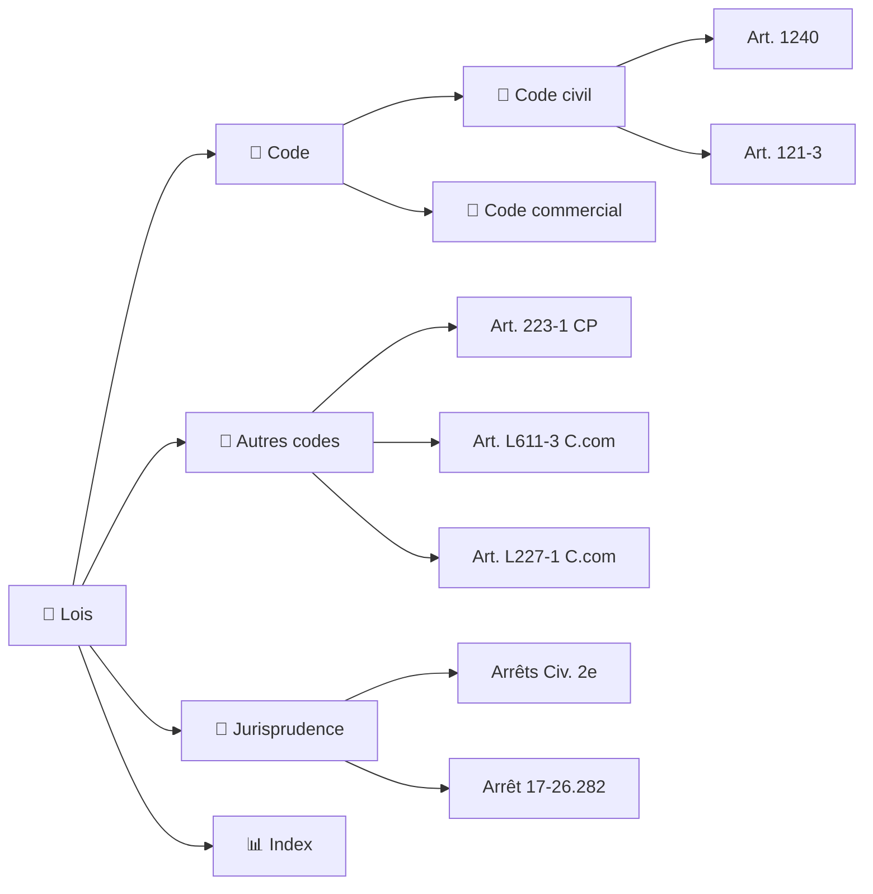

<!-- Breadcrumb -->
*[🏠](../README.md) › 📜 Lois*
<hr>
<!-- /Breadcrumb -->

# ⚖️ Bibliothèque Juridique

**Ce dossier contient les textes de loi et les arrêts de jurisprudence cités dans les actes du dossier.**
Chaque fichier est une fiche dédiée, conservant le texte intégral ou un extrait significatif de la source officielle.

## 🗺️ Cartographie des sources (interactif)



Le dossier a été réorganisé pour une meilleure navigation :

```
📜 Lois/
├── 📜 Jurisprudence/          # 26 arrêts de la Cour de cassation
│   ├── 🏛️ Responsabilité du fait des choses/     # 7 arrêts
│   ├── 🏛️ Transaction sous réserve d'aggravation/ # 3 arrêts
│   ├── 🏛️ Réserve d'aggravation/                  # 2 arrêts
│   ├── 🏛️ Préjudice corporel et incidence prof./   # 5 arrêts
│   ├── 🏛️ Responsabilité des dirigeants/          # 3 arrêts
│   ├── 🏛️ Action directe et assurance/            # 3 arrêts
│   ├── 🏛️ Responsabilité du commettant/           # 2 arrêts
│   └── 🏛️ Mise en danger d'autrui/                # 1 arrêt
├── 📒 Code/                  # 7 sous-dossiers
│   ├── 📒 Code civil/             # 5 articles
│   ├── 📒 Code penal/             # 4 articles
│   ├── 📒 Code procedure civile/  # 4 articles
│   ├── 📒 Code procedure penale/  # 2 articles
│   ├── 📒 Code assurances/         # 2 articles
│   ├── 📒 Code commerce/          # 6 articles
│   └── 📒 Autres codes/            # CGCT, C.trav, CCH, etc. (7 articles)
└── README.md                 # Ce fichier
```

## 📜 Codes et textes législatifs

### [📒 Code civil (5 articles)](📒%20Code/📒%20Code%20civil/README.md)
- [🔗](https://www.legifrance.gouv.fr/codes/article_lc/LEGIARTI000019019256) [Art. 1240](📒%20Code/📒%20Code%20civil/Article1240_CodeCivil.md) — Responsabilité délictuelle
- [🔗](https://www.legifrance.gouv.fr/codes/article_lc/LEGIARTI000019019258) [Art. 1242](📒%20Code/📒%20Code%20civil/Article1242_CodeCivil.md) — Responsabilité du fait des choses
- [🔗](https://www.legifrance.gouv.fr/codes/article_lc/LEGIARTI000020459127) [Art. 1719](📒%20Code/📒%20Code%20civil/Article1719_CodeCivil_LegiFrance.md) — Obligations du bailleur
- [🔗](https://www.legifrance.gouv.fr/codes/article_lc/LEGIARTI000006442784) [Art. 1720](📒%20Code/📒%20Code%20civil/Article1720_CodeCivil_LegiFrance.md) — Obligations du bailleur (grosses réparations)
- [🔗](https://www.legifrance.gouv.fr/codes/article_lc/LEGIARTI000019017259) [Art. 2226](📒%20Code/📒%20Code%20civil/Article_2226_Code_Legifrance.md) — Prescription décennale

### [📒 Code pénal (10 articles)](📒%20Code/📒%20Code%20penal/README.md)
- [🔗](https://www.legifrance.gouv.fr/codes/article_lc/LEGIARTI000006417208) [Art. 121-3](📒%20Code/📒%20Autres%20codes/Article_121-3_Code_Legifrance.md) — Responsabilité des personnes morales
- [🔗](https://www.legifrance.gouv.fr/codes/article_lc/LEGIARTI000024042643) [Art. 222-19](📒%20Code/📒%20Code%20penal/Article_222-19_CodePenal_Legifrance.md) — Blessures involontaires
- [🔗](https://www.legifrance.gouv.fr/codes/article_lc/LEGIARTI000024042640) [Art. 222-20](📒%20Code/📒%20Code%20penal/Article222-20_CodePenal_LegiFrance.md) — Blessures avec circonstances aggravantes
- [🔗](https://www.legifrance.gouv.fr/codes/article_lc/LEGIARTI000006417253) [Art. 223-1](📒%20Code/📒%20Autres%20codes/Article_223-1_Code_Legifrance.md) — Mise en danger d'autrui
- [🔗](https://www.legifrance.gouv.fr/codes/article_lc/LEGIARTI000006418226) [Art. 314-7](📒%20Code/📒%20Code%20penal/Article_314-7_CodePenal_Legifrance.md) — Fraude sociale
- [🔗](https://www.legifrance.gouv.fr/codes/article_lc/LEGIARTI000006418608) [Art. 434-4](📒%20Code/📒%20Code%20penal/Article_434-4_CodePenal_Legifrance.md) — Refus de communication
- [🔗](https://www.legifrance.gouv.fr/codes/article_lc/LEGIARTI000006417900) [Art. 434-15](📒%20Code/📒%20Code%20penal/Article_434-15_CodePenal_Legifrance.md) — Obstruction à la justice
- [🔗](https://www.legifrance.gouv.fr/codes/article_lc/LEGIARTI000038876031) [Art. 434-15-1](📒%20Code/📒%20Code%20penal/Article_434-15-1_CodePenal_Legifrance.md) — Obstruction aggravée

### [📒 Code de procédure civile (4 articles)](📒%20Code/📒%20Code%20procedure%20civile/README.md)
- [🔗](https://www.legifrance.gouv.fr/codes/article_lc/LEGIARTI000051869339) [Art. 145](📒%20Code/📒%20Code%20procedure%20civile/Article_145_CodeDeProcédureCivile_Legifrance.md) — Mesures d'instruction
- [🔗](https://www.legifrance.gouv.fr/codes/article_lc/LEGIARTI000006410394) [Art. 263](📒%20Code/📒%20Code%20procedure%20civile/Article_263_Codeproc_Legifrance.md) — Expertise judiciaire
- [🔗](https://www.legifrance.gouv.fr/codes/article_lc/LEGIARTI000045268436) [Art. 700](📒%20Code/📒%20Code%20procedure%20civile/Article_700_Codeproc_Legifrance.md) — Frais irrépétibles
- [🔗](https://www.legifrance.gouv.fr/codes/article_lc/LEGIARTI000042597284) [Art. 835](📒%20Code/📒%20Code%20procedure%20civile/Article835_CodeDeProcedureCivile_LegiFrance.md) — Référé-provision

### [📒 Code de procédure pénale (2 articles)](📒%20Code/📒%20Code%20procedure%20penale/README.md)
- [🔗](https://www.legifrance.gouv.fr/codes/article_lc/LEGIARTI000044570107) [Art. 475-1](📒%20Code/📒%20Code%20procedure%20penale/Article475-1_CodeProcedurePenale.md) — Constitution de partie civile
- [🔗](https://www.legifrance.gouv.fr/codes/article_lc/LEGIARTI000006577625) [Art. 706-3](📒%20Code/📒%20Code%20procedure%20penale/Article_706-3_CodeProcedurePenale_Legifrance.md) — FGTI

### [📒 Code des assurances (2 articles)](📒%20Code/📒%20Code%20assurances/README.md)
- [🔗](https://www.legifrance.gouv.fr/codes/article_lc/LEGIARTI000035731302) [Art. L.113-2](📒%20Code/📒%20Code%20assurances/Article_L113-2_Codesassurances_Legifrance.md) — Déclaration du risque
- [🔗](https://www.legifrance.gouv.fr/codes/article_lc/LEGIARTI000017735449) [Art. L.124-3](📒%20Code/📒%20Code%20assurances/Article_L124-3_Codesassurances_Legifrance.md) — Action directe

### [📒 Code de commerce (6 articles)](📒%20Code/📒%20Code%20commerce/README.md)
- [🔗](https://www.legifrance.gouv.fr/codes/article_lc/LEGIARTI000006222358) [Art. L.210-6](📒%20Code/📒%20Code%20commerce/Article_L210-6_Codecommerce_Legifrance.md) — Responsabilité des dirigeants
- [🔗](https://www.legifrance.gouv.fr/codes/article_lc/LEGIARTI000006223141) [Art. L.223-22](📒%20Code/📒%20Code%20commerce/Article_L223-22_Codecommerce_Legifrance.md) — Nullité des actes
- [🔗](https://www.legifrance.gouv.fr/codes/article_lc/LEGIARTI000006226329) [Art. L.225-251](📒%20Code/📒%20Code%20commerce/Article_L225-251_Codecommerce_Legifrance.md) — Responsabilité en cas de liquidation
- [🔗](https://www.legifrance.gouv.fr/codes/article_lc/LEGIARTI000006227036) [Art. L.227-8](📒%20Code/📒%20Code%20commerce/Article_L227-8_Codecommerce_Legifrance.md) — Responsabilité des dirigeants de SAS
- [🔗](https://www.legifrance.gouv.fr/codes/article_lc/LEGIARTI000047591332) [Art. L.227-1](📒%20Code/📒%20Code%20commerce/Article_L227-1_Code_Legifrance.md) — Pouvoirs du président
- [🔗](https://www.legifrance.gouv.fr/codes/article_lc/LEGIARTI000006230063) [Art. L.237-2](📒%20Code/📒%20Code%20commerce/Article_L237-2_Codecommerce_Legifrance.md) — Responsabilité des dirigeants

### [📒 Autres codes (7 articles)](📒%20Code/📒%20Autres%20codes/README.md)
- [🔗](https://www.legifrance.gouv.fr/codes/article_lc/LEGIARTI000049464053) [Art. L.421-3](📒%20Code/📒%20Autres%20codes/Article_L421-3_Codeconsommation_Legifrance.md) — Sécurité des consommateurs
- [🔗](https://www.legifrance.gouv.fr/codes/article_lc/LEGIARTI000043818941) [Art. R.143-2](📒%20Code/📒%20Autres%20codes/Article_R143-2_Codeconstructionhabitation_Legifrance.md) — Sécurité des ERP
- [🔗](https://www.legifrance.gouv.fr/codes/article_lc/LEGIARTI000029946370) [Art. L.2212-2](📒%20Code/📒%20Autres%20codes/Article_L2212-2_CodeGeneralCollectivitesTerritoriales_Legifrance.md) — Pouvoirs de police du maire
- [🔗](https://www.legifrance.gouv.fr/codes/article_lc/LEGIARTI000006390155) [Art. L.2212-4](📒%20Code/📒%20Autres%20codes/Article_L2212-4_CodeGeneralCollectivitesTerritoriales_Legifrance.md) — Mesures d'urgence du maire
- [🔗](https://www.legifrance.gouv.fr/codes/article_lc/LEGIARTI000044052542) [Art. L.611-3](📒%20Code/📒%20Autres%20codes/Article_L611-3_Code_Legifrance.md) — Procédure de sauvegarde
- [🔗](https://www.legifrance.gouv.fr/codes/article_lc/LEGIARTI000051752672) [Art. L.123-2](📒%20Code/📒%20Autres%20codes/Article_L123-2_Code_Legifrance.md) — Immatriculation des sociétés

## 🏛️ Jurisprudence (Cour de cassation) — 26 arrêts

Tous les arrêts sont disponibles dans le dossier [📜 Jurisprudence/](📜%20Jurisprudence/)

### [🏛️ Responsabilité du fait des choses (7 arrêts)](📜%20Jurisprudence/🏛️%20Responsabilité%20du%20fait%20des%20choses/README.md)
- [🔗](https://www.legifrance.gouv.fr/juri/id/JURITEXT000006987399) [70-12.124](📜%20Jurisprudence/🏛️%20Responsabilité%20du%20fait%20des%20choses/70-12.124_CourCassation.md) — **Civ. 2e, 23 fév. 1972** — Arrêt *Leroy* — Baignoire passive exposée à la vente
- [🔗](https://www.legifrance.gouv.fr/juri/id/JURITEXT000006993485) [74-10.466](📜%20Jurisprudence/🏛️%20Responsabilité%20du%20fait%20des%20choses/74-10.466_CourCassation.md) — **Civ. 2e, 5 mai 1975** — Vice inhérent ≠ cause d'exonération
- [🔗](https://www.legifrance.gouv.fr/juri/id/JURITEXT000007026411) [89-18.422](📜%20Jurisprudence/🏛️%20Responsabilité%20du%20fait%20des%20choses/89-18.422_CourCassation.md) — **Civ. 2e, 13 fév. 1991** — Échelle qui bascule = instrument du dommage
- [🔗](https://www.legifrance.gouv.fr/juri/id/JURITEXT000007029806) [91-13.580](📜%20Jurisprudence/🏛️%20Responsabilité%20du%20fait%20des%20choses/91-13.580_CourCassation.md) — **Civ. 2e, 25 nov. 1992** — Chose inerte — position anormale à prouver
- [🔗](https://www.legifrance.gouv.fr/juri/id/JURITEXT000007030324) [91-15.035](📜%20Jurisprudence/🏛️%20Responsabilité%20du%20fait%20des%20choses/91-15.035_CourCassation.md) — **Civ. 2e, 5 mai 1993** — Charge preuve instrument du dommage (chose inerte)
- [🔗](https://www.legifrance.gouv.fr/juri/id/JURITEXT000053859664) [24-17.944](📜%20Jurisprudence/🏛️%20Responsabilité%20du%20fait%20des%20choses/24-17.944_CourCassation.md) — **Civ. 2e, 2 avril 2026** — Aggravation — force majeure gardien de la chose
- [🔗](https://www.legifrance.gouv.fr/juri/id/JURITEXT000054167506) [24-21.702](📜%20Jurisprudence/🏛️%20Responsabilité%20du%20fait%20des%20choses/24-21.702_CourCassation.md) — **Civ. 2e, 28 mai 2026** — Échelle instable — preuve position anormale insuffisante

### [🏛️ Transaction sous réserve d'aggravation (3 arrêts)](📜%20Jurisprudence/🏛️%20Transaction%20sous%20réserve%20d'aggravation/README.md)
- [🔗](https://www.legifrance.gouv.fr/juri/id/JURITEXT000007441243) [01-02.274](📜%20Jurisprudence/🏛️%20Transaction%20sous%20réserve%20d'aggravation/01-02.274_CourCassation.md) — **Civ. 2e, 26 sept. 2002** — Transaction sous réserve d'aggravation — prescription
- [🔗](https://www.legifrance.gouv.fr/juri/id/JURITEXT000007206125) [92-13.880](📜%20Jurisprudence/🏛️%20Transaction%20sous%20réserve%20d'aggravation/92-13.880_CourCassation.md) — **Civ. 2e, 2 fév. 1994** — Transaction sous réserve d'aggravation — expertise
- [🔗](https://www.legifrance.gouv.fr/juri/id/JURITEXT000049321551) [22-18.089](📜%20Jurisprudence/🏛️%20Transaction%20sous%20réserve%20d'aggravation/22-18.089_CourCassation.md) — **Civ. 2e, 21 mars 2024** — Autonomie action aggravation — prescription (publié Bulletin)

### [🏛️ Réserve d'aggravation (2 arrêts)](📜%20Jurisprudence/🏛️%20Réserve%20d'aggravation/README.md)
- [🔗](https://www.legifrance.gouv.fr/juri/id/JURITEXT000043782126) [20-15.106](📜%20Jurisprudence/🏛️%20Réserve%20d'aggravation/20-15.106_CourCassation.md) — **Civ. 2e, 8 juillet 2021** — Réserves d'aggravation, incidence professionnelle
- [🔗](https://www.legifrance.gouv.fr/juri/id/JURITEXT000049418278) [22-19.307](📜%20Jurisprudence/🏛️%20Réserve%20d'aggravation/22-19.307_CourCassation.md) — **Civ. 2e, 4 avril 2024** — Réserve d'aggravation

### [🏛️ Préjudice corporel et incidence professionnelle (5 arrêts)](📜%20Jurisprudence/🏛️%20Préjudice%20corporel%20et%20incidence%20professionnelle/README.md)
- [🔗](https://www.legifrance.gouv.fr/juri/id/JURITEXT000036635385) [16-24.631](📜%20Jurisprudence/🏛️%20Préjudice%20corporel%20et%20incidence%20professionnelle/16-24.631_CourCassation.md) — **Civ. 2e** — Préjudice corporel
- [🔗](https://www.legifrance.gouv.fr/juri/id/JURITEXT000041585779) [18-17.868](📜%20Jurisprudence/🏛️%20Préjudice%20corporel%20et%20incidence%20professionnelle/18-17.868_CourCassation.md) — **Civ. 2e** — Incidence professionnelle
- [🔗](https://www.legifrance.gouv.fr/juri/id/JURITEXT000043489943) [19-23.173](📜%20Jurisprudence/🏛️%20Préjudice%20corporel%20et%20incidence%20professionnelle/19-23.173_CourCassation.md) — **Civ. 2e, 6 mai 2021** — Incidence professionnelle
- [🔗](https://www.legifrance.gouv.fr/juri/id/JURITEXT000047700832) [21-14.197](📜%20Jurisprudence/🏛️%20Préjudice%20corporel%20et%20incidence%20professionnelle/21-14.197_CourCassation.md) — **Civ. 2e** — Préjudice corporel
- [🔗](https://www.legifrance.gouv.fr/juri/id/JURITEXT000050509897) [23-12.369](📜%20Jurisprudence/🏛️%20Préjudice%20corporel%20et%20incidence%20professionnelle/23-12.369_CourCassation.md) — **Civ. 2e** — Évaluation préjudice

### [🏛️ Responsabilité des dirigeants (3 arrêts)](📜%20Jurisprudence/🏛️%20Responsabilité%20des%20dirigeants/README.md)
- [🔗](https://www.legifrance.gouv.fr/juri/id/JURITEXT000007043704) [97-17.378](📜%20Jurisprudence/🏛️%20Responsabilité%20des%20dirigeants/97-17.378_CourCassation.md) — **Ass. Plén., 25 février 2000** — Arrêt *Costedoat* — Responsabilité personnelle du dirigeant
- [🔗](https://www.legifrance.gouv.fr/juri/id/JURITEXT000007047369) [99-17.092](📜%20Jurisprudence/🏛️%20Responsabilité%20des%20dirigeants/99-17.092_CourCassation.md) — **Com., 20 mai 2003** — Responsabilité pour défaut d'assurance
- [🔗](https://www.legifrance.gouv.fr/juri/id/JURITEXT000026515553) [11-15.699](📜%20Jurisprudence/🏛️%20Responsabilité%20des%20dirigeants/11-15.699_CourCassation.md) — **Com.** — Responsabilité dirigeant

### [🏛️ Action directe et obligation d'assurance (3 arrêts)](📜%20Jurisprudence/🏛️%20Action%20directe%20et%20obligation%20d'assurance/README.md)
- [🔗](https://www.legifrance.gouv.fr/juri/id/JURITEXT000032194983) [14-15.326](📜%20Jurisprudence/🏛️%20Action%20directe%20et%20obligation%20d'assurance/14-15.326_CourCassation.md) — **Civ. 3e** — Obligation d'assurance du bailleur
- [19-15.659](📜%20Jurisprudence/🏛️%20Action%20directe%20et%20obligation%20d'assurance/19-15.659_CourCassation.md) — **Civ. 2e, 14 mai 2020** — Action directe contre l'assureur
- [🔗](https://www.legifrance.gouv.fr/juri/id/JURITEXT000044482848) [20-16.463](📜%20Jurisprudence/🏛️%20Action%20directe%20et%20obligation%20d'assurance/20-16.463_CourCassation.md) — **Civ. 1re, 8 décembre 2021** — Action directe, dissolution société

### [🏛️ Responsabilité du commettant (2 arrêts)](📜%20Jurisprudence/🏛️%20Responsabilité%20du%20commettant/README.md)
- [🔗](https://www.legifrance.gouv.fr/juri/id/JURITEXT000007071351) [00-82.066](📜%20Jurisprudence/🏛️%20Responsabilité%20du%20commettant/00-82.066_CourCassation.md) — **Ass. Plén., 14 décembre 2001** — Arrêt *Cousin* — Responsabilité du commettant
- [🔗](https://www.legifrance.gouv.fr/juri/id/JURITEXT000007013792) [80-14.994](📜%20Jurisprudence/🏛️%20Responsabilité%20du%20commettant/80-14.994_CourCassation.md) — **Ass. Plén., 9 mai 1984** — Arrêt *Gabillet* — Cumul responsabilités contractuelle/délictuelle

### [🏛️ Mise en danger d'autrui (1 arrêt)](📜%20Jurisprudence/🏛️%20Mise%20en%20danger%20d'autrui/README.md)
- [🔗](https://www.legifrance.gouv.fr/juri/id/JURITEXT000029014493) [13-80.849](📜%20Jurisprudence/🏛️%20Mise%20en%20danger%20d'autrui/13-80.849_CourCassation.md) — **Crim., 27 mai 2014** — Mise en danger d'autrui

## 🔧 Documents techniques

- **[EXEMPLES_REQUETES_MCP](EXEMPLES_REQUETES_MCP.md)** — Exemples concrets de requêtes MCP Légifrance et Judilibre pour le projet.
- **[RAPPORT_ORGANISATION_20260711](RAPPORT_ORGANISATION_20260711.md)** — Rapport d'organisation et d'audit de la bibliothèque juridique (11 juillet 2026).