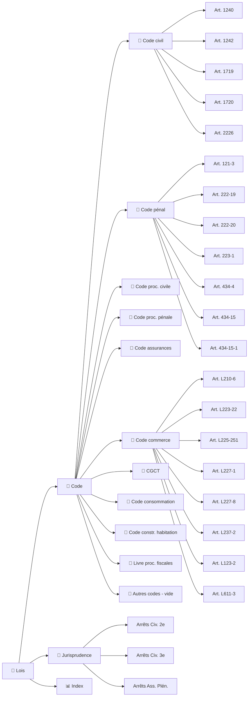

<!-- Breadcrumb -->
*[🏠](../README.md) › 📜 Lois*
<hr>
<!-- /Breadcrumb -->

# ⚖️ Bibliothèque Juridique

**Ce dossier contient les textes de loi et les arrêts de jurisprudence cités dans les actes du dossier.**
Chaque fichier est une fiche dédiée, conservant le texte intégral ou un extrait significatif de la source officielle.

## 🗺️ Cartographie des sources (interactif)



Le dossier a été réorganisé pour une meilleure navigation :

```
📜 Lois/
├── 📜 Jurisprudence/README.md          # 37 arrêts Cass. + 7 décisions CA/TJ
│   ├── 🏛️ Responsabilité du fait des choses/     # 8 arrêts
│   ├── 🏛️ Transaction sous réserve d'aggravation/ # 3 arrêts
│   ├── 🏛️ Réserve d'aggravation/                  # 3 arrêts
│   ├── 🏛️ Préjudice corporel et incidence prof./   # 5 arrêts
│   ├── 🏛️ Responsabilité des dirigeants/          # 4 arrêts
│   ├── 🏛️ Action directe et assurance/            # 8 arrêts
│   ├── 🏛️ Jurisprudence du fond (CA-TJ)/          # 7 décisions
│   ├── 🏛️ Responsabilité du commettant/           # 2 arrêts
│   └── 🏛️ Mise en danger d'autrui/                # 1 arrêt
├── 📒 Code/                  # 12 sous-dossiers
│   ├── 📒 Code civil/                            # 12 articles
│   ├── 📒 Code pénal/                            # 9 articles
│   ├── 📒 Code procédure civile/                 # 7 articles
│   ├── 📒 Code procédure pénale/                 # 10 articles
│   ├── 📒 Code assurances/                       # 5 articles
│   ├── 📒 Code du travail/                      # 7 articles
│   ├── 📒 Code commerce/                         # 12 articles
│   ├── 📒 Code général des collectivités territoriales/ # 2 articles
│   ├── 📒 Code consommation/                     # 1 article
│   ├── 📒 Code construction habitation/          # 1 article
│   ├── 📒 Code des relations avec le public/      # 1 article
│   ├── 📒 Livre des procédures fiscales/         # 2 articles
│   └── 📒 Autres codes/                           # vide (articles déplacés)
└── README.md                 # Ce fichier
```

## 📜 Codes et textes législatifs

### [📒 Code civil (12 articles)](../%E2%9A%96%EF%B8%8F%20Actes/%F0%9F%94%91%20Token/README.md)
- [🔗](https://www.legifrance.gouv.fr/codes/article_lc/LEGIARTI000019019256) [Art. 1240](%F0%9F%93%92%20Code/%F0%9F%93%92%20Code%20civil/Article1240_CodeCivil.md) — Responsabilité délictuelle

- [🔗](https://www.legifrance.gouv.fr/codes/article_lc/LEGIARTI000019019258) [Art. 1242](%F0%9F%93%92%20Code/%F0%9F%93%92%20Code%20civil/Article1242_CodeCivil.md) — Responsabilité du fait des choses

- [🔗](https://www.legifrance.gouv.fr/codes/article_lc/LEGIARTI000020459127) [Art. 1719](%F0%9F%93%92%20Code/%F0%9F%93%92%20Code%20civil/Article1719_CodeCivil_LegiFrance.md) — Obligations du bailleur

- [🔗](https://www.legifrance.gouv.fr/codes/article_lc/LEGIARTI000006442784) [Art. 1720](%F0%9F%93%92%20Code/%F0%9F%93%92%20Code%20civil/Article1720_CodeCivil_LegiFrance.md) — Obligations du bailleur (grosses réparations)

- [🔗](https://www.legifrance.gouv.fr/codes/article_lc/LEGIARTI000006441924) [Art. 1641](%F0%9F%93%92%20Code/%F0%9F%93%92%20Code%20civil/Article_1641_CodeCivil.md) — Garantie des défauts cachés

- [🔗](https://www.legifrance.gouv.fr/codes/article_lc/LEGIARTI000019017259) [Art. 2226](%F0%9F%93%92%20Code/%F0%9F%93%92%20Code%20civil/Article_2226_Code_Legifrance.md) — Prescription décennale

- [🔗](https://www.legifrance.gouv.fr/codes/article_lc/LEGIARTI000032042311) [Art. 1359](%F0%9F%93%92%20Code/%F0%9F%93%92%20Code%20civil/Article_1359_CodeCivil.md) — Preuve par écrit des actes juridiques

- [🔗](https://www.legifrance.gouv.fr/codes/article_lc/LEGIARTI000032042379) [Art. 1382](%F0%9F%93%92%20Code/%F0%9F%93%92%20Code%20civil/Article_1382_CodeCivil.md) — Preuve par présomption judiciaire

- [🔗](https://www.legifrance.gouv.fr/codes/article_lc/LEGIARTI000032042374) [Art. 1383](%F0%9F%93%92%20Code/%F0%9F%93%92%20Code%20civil/Article_1383_CodeCivil.md) — L'aveu

- [🔗](https://www.legifrance.gouv.fr/codes/article_lc/LEGIARTI000033458766) [Art. 2044](%F0%9F%93%92%20Code/%F0%9F%93%92%20Code%20civil/Article_2044_CodeCivil.md) — Définition de la transaction

- [🔗](https://www.legifrance.gouv.fr/codes/article_lc/LEGIARTI000019017112) [Art. 2224](%F0%9F%93%92%20Code/%F0%9F%93%92%20Code%20civil/Article_2224_CodeCivil.md) — Prescription de droit commun 5 ans

### [📒 Code pénal (9 articles)](../%E2%9A%96%EF%B8%8F%20Actes/%F0%9F%94%91%20Token/README.md)
- [🔗](https://www.legifrance.gouv.fr/codes/article_lc/LEGIARTI000006417208) [Art. 121-3](%F0%9F%93%92%20Code/%F0%9F%93%92%20Code%20p%C3%A9nal/Article_121-3_Code_Legifrance.md) — Principe de la responsabilité pénale

- [🔗](https://www.legifrance.gouv.fr/codes/article_lc/LEGIARTI000006417206) [Art. 121-1 à 121-7](%F0%9F%93%92%20Code/%F0%9F%93%92%20Code%20p%C3%A9nal/Article_121-1a121-7_CodePenal_Legifrance.md) — Principes généraux

- [🔗](https://www.legifrance.gouv.fr/codes/article_lc/LEGIARTI000024042643) [Art. 222-19](📒 Code/📒 Code pénal/Article_222-19_CodePenal_Legifrance.md) — Blessures involontaires

- [🔗](https://www.legifrance.gouv.fr/codes/article_lc/LEGIARTI000024042640) [Art. 222-20](%F0%9F%93%92%20Code/%F0%9F%93%92%20Code%20p%C3%A9nal/Article222-20_CodePenal_LegiFrance.md) — Blessures avec circonstances aggravantes

- [🔗](https://www.legifrance.gouv.fr/codes/article_lc/LEGIARTI000024042637) [Art. 223-1](%F0%9F%93%92%20Code/%F0%9F%93%92%20Code%20p%C3%A9nal/Article_223-1_Code_Legifrance.md) — Mise en danger d'autrui

- [🔗](https://www.legifrance.gouv.fr/codes/article_lc/LEGIARTI000006418226) [Art. 314-7](%F0%9F%93%92%20Code/%F0%9F%93%92%20Code%20p%C3%A9nal/Article_314-7_CodePenal_Legifrance.md) — Fraude sociale

- [🔗](https://www.legifrance.gouv.fr/codes/article_lc/LEGIARTI000006418608) [Art. 434-4](%F0%9F%93%92%20Code/%F0%9F%93%92%20Code%20p%C3%A9nal/Article_434-4_CodePenal_Legifrance.md) — Refus de communication

- [🔗](https://www.legifrance.gouv.fr/codes/article_lc/LEGIARTI000006418641) [Art. 434-15](%F0%9F%93%92%20Code/%F0%9F%93%92%20Code%20p%C3%A9nal/Article_434-15_CodePenal_Legifrance.md) — Obstruction à la justice

- [🔗](https://www.legifrance.gouv.fr/codes/article_lc/LEGIARTI000038876031) [Art. 434-15-1](%F0%9F%93%92%20Code/%F0%9F%93%92%20Code%20p%C3%A9nal/Article_434-15-1_CodePenal_Legifrance.md) — Obstruction aggravée

### [📒 Code de procédure civile (7 articles)](../%E2%9A%96%EF%B8%8F%20Actes/%F0%9F%94%91%20Token/README.md)
- [🔗](https://www.legifrance.gouv.fr/codes/article_lc/LEGIARTI000051869339) [Art. 144](%F0%9F%93%92%20Code/%F0%9F%93%92%20Code%20proc%C3%A9dure%20civile/Article_144_CodeDeProcedureCivile.md) — Mesures d'instruction

- [🔗](https://www.legifrance.gouv.fr/codes/article_lc/LEGIARTI000051869339) [Art. 145](%F0%9F%93%92%20Code/%F0%9F%93%92%20Code%20proc%C3%A9dure%20civile/Article_145_CodeDeProc%C3%A9dureCivile_Legifrance.md) — Mesures d'instruction in futurum

- [🔗](https://www.legifrance.gouv.fr/codes/article_lc/LEGIARTI000006410394) [Art. 263](%F0%9F%93%92%20Code/%F0%9F%93%92%20Code%20proc%C3%A9dure%20civile/Article_263_Codeproc_Legifrance.md) — Expertise judiciaire

- [🔗](https://www.legifrance.gouv.fr/codes/article_lc/LEGIARTI000006410330) [Art. 202](%F0%9F%93%92%20Code/%F0%9F%93%92%20Code%20proc%C3%A9dure%20civile/Article_202_CodeDeProcedureCivile.md) — Les attestations

- [🔗](https://www.legifrance.gouv.fr/codes/article_lc/LEGIARTI000045268436) [Art. 700](%F0%9F%93%92%20Code/%F0%9F%93%92%20Code%20proc%C3%A9dure%20civile/Article_700_Codeproc_Legifrance.md) — Frais irrépétibles

- [🔗](https://www.legifrance.gouv.fr/codes/article_lc/LEGIARTI000042597284) [Art. 835](%F0%9F%93%92%20Code/%F0%9F%93%92%20Code%20proc%C3%A9dure%20civile/Article835_CodeDeProcedureCivile_LegiFrance.md) — Référé-provision

- [🔗](https://www.legifrance.gouv.fr/codes/article_lc/LEGIARTI000006411023) [Art. 655](%F0%9F%93%92%20Code/%F0%9F%93%92%20Code%20proc%C3%A9dure%20civile/Article_655_CodeProcedureCivile.md) — Signification à domicile ou à résidence

### [📒 Code de procédure pénale (10 articles)](../%E2%9A%96%EF%B8%8F%20Actes/%F0%9F%94%91%20Token/README.md)
- [🔗](https://www.legifrance.gouv.fr/codes/article_lc/LEGIARTI000049531911) [Art. 8](%F0%9F%93%92%20Code/%F0%9F%93%92%20Code%20proc%C3%A9dure%20p%C3%A9nale/Article_8_CodeProcedurePenale.md) — Prescription de l'action publique

- [🔗](https://www.legifrance.gouv.fr/codes/article_lc/LEGIARTI000006574933) [Art. 40](%F0%9F%93%92%20Code/%F0%9F%93%92%20Code%20proc%C3%A9dure%20p%C3%A9nale/Article_40_CodeProcedurePenale.md) — Attributions du procureur

- [🔗](https://www.legifrance.gouv.fr/codes/article_lc/LEGIARTI000006575016) [Art. 53](%F0%9F%93%92%20Code/%F0%9F%93%92%20Code%20proc%C3%A9dure%20p%C3%A9nale/Article_53_CodeProcedurePenale.md) — Flagrant délit

- [🔗](https://www.legifrance.gouv.fr/codes/article_lc/LEGIARTI000038311441) [Art. 15-3](%F0%9F%93%92%20Code/%F0%9F%93%92%20Code%20proc%C3%A9dure%20p%C3%A9nale/Article_15-3_CodeProcedurePenale.md) — Dépôt plainte, récépissé

- [🔗](https://www.legifrance.gouv.fr/codes/article_lc/LEGIARTI000047052915) [Art. 77-1-1](%F0%9F%93%92%20Code/%F0%9F%93%92%20Code%20proc%C3%A9dure%20p%C3%A9nale/Article_77-1-1_CodeProcedurePenale.md) — Réquisitions vidéoprotection

- [🔗](https://www.legifrance.gouv.fr/codes/article_lc/LEGIARTI000044568319) [Art. 80](%F0%9F%93%92%20Code/%F0%9F%93%92%20Code%20proc%C3%A9dure%20p%C3%A9nale/Article_80_CodeProcedurePenale.md) — Réquisitoire introductif

- [🔗](https://www.legifrance.gouv.fr/codes/article_lc/LEGIARTI000038312062) [Art. 86](%F0%9F%93%92%20Code/%F0%9F%93%92%20Code%20proc%C3%A9dure%20p%C3%A9nale/Article_86_CodeProcedurePenale.md) — Constitution partie civile

- [🔗](https://www.legifrance.gouv.fr/codes/article_lc/LEGIARTI000048442334) [Art. 706-5](%F0%9F%93%92%20Code/%F0%9F%93%92%20Code%20proc%C3%A9dure%20p%C3%A9nale/Article_706-5_CodeProcedurePenale.md) — Délai forclusion CIVI (3 ans)

### [📒 Code des assurances (5 articles)](../%E2%9A%96%EF%B8%8F%20Actes/%F0%9F%94%91%20Token/README.md)
- [🔗](https://www.legifrance.gouv.fr/codes/article_lc/LEGIARTI000006791984) [Art. L.113-1](%F0%9F%93%92%20Code/%F0%9F%93%92%20Code%20assurances/Article_L113-1_Codesassurances.md) — Obligations de l'assureur et de l'assuré

- [🔗](https://www.legifrance.gouv.fr/codes/article_lc/LEGIARTI000035731302) [Art. L.113-2](%F0%9F%93%92%20Code/%F0%9F%93%92%20Code%20assurances/Article_L113-2_Codesassurances_Legifrance.md) — Déclaration du risque

- [🔗](https://www.legifrance.gouv.fr/codes/article_lc/LEGIARTI000017735449) [Art. L.124-3](%F0%9F%93%92%20Code/%F0%9F%93%92%20Code%20assurances/Article_L124-3_Codesassurances_Legifrance.md) — Action directe

- [🔗](https://www.legifrance.gouv.fr/codes/article_lc/LEGIARTI000044607740) [Art. L.114-1](%F0%9F%93%92%20Code/%F0%9F%93%92%20Code%20assurances/Article_L114-1_Codesassurances.md) — Prescription biennale

- [🔗](https://www.legifrance.gouv.fr/codes/article_lc/LEGIARTI000006417206) [Art. 121-1 à 121-7](%F0%9F%93%92%20Code/%F0%9F%93%92%20Code%20assurances/Article_L121-1a121-7_Code_Legifrance.md) — Principes généraux responsabilité pénale (personnes morales)

### [📒 Code de commerce (12 articles)](../%E2%9A%96%EF%B8%8F%20Actes/%F0%9F%94%91%20Token/README.md)
- [🔗](https://www.legifrance.gouv.fr/codes/article_lc/LEGIARTI000051752672) [Art. L.123-2](%F0%9F%93%92%20Code/%F0%9F%93%92%20Code%20commerce/Article_L123-2_Code_Legifrance.md) — Immatriculation des commerçants au RCS

- [🔗](https://www.legifrance.gouv.fr/codes/article_lc/LEGIARTI000025559422) [Art. L.123-3](%F0%9F%93%92%20Code/%F0%9F%93%92%20Code%20commerce/Article_L123-3_Codecommerce.md) — Injonction d'immatriculation et radiation au RCS

- [🔗](https://www.legifrance.gouv.fr/codes/article_lc/LEGIARTI000006219291) [Art. L.123-5-1](%F0%9F%93%92%20Code/%F0%9F%93%92%20Code%20commerce/Article_L123-5-1_Codecommerce.md) — Injonction de dépôt des pièces au RCS

- [🔗](https://www.legifrance.gouv.fr/codes/article_lc/LEGIARTI000006222358) [Art. L.210-6](%F0%9F%93%92%20Code/%F0%9F%93%92%20Code%20commerce/Article_L210-6_Codecommerce_Legifrance.md) — Responsabilité des dirigeants

- [🔗](https://www.legifrance.gouv.fr/codes/article_lc/LEGIARTI000006223141) [Art. L.223-22](%F0%9F%93%92%20Code/%F0%9F%93%92%20Code%20commerce/Article_L223-22_Codecommerce_Legifrance.md) — Nullité des actes

- [🔗](https://www.legifrance.gouv.fr/codes/article_lc/LEGIARTI000006226329) [Art. L.225-251](%F0%9F%93%92%20Code/%F0%9F%93%92%20Code%20commerce/Article_L225-251_Codecommerce_Legifrance.md) — Responsabilité en cas de liquidation

- [🔗](https://www.legifrance.gouv.fr/codes/article_lc/LEGIARTI000006227036) [Art. L.227-8](%F0%9F%93%92%20Code/%F0%9F%93%92%20Code%20commerce/Article_L227-8_Codecommerce_Legifrance.md) — Responsabilité des dirigeants de SAS

- [🔗](https://www.legifrance.gouv.fr/codes/article_lc/LEGIARTI000047591332) [Art. L.227-1](%F0%9F%93%92%20Code/%F0%9F%93%92%20Code%20commerce/Article_L227-1_Code_Legifrance.md) — Pouvoirs du président

- [🔗](https://www.legifrance.gouv.fr/codes/article_lc/LEGIARTI000006230063) [Art. L.237-2](%F0%9F%93%92%20Code/%F0%9F%93%92%20Code%20commerce/Article_L237-2_Codecommerce_Legifrance.md) — Responsabilité des dirigeants

- [🔗](https://www.legifrance.gouv.fr/codes/article_lc/LEGIARTI000044052542) [Art. L.611-3](%F0%9F%93%92%20Code/%F0%9F%93%92%20Code%20commerce/Article_L611-3_Code_Legifrance.md) — Procédure de sauvegarde

- [🔗](https://www.legifrance.gouv.fr/codes/article_lc/LEGIARTI000046073350) [Art. R.123-2](%F0%9F%93%92%20Code/%F0%9F%93%92%20Code%20commerce/Article_R123-2_Codecommerce.md) — Guichet unique

- [🔗](https://www.legifrance.gouv.fr/codes/article_lc/LEGIARTI000039278214) [Art. R.123-128](%F0%9F%93%92%20Code/%F0%9F%93%92%20Code%20commerce/Article_R123-128_Codecommerce.md) — Radiations d'office

### [📒 Code du travail (7 articles)](../%E2%9A%96%EF%B8%8F%20Actes/%F0%9F%94%91%20Token/README.md)
- [🔗](https://www.legifrance.gouv.fr/codes/article_lc/LEGIARTI000006904815) [Art. L.8221-1](%F0%9F%93%92%20Code/%F0%9F%93%92%20Code%20du%20travail/Article_L8221-1_CodeTravail.md) — Interdiction du travail dissimulé

- [🔗](https://www.legifrance.gouv.fr/codes/article_lc/LEGIARTI000033024966) [Art. L.8221-5](%F0%9F%93%92%20Code/%F0%9F%93%92%20Code%20du%20travail/Article_L8221-5_CodeTravail.md) — Travail dissimulé par dissimulation d'emploi salarié

- [🔗](https://www.legifrance.gouv.fr/codes/article_lc/LEGIARTI000006917375) [Art. L.8271-1-2](%F0%9F%93%92%20Code/%F0%9F%93%92%20Code%20du%20travail/Article_L8271-1-2_CodeTravail.md) — Agents de contrôle pour la lutte contre le travail illégal

- [🔗](https://www.legifrance.gouv.fr/codes/article_lc/LEGIARTI000035638287) [Art. L.4121-1](%F0%9F%93%92%20Code/%F0%9F%93%92%20Code%20du%20travail/Article_L4121-1_CodeTravail.md) — Obligations de l'employeur en matière de santé et sécurité

- [🔗](https://www.legifrance.gouv.fr/codes/article_lc/LEGIARTI000035640037) [Art. L.4321-1](%F0%9F%93%92%20Code/%F0%9F%93%92%20Code%20du%20travail/Article_L4321-1_CodeTravail.md) — Principes généraux des équipements de travail

- [🔗](https://www.legifrance.gouv.fr/codes/article_lc/LEGIARTI000045123161) [Art. R.4121-1](%F0%9F%93%92%20Code/%F0%9F%93%92%20Code%20du%20travail/Article_R4121-1_CodeTravail.md) — Document unique d'évaluation des risques

- [Art. R.4323-58](%F0%9F%93%92%20Code/%F0%9F%93%92%20Code%20du%20travail/Article_R4323-58_CodeTravail.md) — Travaux temporaires en hauteur

### [📒 Code Général des Collectivités Territoriales (2 articles)](../%E2%9A%96%EF%B8%8F%20Actes/%F0%9F%94%91%20Token/README.md)
- [🔗](https://www.legifrance.gouv.fr/codes/article_lc/LEGIARTI000029946370) [Art. L.2212-2](%F0%9F%93%92%20Code/%F0%9F%93%92%20Code%20g%C3%A9n%C3%A9ral%20des%20collectivit%C3%A9s%20territoriales/Article_L2212-2_CodeGeneralCollectivitesTerritoriales_Legifrance.md) — Pouvoirs de police du maire

- [🔗](https://www.legifrance.gouv.fr/codes/article_lc/LEGIARTI000006390155) [Art. L.2212-4](%F0%9F%93%92%20Code/%F0%9F%93%92%20Code%20g%C3%A9n%C3%A9ral%20des%20collectivit%C3%A9s%20territoriales/Article_L2212-4_CodeGeneralCollectivitesTerritoriales_Legifrance.md) — Mesures d'urgence du maire

### [📒 Code de la consommation (1 article)](../%E2%9A%96%EF%B8%8F%20Actes/%F0%9F%94%91%20Token/README.md)
- [🔗](https://www.legifrance.gouv.fr/codes/article_lc/LEGIARTI000049464053) [Art. L.421-3](%F0%9F%93%92%20Code/%F0%9F%93%92%20Code%20consommation/Article_L421-3_Codeconsommation_Legifrance.md) — Obligation générale de sécurité des prestations

### [📒 Code de la construction et de l'habitation (1 article)](../%E2%9A%96%EF%B8%8F%20Actes/%F0%9F%94%91%20Token/README.md)
- [🔗](https://www.legifrance.gouv.fr/codes/article_lc/LEGIARTI000043818941) [Art. R.143-2](%F0%9F%93%92%20Code/%F0%9F%93%92%20Code%20construction%20habitation/Article_R143-2_Codeconstructionhabitation_Legifrance.md) — Définition des ERP

### [📒 Code des relations entre le public et l'administration (1 article)](../%E2%9A%96%EF%B8%8F%20Actes/%F0%9F%94%91%20Token/README.md)
- [🔗](https://www.legifrance.gouv.fr/codes/article_lc/LEGIARTI000033218946) [Art. L.311-1](%F0%9F%93%92%20Code/%F0%9F%93%92%20Code%20des%20relations%20entre%20le%20public%20et%20l%27administration/Article_L311-1_CRPA.md) — Droit à communication des documents administratifs

### [📒 Livre des procédures fiscales (2 articles)](../%E2%9A%96%EF%B8%8F%20Actes/%F0%9F%94%91%20Token/README.md)
- [🔗](https://www.legifrance.gouv.fr/codes/article_lc/LEGIARTI000006316012) [Art. L.252](%F0%9F%93%92%20Code/%F0%9F%93%92%20Livre%20des%20proc%C3%A9dures%20fiscales/Article_L252_LivreProceduresFiscales.md) — Recouvrement impôts, comptables publics

- [🔗](https://www.legifrance.gouv.fr/codes/article_lc/LEGIARTI000042914471) [Art. L.274](%F0%9F%93%92%20Code/%F0%9F%93%92%20Livre%20des%20proc%C3%A9dures%20fiscales/Article_L274_LivreProceduresFiscales.md) — Prescription action recouvrement (4 ans)

### [📒 Code de la sécurité sociale (1 fiche)](../%E2%9A%96%EF%B8%8F%20Actes/%F0%9F%94%91%20Token/README.md)
- [🔗](https://www.legifrance.gouv.fr/codes/article_lc/LEGIARTI000006742979) [AT/MP indépendants](%F0%9F%93%92%20Code/%F0%9F%93%92%20Code%20s%C3%A9curite%20sociale/Accident_Travail_Independants.md) — Régime AT/MP des travailleurs indépendants

### 📜 Règlements européens
- [🔗](https://eur-lex.europa.eu/eli/reg/2016/679/oj/fra) [RGPD – Art. 7, 9 et 82](RGPD_Articles7_9_82.md) — Consentement, données sensibles, réparation

## 🏛️ Jurisprudence — 37 arrêts Cass. + 7 décisions CA/TJ

Tous les arrêts sont disponibles dans le dossier [📜 Jurisprudence/README.md](📜 Jurisprudence/README.md)

### [🏛️ Responsabilité du fait des choses (8 arrêts)](../%E2%9A%96%EF%B8%8F%20Actes/%F0%9F%94%91%20Token/README.md)
- [🔗](https://www.legifrance.gouv.fr/juri/id/JURITEXT000006987399) [70-12.124](%F0%9F%93%9C%20Jurisprudence/%F0%9F%8F%9B%EF%B8%8F%20Responsabilit%C3%A9%20du%20fait%20des%20choses/70-12.124_CourCassation.md) — Civ. 2e, 23 fév. 1972 — *Leroy* — Baignoire passive

- [🔗](https://www.legifrance.gouv.fr/juri/id/JURITEXT000006993485) [74-10.466](%F0%9F%93%9C%20Jurisprudence/%F0%9F%8F%9B%EF%B8%8F%20Responsabilit%C3%A9%20du%20fait%20des%20choses/74-10.466_CourCassation.md) — Civ. 2e, 5 mai 1975 — Vice inhérent ≠ exonération

- [🔗](https://www.legifrance.gouv.fr/juri/id/JURITEXT000007026411) [89-18.422](%F0%9F%93%9C%20Jurisprudence/%F0%9F%8F%9B%EF%B8%8F%20Responsabilit%C3%A9%20du%20fait%20des%20choses/89-18.422_CourCassation.md) — Civ. 2e, 13 fév. 1991 — Échelle qui bascule = instrument dommage

- [🔗](https://www.legifrance.gouv.fr/juri/id/JURITEXT000007029806) [91-13.580](%F0%9F%93%9C%20Jurisprudence/%F0%9F%8F%9B%EF%B8%8F%20Responsabilit%C3%A9%20du%20fait%20des%20choses/91-13.580_CourCassation.md) — Civ. 2e, 25 nov. 1992 — Chose inerte — position anormale

- [🔗](https://www.legifrance.gouv.fr/juri/id/JURITEXT000007030324) [91-15.035](%F0%9F%93%9C%20Jurisprudence/%F0%9F%8F%9B%EF%B8%8F%20Responsabilit%C3%A9%20du%20fait%20des%20choses/91-15.035_CourCassation.md) — Civ. 2e, 5 mai 1993 — Charge preuve instrument chose inerte

- [🔗](https://www.legifrance.gouv.fr/juri/id/JURITEXT000053859664) [24-17.944](%F0%9F%93%9C%20Jurisprudence/%F0%9F%8F%9B%EF%B8%8F%20Responsabilit%C3%A9%20du%20fait%20des%20choses/24-17.944_CourCassation.md) — Civ. 2e, 2 avril 2026 — Force majeure gardien

- [🔗](https://www.legifrance.gouv.fr/juri/id/JURITEXT000054167506) [24-21.702](%F0%9F%93%9C%20Jurisprudence/%F0%9F%8F%9B%EF%B8%8F%20Responsabilit%C3%A9%20du%20fait%20des%20choses/24-21.702_CourCassation.md) — Civ. 2e, 28 mai 2026 — Échelle instable

- [🔗](https://www.legifrance.gouv.fr/juri/id/JURITEXT000007026411) [63-13.613](%F0%9F%93%9C%20Jurisprudence/%F0%9F%8F%9B%EF%B8%8F%20Responsabilit%C3%A9%20du%20fait%20des%20choses/63-13.613_CourCassation.md) — Civ. 2e, 23 janv. 1964 — Gardien, vice construction

### [🏛️ Transaction sous réserve d'aggravation (3 arrêts)](../%E2%9A%96%EF%B8%8F%20Actes/%F0%9F%94%91%20Token/README.md)
- [🔗](https://www.legifrance.gouv.fr/juri/id/JURITEXT000007441243) [01-02.274](%F0%9F%93%9C%20Jurisprudence/%F0%9F%8F%9B%EF%B8%8F%20Transaction%20sous%20r%C3%A9serve%20d%27aggravation/01-02.274_CourCassation.md) — Civ. 2e, 26 sept. 2002

- [🔗](https://www.legifrance.gouv.fr/juri/id/JURITEXT000007206125) [92-13.880](%F0%9F%93%9C%20Jurisprudence/%F0%9F%8F%9B%EF%B8%8F%20Transaction%20sous%20r%C3%A9serve%20d%27aggravation/92-13.880_CourCassation.md) — Civ. 2e, 2 fév. 1994

- [🔗](https://www.legifrance.gouv.fr/juri/id/JURITEXT000049321551) [22-18.089](%F0%9F%93%9C%20Jurisprudence/%F0%9F%8F%9B%EF%B8%8F%20Transaction%20sous%20r%C3%A9serve%20d%27aggravation/22-18.089_CourCassation.md) — Civ. 2e, 21 mars 2024 (Bulletin)

### [🏛️ Réserve d'aggravation (3 arrêts)](../%E2%9A%96%EF%B8%8F%20Actes/%F0%9F%94%91%20Token/README.md)
- [🔗](https://www.legifrance.gouv.fr/juri/id/JURITEXT000043782126) [20-15.106](%F0%9F%93%9C%20Jurisprudence/%F0%9F%8F%9B%EF%B8%8F%20R%C3%A9serve%20d%27aggravation/20-15.106_CourCassation.md) — Civ. 2e, 8 juil. 2021

- [🔗](https://www.legifrance.gouv.fr/juri/id/JURITEXT000049418278) [22-19.307](%F0%9F%93%9C%20Jurisprudence/%F0%9F%8F%9B%EF%B8%8F%20R%C3%A9serve%20d%27aggravation/22-19.307_CourCassation.md) — Civ. 2e, 4 avril 2024

- [🔗](https://www.legifrance.gouv.fr/juri/id/JURITEXT000007047369) [17-26.282](%F0%9F%93%9C%20Jurisprudence/%F0%9F%8F%9B%EF%B8%8F%20R%C3%A9serve%20d%27aggravation/17-26.282_CourCassation.md) — Civ. 2e — *À VÉRIFIER* (accès Légifrance bloqué)

### [🏛️ Préjudice corporel et incidence professionnelle (5 arrêts)](../%E2%9A%96%EF%B8%8F%20Actes/%F0%9F%94%91%20Token/README.md)
- [🔗](https://www.legifrance.gouv.fr/juri/id/JURITEXT000036635385) [16-24.631](%F0%9F%93%9C%20Jurisprudence/%F0%9F%8F%9B%EF%B8%8F%20Pr%C3%A9judice%20corporel%20et%20incidence%20professionnelle/16-24.631_CourCassation.md) — Civ. 2e

- [🔗](https://www.legifrance.gouv.fr/juri/id/JURITEXT000041585779) [18-17.868](%F0%9F%93%9C%20Jurisprudence/%F0%9F%8F%9B%EF%B8%8F%20Pr%C3%A9judice%20corporel%20et%20incidence%20professionnelle/18-17.868_CourCassation.md) — Civ. 2e

- [🔗](https://www.legifrance.gouv.fr/juri/id/JURITEXT000043489943) [19-23.173](%F0%9F%93%9C%20Jurisprudence/%F0%9F%8F%9B%EF%B8%8F%20Pr%C3%A9judice%20corporel%20et%20incidence%20professionnelle/19-23.173_CourCassation.md) — Civ. 2e, 6 mai 2021

- [🔗](https://www.legifrance.gouv.fr/juri/id/JURITEXT000047700832) [21-14.197](%F0%9F%93%9C%20Jurisprudence/%F0%9F%8F%9B%EF%B8%8F%20Pr%C3%A9judice%20corporel%20et%20incidence%20professionnelle/21-14.197_CourCassation.md) — Civ. 2e

- [🔗](https://www.legifrance.gouv.fr/juri/id/JURITEXT000050509897) [23-12.369](%F0%9F%93%9C%20Jurisprudence/%F0%9F%8F%9B%EF%B8%8F%20Pr%C3%A9judice%20corporel%20et%20incidence%20professionnelle/23-12.369_CourCassation.md) — Civ. 2e

### [🏛️ Responsabilité des dirigeants (4 arrêts)](../%E2%9A%96%EF%B8%8F%20Actes/%F0%9F%94%91%20Token/README.md)
- [🔗](https://www.legifrance.gouv.fr/juri/id/JURITEXT000007043704) [97-17.378](%F0%9F%93%9C%20Jurisprudence/%F0%9F%8F%9B%EF%B8%8F%20Responsabilit%C3%A9%20des%20dirigeants/97-17.378_CourCassation.md) — Ass. Plén., 25 fév. 2000 — *Costedoat*

- [🔗](https://www.legifrance.gouv.fr/juri/id/JURITEXT000007047369) [99-17.092](%F0%9F%93%9C%20Jurisprudence/%F0%9F%8F%9B%EF%B8%8F%20Responsabilit%C3%A9%20des%20dirigeants/99-17.092_CourCassation.md) — Com., 20 mai 2003 — *SATI* (défaut assurance)

- [🔗](https://www.legifrance.gouv.fr/juri/id/JURITEXT000026515553) [11-15.699](%F0%9F%93%9C%20Jurisprudence/%F0%9F%8F%9B%EF%B8%8F%20Responsabilit%C3%A9%20des%20dirigeants/11-15.699_CourCassation.md) — Com.

- [🔗](https://www.legifrance.gouv.fr/juri/id/JURITEXT000026156720) [11-13.384](%F0%9F%93%9C%20Jurisprudence/%F0%9F%8F%9B%EF%B8%8F%20Responsabilit%C3%A9%20des%20dirigeants/11-13.384_CourCassation.md) — Com.

### [🏛️ Action directe et obligation d'assurance (8 arrêts)](../%E2%9A%96%EF%B8%8F%20Actes/%F0%9F%94%91%20Token/README.md)
- [🔗](https://www.legifrance.gouv.fr/juri/id/JURITEXT000032194983) [14-15.326](%F0%9F%93%9C%20Jurisprudence/%F0%9F%8F%9B%EF%B8%8F%20Action%20directe%20et%20obligation%20d%27assurance/14-15.326_CourCassation.md) — Civ. 3e — Obligation assurance bailleur

- [🔗](https://www.legifrance.gouv.fr/juri/id/JURITEXT000044482848) [19-15.659](%F0%9F%93%9C%20Jurisprudence/%F0%9F%8F%9B%EF%B8%8F%20Action%20directe%20et%20obligation%20d%27assurance/19-15.659_CourCassation.md) — Civ. 2e, 14 mai 2020

- [🔗](https://www.legifrance.gouv.fr/juri/id/JURITEXT000044482848) [20-16.463](%F0%9F%93%9C%20Jurisprudence/%F0%9F%8F%9B%EF%B8%8F%20Action%20directe%20et%20obligation%20d%27assurance/20-16.463_CourCassation.md) — Civ. 1re, 8 déc. 2021

- [🔗](https://www.legifrance.gouv.fr/juri/id/JURITEXT000044482848) [20-16.463](%F0%9F%93%9C%20Jurisprudence/%F0%9F%8F%9B%EF%B8%8F%20Action%20directe%20et%20obligation%20d%27assurance/20-16.463_CourCassation.md) — Civ. 1re, 8 déc. 2021 — Action directe, dissolution

- [🔗](https://www.legifrance.gouv.fr/juri/id/JURITEXT000047783279) [80-16.679](%F0%9F%93%9C%20Jurisprudence/%F0%9F%8F%9B%EF%B8%8F%20Action%20directe%20et%20obligation%20d%27assurance/80-16.679_CourCassation.md) — Civ. 1re, 10 mars 1982 — Prescription action directe

- [🔗](https://www.legifrance.gouv.fr/juri/id/JURITEXT000045822770) [20-23.462](%F0%9F%93%9C%20Jurisprudence/%F0%9F%8F%9B%EF%B8%8F%20Action%20directe%20et%20obligation%20d%27assurance/20-23.462_CourCassation.md) — Civ. 2e, 24 nov. 2022 — Action directe subrogatoire CPAM

- [🔗](https://www.legifrance.gouv.fr/juri/id/JURITEXT000044482848) [20-22.100](%F0%9F%93%9C%20Jurisprudence/%F0%9F%8F%9B%EF%B8%8F%20Action%20directe%20et%20obligation%20d%27assurance/20-22.100_CourCassation.md) — Civ. 2e, 24 nov. 2022 — Champ FGAO

- [🔗](https://www.legifrance.gouv.fr/juri/id/JURITEXT000045822770) [20-19.288](%F0%9F%93%9C%20Jurisprudence/%F0%9F%8F%9B%EF%B8%8F%20Action%20directe%20et%20obligation%20d%27assurance/20-19.288_CourCassation.md) — Civ. 2e, 24 nov. 2022 — Exclusion FGAO accidents corporels

### [🏛️ Responsabilité du commettant (2 arrêts)](../%E2%9A%96%EF%B8%8F%20Actes/%F0%9F%94%91%20Token/README.md)
- [🔗](https://www.legifrance.gouv.fr/juri/id/JURITEXT000007071351) [00-82.066](%F0%9F%93%9C%20Jurisprudence/%F0%9F%8F%9B%EF%B8%8F%20Responsabilit%C3%A9%20du%20commettant/00-82.066_CourCassation.md) — Ass. Plén., 14 déc. 2001 — *Cousin*

- [🔗](https://www.legifrance.gouv.fr/juri/id/JURITEXT000007013792) [80-14.994](%F0%9F%93%9C%20Jurisprudence/%F0%9F%8F%9B%EF%B8%8F%20Responsabilit%C3%A9%20du%20commettant/80-14.994_CourCassation.md) — Ass. Plén., 9 mai 1984 — *Gabillet*

### [🏛️ Mise en danger d'autrui (1 arrêt)](../%E2%9A%96%EF%B8%8F%20Actes/%F0%9F%94%91%20Token/README.md)
- [🔗](https://www.legifrance.gouv.fr/juri/id/JURITEXT000029014493) [13-80.849](%F0%9F%93%9C%20Jurisprudence/%F0%9F%8F%9B%EF%B8%8F%20Mise%20en%20danger%20d%27autrui/13-80.849_CourCassation.md) — Crim., 27 mai 2014

### [🏛️ Jurisprudence du fond (CA-TJ) — 7 décisions](📜 Jurisprudence/🏛️ Jurisprudence du fond (CA-TJ)/README.md)
Décisions de cours d'appel et tribunaux judiciaires sur les thèmes ERP, action directe, transaction et incidence professionnelle.

## 🔧 Documents techniques

- **[EXEMPLES_REQUETES_MCP](EXEMPLES_REQUETES_MCP.md)** — Exemples concrets de requêtes MCP Légifrance et Judilibre.

- **[RAPPORT_ORGANISATION_20260711](RAPPORT_ORGANISATION_20260711.md)** — Rapport d'organisation et d'audit (11 juillet 2026).

- **[CHANGELOG_JURIDIQUE](CHANGELOG_JURIDIQUE.md)** — Historique des modifications.