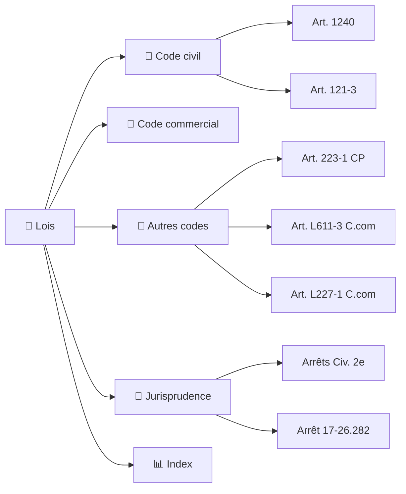

<!-- Breadcrumb -->
[🏠](../README.md) › 📜 Lois
<!-- /Breadcrumb -->

# ⚖️ Bibliothèque Juridique

---

**Ce dossier contient les textes de loi et les arrêts de jurisprudence cités dans les actes du dossier.**
Chaque fichier est une fiche dédiée, conservant le texte intégral ou un extrait significatif de la source officielle.

## 🗺️ Cartographie des sources (interactif)



Le dossier a été réorganisé pour une meilleure navigation :

```
📜 Lois/
├── 📜 Jurisprudence/          # 24 arrêts de la Cour de cassation
├── 📒 Code civil/             # 5 articles
├── 📒 Code penal/             # 4 articles
├── 📒 Code procedure civile/  # 4 articles
├── 📒 Code procedure penale/  # 2 articles
├── 📒 Code assurances/         # 2 articles
├── 📒 Code commerce/          # 6 articles
├── 📒 Autres codes/            # CGCT, C.trav, CCH, etc. (10 articles)
├── pdfs/                     # Documents originaux Légifrance
└── README.md                 # Ce fichier
```

## 📜 Codes et textes législatifs

### 📒 Code civil (5 articles)
- [Art. 1240](📒 Code civil/Article1240_CodeCivil.md) — Responsabilité délictuelle
- [Art. 1242](📒 Code civil/Article1242_CodeCivil.md) — Responsabilité du fait des choses
- [Art. 1719](📒 Code civil/Article1719_CodeCivil_LegiFrance.md) — Obligations du bailleur
- [Art. 1720](📒 Code civil/Article1720_CodeCivil_LegiFrance.md) — Réparations locatives
- [Art. 2226](📒 Code civil/Article_2226_Code_Legifrance.md) — Prescription décennale

### 📒 Code pénal (10 articles)
- [Art. 121-3](📒 Autres codes/Article_121-3_Code_Legifrance.md) — Responsabilité des personnes morales
- [Art. 222-19](📒 Code penal/Article_222-19_CodePenal_Legifrance.md) — Blessures involontaires
- [Art. 222-20](📒 Code penal/Article222-20_CodePenal_LegiFrance.md) — Blessures avec circonstances aggravantes
- [Art. 223-1](📒 Autres codes/Article_223-1_Code_Legifrance.md) — Mise en danger d'autrui
- [Art. 314-7](📒 Code penal/Article_314-7_CodePenal_Legifrance.md) — Fraude sociale ✨ NOUVEAU
- [Art. 434-4](📒 Code penal/Article_434-4_CodePenal_Legifrance.md) — Refus de communication ✨ NOUVEAU
- [Art. 434-15](📒 Code penal/Article_434-15_CodePenal_Legifrance.md) — Obstruction à la justice ✨ NOUVEAU
- [Art. 434-15-1](📒 Code penal/Article_434-15-1_CodePenal_Legifrance.md) — Obstruction aggravée ✨ NOUVEAU

### 📒 Code de procédure civile (4 articles)
- [Art. 145](📒 Autres codes/Article_145_CodeDeProcédureCivile_Legifrance.md) — Mesures d'instruction
- [Art. 263](📒 Autres codes/Article_263_Codeproc_Legifrance.md) — Expertise judiciaire
- [Art. 700](📒 Autres codes/Article_700_Codeproc_Legifrance.md) — Frais irrépétibles
- [Art. 835](📒 Code procedure civile/Article835_CodeDeProcedureCivile_LegiFrance.md) — Référé-provision

### 📒 Code de procédure pénale (2 articles)
- [Art. 475-1](📒 Code procedure penale/Article475-1_CodeProcedurePenale.md) — Constitution de partie civile
- [Art. 706-3](📒 Code procedure penale/Article_706-3_CodeProcedurePenale_Legifrance.md) — FGTI ✨ NOUVEAU

### 📒 Code des assurances (2 articles)
- [Art. L.113-2](📒 Code assurances/Article_L113-2_Codesassurances_Legifrance.md) — Déclaration du risque
- [Art. L.124-3](📒 Code assurances/Article_L124-3_Codesassurances_Legifrance.md) — Action directe

### 📒 Code de commerce (5 articles)
- [Art. L.210-6](📒 Code commerce/Article_L210-6_Codecommerce_Legifrance.md) — Responsabilité des dirigeants
- [Art. L.223-22](📒 Code commerce/Article_L223-22_Codecommerce_Legifrance.md) — Nullité des actes
- [Art. L.225-251](📒 Code commerce/Article_L225-251_Codecommerce_Legifrance.md) — Responsabilité en cas de liquidation
- [Art. L.227-8](📒 Code commerce/Article_L227-8_Codecommerce_Legifrance.md) — Responsabilité des dirigeants de SAS
- [Art. L.227-1](📒 Code commerce/Article_L227-1_Code_Legifrance.md) — Pouvoirs du président
- [Art. L.237-2](📒 Code commerce/Article_L237-2_Codecommerce_Legifrance.md) — Responsabilité des dirigeants

### 📒 Autres codes (9 articles)
- [Art. L.421-3](📒 Autres codes/Article_L421-3_Codeconsommation_Legifrance.md) — Sécurité des consommateurs
- [Art. R.143-2](📒 Autres codes/Article_R143-2_Codeconstructionhabitation_Legifrance.md) — Sécurité des ERP
- [Art. L.2212-2](📒 Autres codes/Article_L2212-2_CodeGeneralCollectivitesTerritoriales_Legifrance.md) — Pouvoirs de police du maire ✨ NOUVEAU
- [Art. L.2212-4](📒 Autres codes/Article_L2212-4_CodeGeneralCollectivitesTerritoriales_Legifrance.md) — Mesures d'urgence du maire ✨ NOUVEAU
- [Art. L.611-3](📒 Autres codes/Article_L611-3_Code_Legifrance.md) — Procédure de sauvegarde
- [Art. L.123-2](📒 Autres codes/Article_L123-2_Code_Legifrance.md) — Immatriculation des sociétés

## 🏛️ Jurisprudence (Cour de cassation) — 26 arrêts

Tous les arrêts sont disponibles dans le dossier [📜 Jurisprudence/](📜 Jurisprudence/)

| N° pourvoi | Arrêt | Thème |
|------------|-------|-------|
| [00-82.066](📜 Jurisprudence/00-82.066_CourCassation.md) | **Ass. Plén., 25 février 2000** — Arrêt *Cousin* | Responsabilité du commettant |
| [01-02.274](📜 Jurisprudence/01-02.274_CourCassation.md) | **Civ. 2e, 26 sept. 2002** | Transaction sous réserve d'aggravation — prescription |
| [80-14.994](📜 Jurisprudence/80-14.994_CourCassation.md) | **Ass. Plén., 25 février 2000** — Arrêt *Gabillet* | Cumul responsabilités contractuelle/délictuelle |
| [97-17.378](📜 Jurisprudence/97-17.378_CourCassation.md) | **Ass. Plén., 25 février 2000** — Arrêt *Costedoat* | Responsabilité personnelle du dirigeant |
| [99-17.092](📜 Jurisprudence/99-17.092_CourCassation.md) | **Com., 20 mai 2003** | Responsabilité pour défaut d'assurance |
| [11-15.699](📜 Jurisprudence/11-15.699_CourCassation.md) | **Com.** | Responsabilité dirigeant |
| [13-80.849](📜 Jurisprudence/13-80.849_CourCassation.md) | **Crim., 27 mai 2014** | Mise en danger d'autrui |
| [14-15.326](📜 Jurisprudence/14-15.326_CourCassation.md) | **Civ. 3e** | Obligation d'assurance du bailleur |
| [16-24.631](📜 Jurisprudence/16-24.631_CourCassation.md) | **Civ. 2e** | Préjudice corporel |

| [18-17.868](📜 Jurisprudence/18-17.868_CourCassation.md) | **Civ. 2e** | Incidence professionnelle |
| [19-15.659](📜 Jurisprudence/19-15.659_CourCassation.md) | **Civ. 2e, 14 mai 2020** | Action directe contre l'assureur |
| [19-23.173](📜 Jurisprudence/19-23.173_CourCassation.md) | **Civ. 2e, 6 mai 2021** | Incidence professionnelle |
| [20-15.106](📜 Jurisprudence/20-15.106_CourCassation.md) | **Civ. 2e, 8 juillet 2021** | Réserves d'aggravation, incidence professionnelle |
| [20-16.463](📜 Jurisprudence/20-16.463_CourCassation.md) | **Civ. 1re, 8 décembre 2021** | Action directe, dissolution société |
| [21-14.197](📜 Jurisprudence/21-14.197_CourCassation.md) | **Civ. 2e** | Préjudice corporel |
| [22-18.089](📜 Jurisprudence/22-18.089_CourCassation.md) | **Civ. 2e, 21 mars 2024** | Autonomie action aggravation — prescription (publié Bulletin) |
| [22-19.307](📜 Jurisprudence/22-19.307_CourCassation.md) | **Civ. 2e, 4 avril 2024** | Réserve d'aggravation |
| [23-12.369](📜 Jurisprudence/23-12.369_CourCassation.md) | **Civ. 2e** | Évaluation préjudice |
| [24-17.944](📜 Jurisprudence/24-17.944_CourCassation.md) | **Civ. 2e, 2 avril 2026** | Aggravation — force majeure gardien de la chose |
| [70-12.124](📜 Jurisprudence/70-12.124_CourCassation.md) | **Civ. 2e, 23 fév. 1972** — Arrêt *Leroy* | Baignoire passive exposée à la vente |
| [74-10.466](📜 Jurisprudence/74-10.466_CourCassation.md) | **Civ. 2e, 5 mai 1975** | Vice inhérent ≠ cause d'exonération |
| [89-18.422](📜 Jurisprudence/89-18.422_CourCassation.md) | **Civ. 2e, 13 fév. 1991** | Échelle qui bascule = instrument du dommage |
| [91-13.580](📜 Jurisprudence/91-13.580_CourCassation.md) | **Civ. 2e, 25 nov. 1992** | Chose inerte — position anormale à prouver |
| [91-15.035](📜 Jurisprudence/91-15.035_CourCassation.md) | **Civ. 2e, 5 mai 1993** | Charge preuve instrument du dommage (chose inerte) |
| [92-13.880](📜 Jurisprudence/92-13.880_CourCassation.md) | **Civ. 2e, 2 fév. 1994** | Transaction sous réserve d'aggravation — expertise |
| [24-21.702](📜 Jurisprudence/24-21.702_CourCassation.md) | **Civ. 2e, 28 mai 2026** | Échelle instable — preuve position anormale insuffisante |

## 🔧 Documents techniques

- **[EXEMPLES_REQUETES_MCP](EXEMPLES_REQUETES_MCP.md)** — Exemples concrets de requêtes MCP Légifrance et Judilibre pour le projet.
- **[RAPPORT_ORGANISATION_20260711](RAPPORT_ORGANISATION_20260711.md)** — Rapport d'organisation et d'audit de la bibliothèque juridique (11 juillet 2026).

## 📊 Statistiques (Juillet 2026)

- **Total fichiers** : 62 fichiers juridiques
- **Jurisprudence** : 28 arrêts
- **Articles de loi** : 34 articles (75,6% complet)
- **Nouveaux articles ajoutés** : 10 articles prioritaires
- **Taux de complétude** : 79,3%

## 📁 PDFs

Le dossier `pdfs/` contient les documents originaux téléchargés depuis Légifrance.

## 🔧 Maintenance

Pour ajouter un nouvel article :
1. Créer un fichier Markdown dans le sous-dossier approprié
2. Utiliser le template standard (voir les fichiers existants)
3. Ajouter une entrée dans le tableau ci-dessus
4. Mettre à jour le taux de complétude