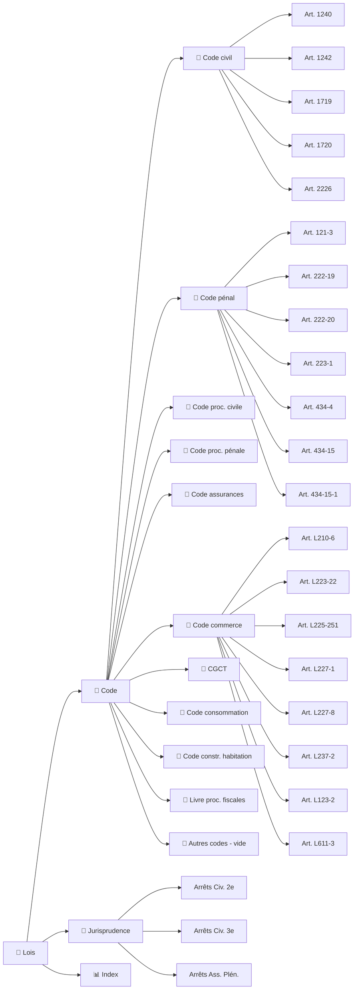

<!-- Breadcrumb -->
*[🏠](../README.md) › 📜 Lois*
<hr>
<!-- /Breadcrumb -->

# ⚖️ Bibliothèque Juridique

**Ce dossier contient les textes de loi et les arrêts de jurisprudence cités dans les actes du dossier.**
Chaque fichier est une fiche dédiée, conservant le texte intégral ou un extrait significatif de la source officielle.

## 🗺️ Cartographie des sources (interactif)



Le dossier a été réorganisé pour une meilleure navigation :

```
📜 Lois/
├── 📜 Jurisprudence/README.md          # 29 arrêts de la Cour de cassation
│   ├── 🏛️ Responsabilité du fait des choses/     # 8 arrêts
│   ├── 🏛️ Transaction sous réserve d'aggravation/ # 4 arrêts
│   ├── 🏛️ Réserve d'aggravation/                  # 3 arrêts
│   ├── 🏛️ Préjudice corporel et incidence prof./   # 5 arrêts
│   ├── 🏛️ Responsabilité des dirigeants/          # 4 arrêts
│   ├── 🏛️ Action directe et assurance/            # 4 arrêts
│   ├── 🏛️ Responsabilité du commettant/           # 2 arrêts
│   └── 🏛️ Mise en danger d'autrui/                # 1 arrêt
├── 📒 Code/                  # 10 sous-dossiers
│   ├── 📒 Code civil/                            # 5 articles
│   ├── 📒 Code pénal/                            # 9 articles
│   ├── 📒 Code procédure civile/                 # 6 articles
│   ├── 📒 Code procédure pénale/                 # 6 articles
│   ├── 📒 Code assurances/                       # 3 articles
│   ├── 📒 Code commerce/                         # 8 articles
│   ├── 📒 Code Général des Collectivités Territoriales/ # 2 articles
│   ├── 📒 Code consommation/                     # 1 article
│   ├── 📒 Code construction habitation/          # 1 article
│   ├── 📒 Livre des procédures fiscales/         # 2 articles
│   └── 📒 Autres codes/                           # vide (articles déplacés)
└── README.md                 # Ce fichier
```

## 📜 Codes et textes législatifs

### [📒 Code civil (5 articles)](Code/Code%20civil/README.md)
- [🔗](https://www.legifrance.gouv.fr/codes/article_lc/LEGIARTI000019019256) [Art. 1240](Code/Code%20civil/Article1240_CodeCivil.md) — Responsabilité délictuelle
- [🔗](https://www.legifrance.gouv.fr/codes/article_lc/LEGIARTI000019019258) [Art. 1242](Code/Code%20civil/Article1242_CodeCivil.md) — Responsabilité du fait des choses
- [🔗](https://www.legifrance.gouv.fr/codes/article_lc/LEGIARTI000020459127) [Art. 1719](Code/Code%20civil/Article1719_CodeCivil_LegiFrance.md) — Obligations du bailleur
- [🔗](https://www.legifrance.gouv.fr/codes/article_lc/LEGIARTI000006442784) [Art. 1720](Code/Code%20civil/Article1720_CodeCivil_LegiFrance.md) — Obligations du bailleur (grosses réparations)
- [🔗](https://www.legifrance.gouv.fr/codes/article_lc/LEGIARTI000019017259) [Art. 2226](Code/Code%20civil/Article_2226_Code_Legifrance.md) — Prescription décennale

### [📒 Code pénal (9 articles)](Code/Code%20penal/README.md)
- [🔗](https://www.legifrance.gouv.fr/codes/article_lc/LEGIARTI000006417208) [Art. 121-3](Code/Code%20penal/Article_121-3_Code_Legifrance.md) — Principe de la responsabilité pénale
- [🔗](https://www.legifrance.gouv.fr/codes/article_lc/LEGIARTI000006417206) [Art. 121-1 à 121-7](Code/Code%20penal/Article_121-1a121-7_CodePenal_Legifrance.md) — Principes généraux
- [🔗](https://www.legifrance.gouv.fr/codes/article_lc/LEGIARTI000024042643) [Art. 222-19](Code/Code%20penal/Article_222-19_CodePenal_Legifrance.md) — Blessures involontaires
- [🔗](https://www.legifrance.gouv.fr/codes/article_lc/LEGIARTI000024042640) [Art. 222-20](Code/Code%20penal/Article222-20_CodePenal_LegiFrance.md) — Blessures avec circonstances aggravantes
- [🔗](https://www.legifrance.gouv.fr/codes/article_lc/LEGIARTI000024042637) [Art. 223-1](Code/Code%20penal/Article_223-1_Code_Legifrance.md) — Mise en danger d'autrui
- [🔗](https://www.legifrance.gouv.fr/codes/article_lc/LEGIARTI000006418226) [Art. 314-7](Code/Code%20penal/Article_314-7_CodePenal_Legifrance.md) — Fraude sociale
- [🔗](https://www.legifrance.gouv.fr/codes/article_lc/LEGIARTI000006418608) [Art. 434-4](Code/Code%20penal/Article_434-4_CodePenal_Legifrance.md) — Refus de communication
- [🔗](https://www.legifrance.gouv.fr/codes/article_lc/LEGIARTI000006418641) [Art. 434-15](Code/Code%20penal/Article_434-15_CodePenal_Legifrance.md) — Obstruction à la justice
- [🔗](https://www.legifrance.gouv.fr/codes/article_lc/LEGIARTI000038876031) [Art. 434-15-1](Code/Code%20penal/Article_434-15-1_CodePenal_Legifrance.md) — Obstruction aggravée

### [📒 Code de procédure civile (6 articles)](Code/Code%20procedure%20civile/README.md)
- [🔗](https://www.legifrance.gouv.fr/codes/article_lc/LEGIARTI000051869339) [Art. 144](Code/Code%20procedure%20civile/Article_144_CodeDeProcedureCivile.md) — Mesures d'instruction
- [🔗](https://www.legifrance.gouv.fr/codes/article_lc/LEGIARTI000051869339) [Art. 145](Code/Code%20procedure%20civile/Article_145_CodeDeProc%C3%A9dureCivile_Legifrance.md) — Mesures d'instruction in futurum
- [🔗](https://www.legifrance.gouv.fr/codes/article_lc/LEGIARTI000006410394) [Art. 263](Code/Code%20procedure%20civile/Article_263_Codeproc_Legifrance.md) — Expertise judiciaire
- [🔗](https://www.legifrance.gouv.fr/codes/article_lc/LEGIARTI000006410330) [Art. 202](Code/Code%20procedure%20civile/Article_202_CodeDeProcedureCivile.md) — Les attestations
- [🔗](https://www.legifrance.gouv.fr/codes/article_lc/LEGIARTI000045268436) [Art. 700](Code/Code%20procedure%20civile/Article_700_Codeproc_Legifrance.md) — Frais irrépétibles
- [🔗](https://www.legifrance.gouv.fr/codes/article_lc/LEGIARTI000042597284) [Art. 835](Code/Code%20procedure%20civile/Article835_CodeDeProcedureCivile_LegiFrance.md) — Référé-provision

### [📒 Code de procédure pénale (6 articles)](Code/Code%20procedure%20penale/README.md)
- [🔗](https://www.legifrance.gouv.fr/codes/article_lc/LEGIARTI000006574933) [Art. 40](Code/Code%20procedure%20penale/Article_40_CodeProcedurePenale.md) — Attributions du procureur
- [🔗](https://www.legifrance.gouv.fr/codes/article_lc/LEGIARTI000006575016) [Art. 53](Code/Code%20procedure%20penale/Article_53_CodeProcedurePenale.md) — Flagrant délit
- [🔗](https://www.legifrance.gouv.fr/codes/article_lc/LEGIARTI000038311441) [Art. 15-3](Code/Code%20procedure%20penale/Article_15-3_CodeProcedurePenale.md) — Dépôt plainte, récépissé
- [🔗](https://www.legifrance.gouv.fr/codes/article_lc/LEGIARTI000044568319) [Art. 80](Code/Code%20procedure%20penale/Article_80_CodeProcedurePenale.md) — Réquisitoire introductif
- [🔗](https://www.legifrance.gouv.fr/codes/article_lc/LEGIARTI000038312062) [Art. 86](Code/Code%20procedure%20penale/Article_86_CodeProcedurePenale.md) — Constitution partie civile
- [🔗](https://www.legifrance.gouv.fr/codes/article_lc/LEGIARTI000048442334) [Art. 706-5](Code/Code%20procedure%20penale/Article_706-5_CodeProcedurePenale.md) — Délai forclusion CIVI (3 ans)

### [📒 Code des assurances (3 articles)](Code/Code%20assurances/README.md)
- [🔗](https://www.legifrance.gouv.fr/codes/article_lc/LEGIARTI000035731302) [Art. L.113-2](Code/Code%20assurances/Article_L113-2_Codesassurances_Legifrance.md) — Déclaration du risque
- [🔗](https://www.legifrance.gouv.fr/codes/article_lc/LEGIARTI000017735449) [Art. L.124-3](Code/Code%20assurances/Article_L124-3_Codesassurances_Legifrance.md) — Action directe
- [🔗](https://www.legifrance.gouv.fr/codes/article_lc/LEGIARTI000006417206) [Art. 121-1 à 121-7](Code/Code%20assurances/Article_L121-1a121-7_Code_Legifrance.md) — Principes généraux responsabilité pénale (personnes morales)

### [📒 Code de commerce (8 articles)](Code/Code%20commerce/README.md)
- [🔗](https://www.legifrance.gouv.fr/codes/article_lc/LEGIARTI000006222358) [Art. L.210-6](Code/Code%20commerce/Article_L210-6_Codecommerce_Legifrance.md) — Responsabilité des dirigeants
- [🔗](https://www.legifrance.gouv.fr/codes/article_lc/LEGIARTI000006223141) [Art. L.223-22](Code/Code%20commerce/Article_L223-22_Codecommerce_Legifrance.md) — Nullité des actes
- [🔗](https://www.legifrance.gouv.fr/codes/article_lc/LEGIARTI000006226329) [Art. L.225-251](Code/Code%20commerce/Article_L225-251_Codecommerce_Legifrance.md) — Responsabilité en cas de liquidation
- [🔗](https://www.legifrance.gouv.fr/codes/article_lc/LEGIARTI000006227036) [Art. L.227-8](Code/Code%20commerce/Article_L227-8_Codecommerce_Legifrance.md) — Responsabilité des dirigeants de SAS
- [🔗](https://www.legifrance.gouv.fr/codes/article_lc/LEGIARTI000047591332) [Art. L.227-1](Code/Code%20commerce/Article_L227-1_Code_Legifrance.md) — Pouvoirs du président
- [🔗](https://www.legifrance.gouv.fr/codes/article_lc/LEGIARTI000006230063) [Art. L.237-2](Code/Code%20commerce/Article_L237-2_Codecommerce_Legifrance.md) — Responsabilité des dirigeants
- [🔗](https://www.legifrance.gouv.fr/codes/article_lc/LEGIARTI000051752672) [Art. L.123-2](Code/Code%20commerce/Article_L123-2_Code_Legifrance.md) — Immatriculation au RCS
- [🔗](https://www.legifrance.gouv.fr/codes/article_lc/LEGIARTI000044052542) [Art. L.611-3](Code/Code%20commerce/Article_L611-3_Code_Legifrance.md) — Procédure de sauvegarde

### [📒 Code Général des Collectivités Territoriales (2 articles)](Code/Code%20general%20des%20collectivites%20territoriales/README.md)
- [🔗](https://www.legifrance.gouv.fr/codes/article_lc/LEGIARTI000029946370) [Art. L.2212-2](Code/Code%20general%20des%20collectivites%20territoriales/Article_L2212-2_CodeGeneralCollectivitesTerritoriales_Legifrance.md) — Pouvoirs de police du maire
- [🔗](https://www.legifrance.gouv.fr/codes/article_lc/LEGIARTI000006390155) [Art. L.2212-4](Code/Code%20general%20des%20collectivites%20territoriales/Article_L2212-4_CodeGeneralCollectivitesTerritoriales_Legifrance.md) — Mesures d'urgence du maire

### [📒 Code de la consommation (1 article)](Code/Code%20consommation/README.md)
- [🔗](https://www.legifrance.gouv.fr/codes/article_lc/LEGIARTI000049464053) [Art. L.421-3](Code/Code%20consommation/Article_L421-3_Codeconsommation_Legifrance.md) — Obligation générale de sécurité des prestations

### [📒 Code de la construction et de l'habitation (1 article)](Code/Code%20construction%20habitation/README.md)
- [🔗](https://www.legifrance.gouv.fr/codes/article_lc/LEGIARTI000043818941) [Art. R.143-2](Code/Code%20construction%20habitation/Article_R143-2_Codeconstructionhabitation_Legifrance.md) — Définition des ERP

### [📒 Livre des procédures fiscales (2 articles)](Code/Livre%20des%20procedures%20fiscales/README.md)
- [🔗](https://www.legifrance.gouv.fr/codes/article_lc/LEGIARTI000006316012) [Art. L.252](Code/Livre%20des%20procedures%20fiscales/Article_L252_LivreProceduresFiscales.md) — Recouvrement impôts, comptables publics
- [🔗](https://www.legifrance.gouv.fr/codes/article_lc/LEGIARTI000042914471) [Art. L.274](Code/Livre%20des%20procedures%20fiscales/Article_L274_LivreProceduresFiscales.md) — Prescription action recouvrement (4 ans)

## 🏛️ Jurisprudence (Cour de cassation) — 29 arrêts

Tous les arrêts sont disponibles dans le dossier [📜 Jurisprudence/README.md](Jurisprudence/)

### [🏛️ Responsabilité du fait des choses (8 arrêts)](Jurisprudence/%F0%9F%8F%9B%EF%B8%8F%20Responsabilit%C3%A9%20du%20fait%20des%20choses/README.md)
- [🔗](https://www.legifrance.gouv.fr/juri/id/JURITEXT000006987399) [70-12.124](Jurisprudence/%F0%9F%8F%9B%EF%B8%8F%20Responsabilit%C3%A9%20du%20fait%20des%20choses/70-12.124_CourCassation.md) — Civ. 2e, 23 fév. 1972 — *Leroy* — Baignoire passive
- [🔗](https://www.legifrance.gouv.fr/juri/id/JURITEXT000006993485) [74-10.466](Jurisprudence/%F0%9F%8F%9B%EF%B8%8F%20Responsabilit%C3%A9%20du%20fait%20des%20choses/74-10.466_CourCassation.md) — Civ. 2e, 5 mai 1975 — Vice inhérent ≠ exonération
- [🔗](https://www.legifrance.gouv.fr/juri/id/JURITEXT000007026411) [89-18.422](Jurisprudence/%F0%9F%8F%9B%EF%B8%8F%20Responsabilit%C3%A9%20du%20fait%20des%20choses/89-18.422_CourCassation.md) — Civ. 2e, 13 fév. 1991 — Échelle qui bascule = instrument dommage
- [🔗](https://www.legifrance.gouv.fr/juri/id/JURITEXT000007029806) [91-13.580](Jurisprudence/%F0%9F%8F%9B%EF%B8%8F%20Responsabilit%C3%A9%20du%20fait%20des%20choses/91-13.580_CourCassation.md) — Civ. 2e, 25 nov. 1992 — Chose inerte — position anormale
- [🔗](https://www.legifrance.gouv.fr/juri/id/JURITEXT000007030324) [91-15.035](Jurisprudence/%F0%9F%8F%9B%EF%B8%8F%20Responsabilit%C3%A9%20du%20fait%20des%20choses/91-15.035_CourCassation.md) — Civ. 2e, 5 mai 1993 — Charge preuve instrument chose inerte
- [🔗](https://www.legifrance.gouv.fr/juri/id/JURITEXT000053859664) [24-17.944](Jurisprudence/%F0%9F%8F%9B%EF%B8%8F%20Responsabilit%C3%A9%20du%20fait%20des%20choses/24-17.944_CourCassation.md) — Civ. 2e, 2 avril 2026 — Force majeure gardien
- [🔗](https://www.legifrance.gouv.fr/juri/id/JURITEXT000054167506) [24-21.702](Jurisprudence/%F0%9F%8F%9B%EF%B8%8F%20Responsabilit%C3%A9%20du%20fait%20des%20choses/24-21.702_CourCassation.md) — Civ. 2e, 28 mai 2026 — Échelle instable
- [🔗](https://www.legifrance.gouv.fr/juri/id/JURITEXT000007026411) [63-13.613](Jurisprudence/%F0%9F%8F%9B%EF%B8%8F%20Responsabilit%C3%A9%20du%20fait%20des%20choses/63-13.613_CourCassation.md) — Civ. 2e, 23 janv. 1964 — Gardien, vice construction

### [🏛️ Transaction sous réserve d'aggravation (4 arrêts)](Jurisprudence/%F0%9F%8F%9B%EF%B8%8F%20Transaction%20sous%20r%C3%A9serve%20d%27aggravation/README.md)
- [🔗](https://www.legifrance.gouv.fr/juri/id/JURITEXT000007441243) [01-02.274](Jurisprudence/%F0%9F%8F%9B%EF%B8%8F%20Transaction%20sous%20r%C3%A9serve%20d%27aggravation/01-02.274_CourCassation.md) — Civ. 2e, 26 sept. 2002
- [🔗](https://www.legifrance.gouv.fr/juri/id/JURITEXT000007206125) [92-13.880](Jurisprudence/%F0%9F%8F%9B%EF%B8%8F%20Transaction%20sous%20r%C3%A9serve%20d%27aggravation/92-13.880_CourCassation.md) — Civ. 2e, 2 fév. 1994
- [🔗](https://www.legifrance.gouv.fr/juri/id/JURITEXT000049321551) [22-18.089](Jurisprudence/%F0%9F%8F%9B%EF%B8%8F%20Transaction%20sous%20r%C3%A9serve%20d%27aggravation/22-18.089_CourCassation.md) — Civ. 2e, 21 mars 2024 (Bulletin)
- [🔗](https://www.legifrance.gouv.fr/juri/id/JURITEXT000007047369) [99-17.092](Jurisprudence/%F0%9F%8F%9B%EF%B8%8F%20Responsabilit%C3%A9%20des%20dirigeants/99-17.092_CourCassation.md) — Com., 20 mai 2003 — SATI (*Note : classé aussi en Resp. dirigeants*)

### [🏛️ Réserve d'aggravation (3 arrêts)](Jurisprudence/%F0%9F%8F%9B%EF%B8%8F%20R%C3%A9serve%20d%27aggravation/README.md)
- [🔗](https://www.legifrance.gouv.fr/juri/id/JURITEXT000043782126) [20-15.106](Jurisprudence/%F0%9F%8F%9B%EF%B8%8F%20R%C3%A9serve%20d%27aggravation/20-15.106_CourCassation.md) — Civ. 2e, 8 juil. 2021
- [🔗](https://www.legifrance.gouv.fr/juri/id/JURITEXT000049418278) [22-19.307](Jurisprudence/%F0%9F%8F%9B%EF%B8%8F%20R%C3%A9serve%20d%27aggravation/22-19.307_CourCassation.md) — Civ. 2e, 4 avril 2024
- [🔗](https://www.legifrance.gouv.fr/juri/id/JURITEXT000007047369) [17-26.282](Jurisprudence/%F0%9F%8F%9B%EF%B8%8F%20R%C3%A9serve%20d%27aggravation/17-26.282_CourCassation.md) — Civ. 2e — *À VÉRIFIER* (accès Légifrance bloqué)

### [🏛️ Préjudice corporel et incidence professionnelle (5 arrêts)](Jurisprudence/%F0%9F%8F%9B%EF%B8%8F%20Pr%C3%A9judice%20corporel%20et%20incidence%20professionnelle/README.md)
- [🔗](https://www.legifrance.gouv.fr/juri/id/JURITEXT000036635385) [16-24.631](Jurisprudence/%F0%9F%8F%9B%EF%B8%8F%20Pr%C3%A9judice%20corporel%20et%20incidence%20professionnelle/16-24.631_CourCassation.md) — Civ. 2e
- [🔗](https://www.legifrance.gouv.fr/juri/id/JURITEXT000041585779) [18-17.868](Jurisprudence/%F0%9F%8F%9B%EF%B8%8F%20Pr%C3%A9judice%20corporel%20et%20incidence%20professionnelle/18-17.868_CourCassation.md) — Civ. 2e
- [🔗](https://www.legifrance.gouv.fr/juri/id/JURITEXT000043489943) [19-23.173](Jurisprudence/%F0%9F%8F%9B%EF%B8%8F%20Pr%C3%A9judice%20corporel%20et%20incidence%20professionnelle/19-23.173_CourCassation.md) — Civ. 2e, 6 mai 2021
- [🔗](https://www.legifrance.gouv.fr/juri/id/JURITEXT000047700832) [21-14.197](Jurisprudence/%F0%9F%8F%9B%EF%B8%8F%20Pr%C3%A9judice%20corporel%20et%20incidence%20professionnelle/21-14.197_CourCassation.md) — Civ. 2e
- [🔗](https://www.legifrance.gouv.fr/juri/id/JURITEXT000050509897) [23-12.369](Jurisprudence/%F0%9F%8F%9B%EF%B8%8F%20Pr%C3%A9judice%20corporel%20et%20incidence%20professionnelle/23-12.369_CourCassation.md) — Civ. 2e

### [🏛️ Responsabilité des dirigeants (4 arrêts)](Jurisprudence/%F0%9F%8F%9B%EF%B8%8F%20Responsabilit%C3%A9%20des%20dirigeants/README.md)
- [🔗](https://www.legifrance.gouv.fr/juri/id/JURITEXT000007043704) [97-17.378](Jurisprudence/%F0%9F%8F%9B%EF%B8%8F%20Responsabilit%C3%A9%20des%20dirigeants/97-17.378_CourCassation.md) — Ass. Plén., 25 fév. 2000 — *Costedoat*
- [🔗](https://www.legifrance.gouv.fr/juri/id/JURITEXT000007047369) [99-17.092](Jurisprudence/%F0%9F%8F%9B%EF%B8%8F%20Responsabilit%C3%A9%20des%20dirigeants/99-17.092_CourCassation.md) — Com., 20 mai 2003 — *SATI* (défaut assurance)
- [🔗](https://www.legifrance.gouv.fr/juri/id/JURITEXT000026515553) [11-15.699](Jurisprudence/%F0%9F%8F%9B%EF%B8%8F%20Responsabilit%C3%A9%20des%20dirigeants/11-15.699_CourCassation.md) — Com.
- [🔗](https://www.legifrance.gouv.fr/juri/id/JURITEXT000007046467) [11-13.384](Jurisprudence/%F0%9F%8F%9B%EF%B8%8F%20Responsabilit%C3%A9%20des%20dirigeants/11-13.384_CourCassation.md) — Com.

### [🏛️ Action directe et obligation d'assurance (4 arrêts)](Jurisprudence/%F0%9F%8F%9B%EF%B8%8F%20Action%20directe%20et%20obligation%20d%27assurance/README.md)
- [🔗](https://www.legifrance.gouv.fr/juri/id/JURITEXT000032194983) [14-15.326](Jurisprudence/%F0%9F%8F%9B%EF%B8%8F%20Action%20directe%20et%20obligation%20d%27assurance/14-15.326_CourCassation.md) — Civ. 3e — Obligation assurance bailleur
- [🔗](https://www.legifrance.gouv.fr/juri/id/JURITEXT000044482848) [19-15.659](Jurisprudence/%F0%9F%8F%9B%EF%B8%8F%20Action%20directe%20et%20obligation%20d%27assurance/19-15.659_CourCassation.md) — Civ. 2e, 14 mai 2020
- [🔗](https://www.legifrance.gouv.fr/juri/id/JURITEXT000044482848) [20-16.463](Jurisprudence/%F0%9F%8F%9B%EF%B8%8F%20Action%20directe%20et%20obligation%20d%27assurance/20-16.463_CourCassation.md) — Civ. 1re, 8 déc. 2021
- [🔗](https://www.legifrance.gouv.fr/juri/id/JURITEXT000044482848) [20-16.463](Jurisprudence/%F0%9F%8F%9B%EF%B8%8F%20Action%20directe%20et%20obligation%20d%27assurance/20-16.463_CourCassation.md) — Civ. 1re, 8 déc. 2021 — Action directe, dissolution

### [🏛️ Responsabilité du commettant (2 arrêts)](Jurisprudence/%F0%9F%8F%9B%EF%B8%8F%20Responsabilit%C3%A9%20du%20commettant/README.md)
- [🔗](https://www.legifrance.gouv.fr/juri/id/JURITEXT000007071351) [00-82.066](Jurisprudence/%F0%9F%8F%9B%EF%B8%8F%20Responsabilit%C3%A9%20du%20commettant/00-82.066_CourCassation.md) — Ass. Plén., 14 déc. 2001 — *Cousin*
- [🔗](https://www.legifrance.gouv.fr/juri/id/JURITEXT000007013792) [80-14.994](Jurisprudence/%F0%9F%8F%9B%EF%B8%8F%20Responsabilit%C3%A9%20du%20commettant/80-14.994_CourCassation.md) — Ass. Plén., 9 mai 1984 — *Gabillet*

### [🏛️ Mise en danger d'autrui (1 arrêt)](Jurisprudence/%F0%9F%8F%9B%EF%B8%8F%20Mise%20en%20danger%20d%27autrui/README.md)
- [🔗](https://www.legifrance.gouv.fr/juri/id/JURITEXT000029014493) [13-80.849](Jurisprudence/%F0%9F%8F%9B%EF%B8%8F%20Mise%20en%20danger%20d%27autrui/13-80.849_CourCassation.md) — Crim., 27 mai 2014

## 🔧 Documents techniques

- **[EXEMPLES_REQUETES_MCP](EXEMPLES_REQUETES_MCP.md)** — Exemples concrets de requêtes MCP Légifrance et Judilibre.
- **[RAPPORT_ORGANISATION_20260711](RAPPORT_ORGANISATION_20260711.md)** — Rapport d'organisation et d'audit (11 juillet 2026).
- **[CHANGELOG_JURIDIQUE](CHANGELOG_JURIDIQUE.md)** — Historique des modifications.