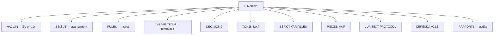

<!-- Breadcrumb -->
*[🏠](../README.md) › 🧠 Memory*

<!-- /Breadcrumb -->

# 🧠 Mémoire du Projet

Ce dossier contient les documents de référence, les variables strictes, et la mémoire institutionnelle du projet accident-main.

## 🗺️ Cartographie mémoire (interactif)

### Fichiers Principaux

- **[CONVENTIONS](CONVENTIONS.md)** - 🔴 Conventions de formatage unifiées
- **DECISIONS.md** - Décisions clés et choix architecturaux
- **DEPENDANCES.md** - Graphe des dépendances logiques des actes
- **STRICT VARIABLES.md** - Variables et constantes de référence
- **TODO.md** - Liste des tâches et roadmap
- **WORKFLOW.md** - Processus et workflows du projet

- **[GESTIONNAIRE_DOC](GESTIONNAIRE_DOC.md)**
- **[📆 Mini Calendrier Procedure](%F0%9F%93%86%20Mini%20Calendrier%20Procedure.md)**
- **[📋 Fiche Suivi Démarches Administratives](%F0%9F%93%8B%20Fiche%20Suivi%20D%C3%A9marches%20Administratives.md)**
### Documentation Technique

- **[RAPPORT_JURISPRUDENCES.md](../%F0%9F%93%8A%20Rapports/%F0%9F%97%84%EF%B8%8F%20Archives/audit/RAPPORT_JURISPRUDENCES.md)** - Analyse des jurisprudences citées
- **[DESIGN](DESIGN.md)**
- **[EVIDENCE_MATRIX](EVIDENCE_MATRIX.md)**
- **[FINANCIAL_VARIABLES_DEPRECATED](FINANCIAL_VARIABLES_DEPRECATED.md)**
- **[JULES_MCP_GUIDELINES](JULES_MCP_GUIDELINES.md)**
- **[JURITEXT_PROTOCOL](JURITEXT_PROTOCOL.md)**
- **[JUSTIFICATION_PROVISION_15000](JUSTIFICATION_PROVISION_15000.md)**
- **[NOTE_SYNTHESE_AVOCAT](NOTE_SYNTHESE_AVOCAT.md)**
- **[PIECES MAP](PIECES%20MAP.md)**
- **[PLAN_ACTION_B](PLAN_ACTION_B.md)**
- **[RECADRAGE_NOMENCLATURE](RECADRAGE_NOMENCLATURE.md)**
- **[RULES](RULES.md)**
- **[STATS_DOSSIER](STATS_DOSSIER.md)**
- **[STATUS](STATUS.md)**
- **[TOKEN MAP](TOKEN%20MAP.md)**
- **[VACCIN](VACCIN.md)**
- **RAPPORT_AUDIT_*.md** - Rapports d'audit technique